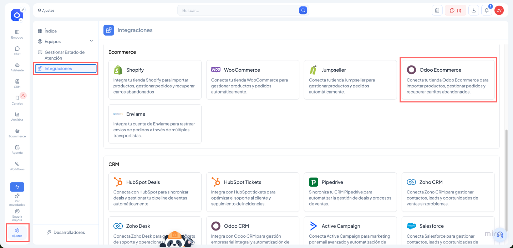

# Cómo conectar tu tienda Odoo Ecommerce con Vambe

### Requisitos previos

* Tener una tienda Odoo Ecommerce operativa.
* Contar con acceso de administrador a tu instancia de Odoo.
* Tener disponible la URL base de tu tienda, el nombre de la base de datos y el token de autenticación.

***

### Ingresar a Integraciones en Vambe

1. En Vambe, dirígete al menú lateral izquierdo.
2. Haz clic en **Ajustes**.
3. Ingresa a la sección **Integraciones**.
4. Dentro de la categoría **Ecommerce**, busca y selecciona **Odoo Ecommerce**.

<figure><figcaption></figcaption></figure>

***

### Conectar tu tienda

1. Dentro de la integración de Odoo Ecommerce, haz clic en **Conectar**.
2. Se abrirá un formulario con tres campos obligatorios:

| Campo             | Descripción                                 | Ejemplo                     |
| ----------------- | ------------------------------------------- | --------------------------- |
| **URL Base**      | La dirección web de tu tienda Odoo          | `https://mitienda.odoo.com` |
| **Base de datos** | El nombre de tu base de datos en Odoo       | `mitienda`                  |
| **Token**         | El token de autenticación de tu cuenta Odoo | _(generado desde Odoo)_     |

3. Completa los tres campos y haz clic en **Siguiente**.
4. Al hacer clic en Siguiente, confirmas tu intención de conectar tu aplicación a Vambe y aceptas los Términos y condiciones.

***

### Verificar la conexión y sincronización de productos

Una vez completada la conexión:

1. Vuelve a **Ajustes → Integraciones → Odoo Ecommerce** en Vambe.
2. Deberías ver la integración como **Conectado**.
3. Vambe comenzará a sincronizar automáticamente los productos de tu tienda.

Puedes verificar que los productos se cargaron correctamente yendo a la sección **Ecommerce → Productos** dentro de Vambe.

> ✅ Si la integración aparece activa y los productos están visibles, tu tienda Odoo Ecommerce ya está correctamente conectada a Vambe.

***

### ¿Qué puede hacer la IA una vez conectada?

Al integrar Odoo Ecommerce, la inteligencia artificial de Vambe tendrá acceso a las siguientes capacidades:

**Conectar Información de Productos** La IA puede consultar información detallada de cada producto: nombre, descripción, características, precio y disponibilidad. Los productos nuevos y eliminados se sincronizan diariamente de forma automática.

**Generación Automática de Carritos** La IA puede crear y enviar carritos de compra directamente en la conversación de WhatsApp, con un link de checkout listo para que el cliente pague en el momento.

**Gestión de Stock en Tiempo Real** La IA puede consultar la disponibilidad de productos en tiempo real, eliminando la necesidad de actualizaciones manuales de stock.

***

### ¿Qué sigue?

Una vez conectada tu tienda Odoo Ecommerce, podrás:

* Utilizar la IA para responder consultas sobre productos y disponibilidad.
* Generar links de checkout directamente desde el chat con el cliente.
* Automatizar flujos de recuperación de carritos abandonados con Workflows.
* Crear automatizaciones post-venta basadas en eventos de pedidos (Order Created) usando el trigger **Evento Capturado** en Flows.
