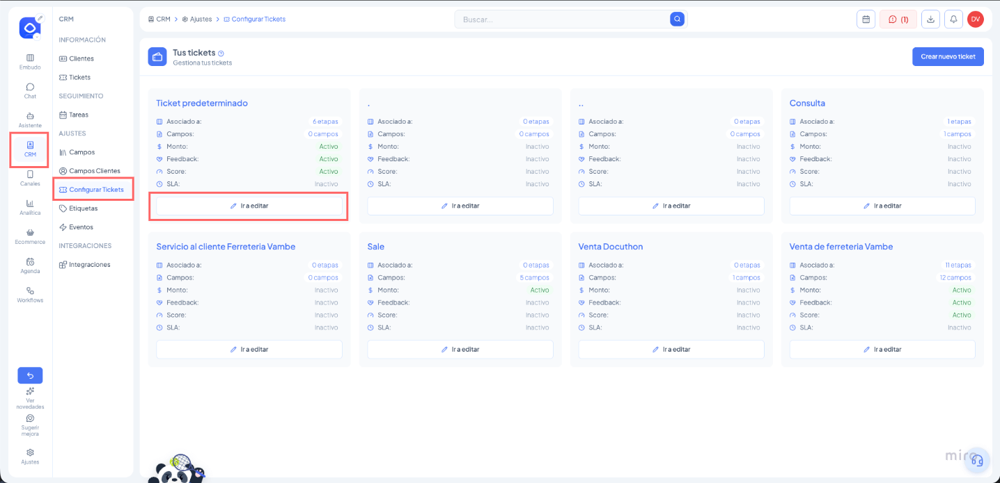

# Service Level Agreement (SLA): Gestión y Cumplimiento de Tiempos de Respuesta

**El SLA (Service Level Agreement)** es una herramienta estratégica diseñada para garantizar que tu equipo de atención y tus asistentes de IA cumplan con estándares de calidad y rapidez en la comunicación con los clientes. Esta funcionalidad permite establecer promesas de tiempo para cada interacción, asegurando que ninguna consulta quede desatendida y permitiendo una priorización inteligente de la carga de trabajo.

Al implementar un SLA en tus embudos, transformas la atención reactiva en una gestión proactiva basada en datos, donde cada segundo cuenta para la satisfacción del usuario final.

### Capacidades de la herramienta

* **Medición de ciclo completo:** Monitorea el tiempo de la **Primera respuesta**, de las **Siguientes respuestas** y el **Tiempo total de resolución** del ticket.
* **Visibilidad en tiempo real:** Cada ticket en el pipeline muestra un temporizador dinámico que indica el estado del compromiso de tiempo.
* **Priorización dinámica:** Permite ordenar los tickets en el embudo según su urgencia, colocando automáticamente en la parte superior a aquellos que están más cerca de incumplir su tiempo límite.
* **Segmentación avanzada:** Puedes definir tiempos de respuesta diferenciados según metadatos o campos específicos (por ejemplo, asignar tiempos más cortos a clientes catalogados como "VIP" o "Urgentes").
* **Compatibilidad Híbrida:** Las métricas se pueden configurar y medir tanto para el desempeño de ejecutivos humanos como para asistentes de IA.

***

### Configuración Paso a Paso

**1. Selección del Embudo y Tipo de Ticket**

Para comenzar, debes definir sobre qué proceso de negocio quieres aplicar estas reglas:

1. Dirígete al menú lateral izquierdo y selecciona CRM.
2. Entra en la sección de Configurar Tickets.
3. Ubica la tarjeta del tipo de ticket que deseas editar (ej. Soporte, Ventas o Onboarding) y haz clic en el botón de configuración o Administrar SLA.

<figure><figcaption></figcaption></figure>

**2. Definición de Políticas y Horarios**

Una vez dentro del módulo de configuración, establece las reglas base:

1. **Activar SLA:** Enciende el interruptor principal para habilitar el seguimiento.
2. **Horario Laboral:** Selecciona el horario en el que estas métricas deben contabilizarse. Esto asegura que el temporizador se pause automáticamente durante las noches o fines de semana si tu equipo no está operativo.
3. **Métricas de Medición:** Define cuáles de los tres pilares quieres activar:
   * **Primera respuesta:** Desde que el cliente inicia el contacto.
   * **Siguiente respuesta:** Para cada mensaje posterior enviado por el cliente.
   * **Tiempo de resolución:** Tiempo transcurrido hasta que el ticket se marca como ganado o perdido.

<figure><figcaption></figcaption></figure>

**3. Configuración de Tiempos y Alertas**

Para cada métrica seleccionada, puedes profundizar en el nivel de exigencia:

* **Tiempos de Advertencia y Objetivo:** Define un "Tiempo Objetivo" (ej. 30 minutos) y un "Tiempo de Advertencia" (ej. 20 minutos) para que el sistema alerte visualmente antes de que se produzca un incumplimiento.
* **Lógica por campos:** Puedes crear reglas de tiempo basadas en opciones de un campo del ticket. Por ejemplo, si el ticket es de "Prioridad Alta", el tiempo de respuesta puede ser de 5 minutos, mientras que para "Prioridad Baja" puede ser de 1 hora.
* **Modo de Visualización:** Elige si prefieres ver un Temporizador con la cuenta regresiva exacta o un Indicador de color (una señal visual simplificada) en las tarjetas del pipeline.

***

### Monitoreo y Analítica Avanzada

Para una gestión efectiva, el sistema ofrece un **Dashboard de SLA** dedicado donde puedes auditar el cumplimiento de tus promesas de servicio.

1. Accede desde el menú lateral a **Analítica** y selecciona la pestaña de **SLA**.
2. **Visualización de Cumplimiento:** Revisa gráficos de "Logrados vs. Incumplidos" para identificar tendencias de desempeño.
3. **Auditoría de Incumplimientos:** El sistema presenta una tabla detallada con todos los casos donde se superó el tiempo límite. Desde esta tabla, puedes hacer clic directamente en el icono de conversación para entrar al chat y analizar la razón del retraso.
4. **Mapa de Calor:** Identifica en qué franjas horarias o días de la semana tu equipo tiene mayores dificultades para cumplir con los tiempos establecidos.

***

### Recomendaciones de Uso

* **Empieza con tiempos realistas:** Configura tiempos que tu equipo realmente pueda cumplir y ajústalos gradualmente.
* **Usa los horarios laborales:** No olvides asociar un horario para evitar que los tickets se marquen como "incumplidos" durante las horas de cierre.
