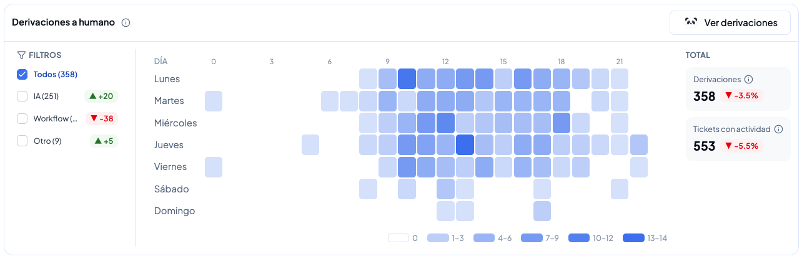
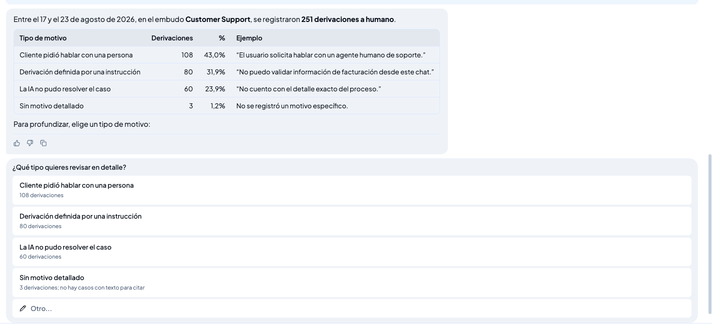
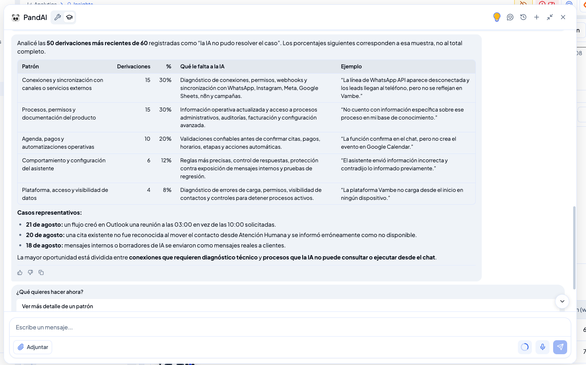

# Derivaciones a humano: entiende cuándo y por qué la IA pasa una conversación a un ejecutivo

Cada vez que la IA mueve una conversación a una etapa de atención humana está dejando una señal: un cliente que pidió hablar con una persona, una instrucción que tú mismo definiste, o una pregunta que no logró responder. Vistas de a una, esas derivaciones parecen casos aislados. Vistas en conjunto, muestran con precisión en qué momentos tu operación necesita cobertura humana y qué le falta a tu asistente para resolver más por su cuenta.

La sección **Derivaciones a humano**, dentro de Insights, reúne esa información en un solo lugar: cuántas derivaciones hubo, en qué horarios se concentran y por qué motivo ocurrió cada una. En este artículo verás cómo leer cada parte y cómo convertirla en decisiones concretas sobre los turnos de tus ejecutivos y el contenido de tu Knowledge Base.

> 💡 **Para entrar:** en el menú de la izquierda, ve a **Servicio** y luego a **Insights**. Abre la pestaña **Métricas** y baja hasta la sección **Derivaciones a humano**.

***

## Todo lo que ves corresponde a un embudo y a una semana

Insights analiza un embudo a la vez. En el panel izquierdo eliges el **embudo** que quieres revisar y la **semana** del análisis, y toda la sección se recalcula con esos datos. Por eso, antes de sacar conclusiones, conviene confirmar que estás mirando el embudo correcto: las derivaciones de Customer Support cuentan una historia distinta a las de un embudo comercial.

***

## Cuántas derivaciones hubo y de dónde vienen

A la derecha de la sección encontrarás los dos números que resumen el período. **Derivaciones** es el total de conversaciones que pasaron a atención humana en la semana. **Tickets con actividad** es el volumen total de tickets que tuvieron movimiento en ese mismo período, y sirve como referencia para dimensionar el dato: 358 derivaciones sobre 553 tickets con actividad no significan lo mismo que 358 sobre 5.000. Ambos indicadores muestran la variación respecto de la semana anterior, para que veas si la tendencia sube o baja.

A la izquierda, los **filtros** separan las derivaciones según su origen:

* **IA:** la conversación fue derivada por decisión del asistente.
* **Workflow:** la derivación la produjo un flujo automatizado que configuraste.
* **Otro:** derivaciones originadas fuera de los dos casos anteriores.

Cada filtro muestra su propio conteo y su variación semanal, así que puedes detectar de inmediato si el alza de derivaciones viene del asistente o de tus automatizaciones. Al seleccionar un filtro, el mapa de calor se ajusta solo a ese grupo.

***

## En qué horarios se concentran

El mapa de calor cruza los días de la semana con las horas del día: cada fila es un día, de lunes a domingo, y cada columna una hora, de las 0 a las 23. La intensidad del color indica cuántas derivaciones ocurrieron en ese bloque, según la escala que aparece bajo el gráfico. Los bloques más oscuros son tus horas críticas.

Leer este mapa toma segundos y responde una pregunta muy concreta: ¿en qué momentos llegan clientes que necesitan a una persona y no hay nadie disponible para atenderlos? Si ves concentración los miércoles al mediodía pero tu equipo refuerza los lunes por la mañana, tienes una desalineación clara entre la demanda real y tu planificación de turnos.

***

## Por qué la IA derivó cada conversación

El botón **Ver derivaciones** abre el análisis de motivos en PandAI, que agrupa las derivaciones del período en categorías y te muestra cuánto pesa cada una. En el ejemplo de la semana del 17 al 23 de agosto en el embudo Customer Support, las 251 derivaciones se ordenan así:

| Tipo de motivo                          | Derivaciones | %      |
| --------------------------------------- | ------------ | ------ |
| Cliente pidió hablar con una persona    | 108          | 43,0 % |
| Derivación definida por una instrucción | 80           | 31,9 % |
| La IA no pudo resolver el caso          | 60           | 23,9 % |
| Sin motivo detallado                    | 3            | 1,2 %  |

Cada categoría viene con un ejemplo real de la conversación que la originó, lo que evita tener que adivinar a qué se refiere. La distinción más importante está entre las dos primeras y la tercera: si un cliente pide hablar con una persona o si una instrucción tuya ordena derivar, el asistente está funcionando como corresponde. Cuando la IA no pudo resolver el caso, en cambio, hay una brecha real que puedes cerrar.

> 💡 El detalle del motivo de cada derivación está disponible para asistentes V3.

### Profundiza en un motivo

Debajo de la tabla puedes elegir un tipo de motivo para revisarlo en detalle. PandAI toma ese grupo y lo descompone en patrones, indicando en cada uno **qué le falta a la IA** para resolverlo y mostrando ejemplos textuales de los casos.

Al abrir "La IA no pudo resolver el caso" del ejemplo anterior, los 60 casos se agrupan en patrones como conexiones y sincronización con canales o servicios externos, procesos y documentación del producto, o agenda, pagos y automatizaciones operativas. Junto a cada patrón aparece la información que el asistente necesitaba y no tenía: por ejemplo, diagnóstico de conexiones y permisos con WhatsApp o Google Sheets, o acceso a procesos administrativos y de facturación. El análisis cierra con casos representativos fechados, que puedes ir a revisar directamente en la conversación.

Cuando un motivo agrupa muchas derivaciones, PandAI analiza las más recientes y te indica el tamaño de la muestra sobre la que calculó los porcentajes. Es un detalle importante al momento de citar cifras: los porcentajes describen esa muestra, no necesariamente el total del período.

***

## Qué hacer con esta información

### Ajustar la cobertura de tus ejecutivos

El mapa de calor te dice exactamente dónde poner las horas de tu equipo. Identifica los bloques con mayor concentración de derivaciones y contrástalos con los turnos que tienes hoy: si hay demanda sostenida en horarios sin cobertura, esos clientes están esperando más de lo necesario. Filtrar por origen **IA** ayuda a separar la demanda genuina de atención humana del ruido que generan las automatizaciones.

### Cerrar las brechas de tu asistente

Las derivaciones agrupadas bajo "La IA no pudo resolver el caso" son tu lista de trabajo priorizada. Cada patrón apunta a una de dos acciones: sumar contenido a la Knowledge Base cuando falta información, o ajustar la configuración e instrucciones del asistente cuando el problema está en cómo responde. Al revisarlo semana a semana, verás cómo ese motivo pierde peso frente a los demás a medida que el asistente resuelve más casos por sí solo.

***

## En resumen

Derivaciones a humano convierte un evento cotidiano —una conversación que cambia de etapa— en dos decisiones concretas: cuándo necesitas gente disponible y qué necesita aprender tu asistente. El mapa de calor ordena tus turnos con datos reales de demanda, y el análisis de motivos te entrega, semana a semana, una lista clara de lo que le falta a la IA para resolver más por su cuenta. Revisarlo con cada nuevo análisis semanal es la forma más directa de mejorar la atención sin agregar carga a tu equipo.
