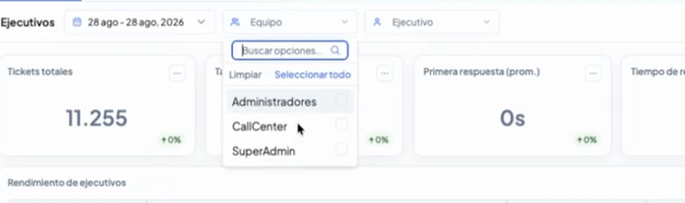
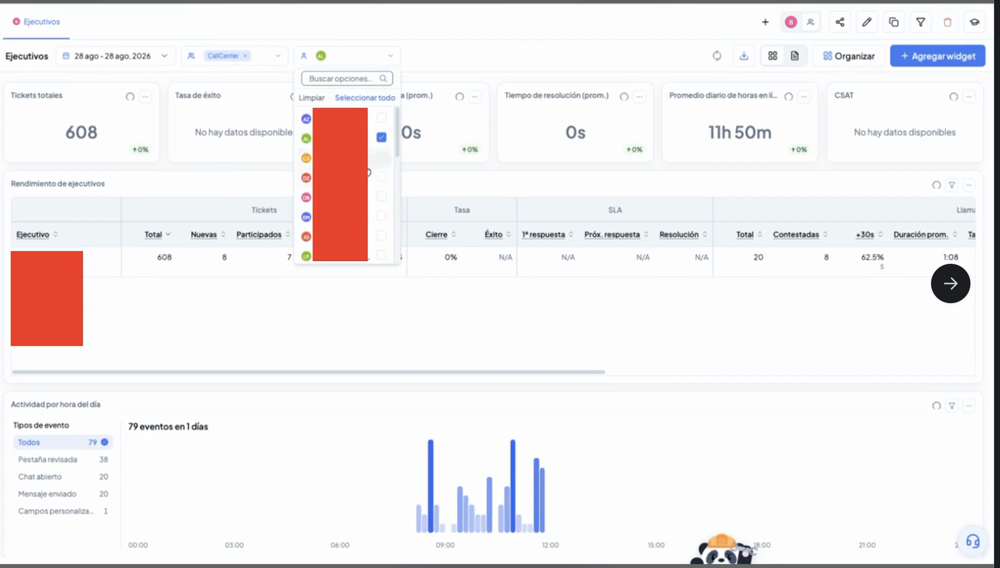
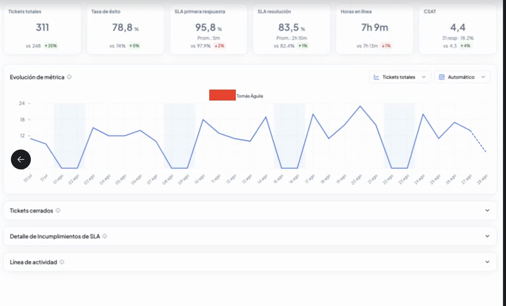
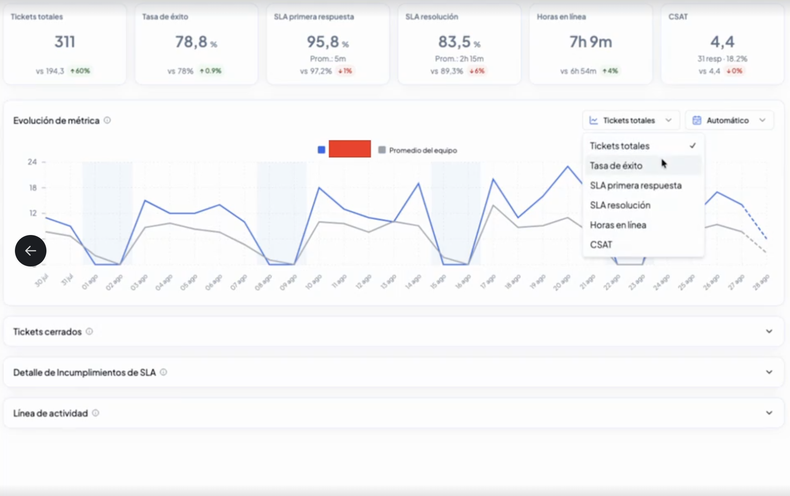
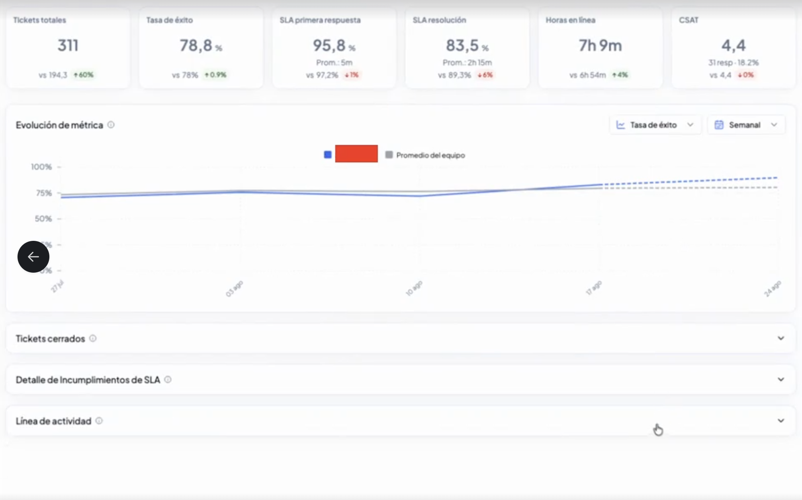

# Rendimiento: el desempeño de tu equipo en widgets listos para usar

Todo tu equipo de Ejecutivos gestiona tickets, responde dentro de SLA y deja —o no— clientes contentos, pero esa información suele estar repartida en varios reportes distintos. **Rendimiento** reúne lo esencial de cómo está trabajando tu equipo en un mismo dashboard: cuántos tickets se resuelven, qué tan rápido, quién está conectado y qué tan satisfechos quedan tus clientes, todo en widgets pensados para leerse de un vistazo.

> Para entrar: en el menú de la izquierda, ve a **Servicio** y luego a **Rendimiento**.

***

### Cómo está organizado

Como el resto de los dashboards de Servicio, Rendimiento se filtra por rango de fechas —por ejemplo, **Últimos 7 días**— y puede tener más de una vista guardada; la pestaña **Customer Support Default** de la captura es un ejemplo de una de esas vistas. Todo lo que ves dentro se actualiza según el período y la vista que elijas.

Junto al selector de período encontrarás dos filtros rápidos, **Equipo** y **Ejecutivo**, que acotan el dashboard al instante: elige uno o varios equipos, o busca directamente a la persona que te interesa, y los widgets, los drill-downs, el PDF y el export a Excel se ajustan al momento. Es un filtro temporal, así que puedes acotar la vista para revisar un caso puntual sin tocar las vistas guardadas del dashboard.

Al final del dashboard encontrarás dos widgets pensados específicamente para leer el desempeño de tu equipo sin cruzar reportes por tu cuenta: un **widget agrupado** con las métricas clave del equipo, y un **widget de actividad** para revisar qué pasó en cualquier bloque de tiempo del día.

***

### El widget agrupado: el resumen de tu equipo, a tu manera

El widget agrupado junta varias métricas en un solo bloque visual, y tú eliges cuáles mostrar. En vez de una fila de números sueltos, cada métrica se presenta como su propio gráfico:

* **Timeline de tickets manejados por humano**, junto con el promedio de mensajes por ticket.
* **Donut de tasa de éxito**, con el detalle de tickets ganados y perdidos.
* **Tarjeta resumen de SLA**, con los tiempos de primera respuesta, próxima respuesta y resolución.
* **Timelines de disponibilidad**, con el promedio diario de horas en línea de tu equipo.
* **Medidor de CSAT / NPS**, con el puntaje de satisfacción del período.
* **Desglose de eventos en Vambe**, con el detalle de qué está haciendo tu equipo dentro de Vambe (chats abiertos, mensajes enviados, etapas cambiadas y más).


Puedes agregar varios widgets agrupados en el mismo dashboard y elegir un Ejecutivo distinto en cada uno. Es una forma sencilla de comparar el desempeño entre Ejecutivos mientras llega la función de comparación dedicada.


#### Disponibilidad: quién estuvo conectado y cuánto

El timeline de disponibilidad muestra, para el período que elijas, quién de tu equipo estuvo conectado y por cuánto tiempo. Si dejas el período en los últimos 7 días, se suman todas las personas que estuvieron conectadas en algún momento de esa semana; si lo cambias a, por ejemplo, solo hoy, verás únicamente la disponibilidad de ese día.

***

### Actividad por bloques de tiempo: qué hizo tu equipo y cuándo

El widget de actividad muestra el volumen de eventos de tu equipo dividido en bloques de tiempo a lo largo del día. Al hacer clic sobre cualquier barra se abre el detalle de qué eventos ocurrieron exactamente en ese bloque, útil para revisar, por ejemplo, qué estaba haciendo tu equipo durante un pico de actividad o un tramo con poca respuesta.

***

### La tabla de Ejecutivos: elige qué columnas ver

Debajo de los widgets encontrarás la tabla de rendimiento por Ejecutivo, con los tickets, tasas, cumplimiento de SLA, plantillas enviadas, horas en línea y CSAT de cada uno. Puedes elegir qué columnas mostrar según lo que te interese: si tu cuenta no tiene configurado SLA o CSAT, por ejemplo, puedes ocultar esas columnas y quedarte solo con la información que sí usas.

#### Las columnas de SLA: el cumplimiento como dato principal

Las tres columnas de SLA —**1ª respuesta**, **Próx. respuesta** y **Resolución**— muestran como dato principal el porcentaje de cumplimiento de cada Ejecutivo, y justo debajo, en tamaño menor, el tiempo promedio. Así sabes de inmediato si se está cumpliendo el objetivo y, en la misma celda, qué tan rápido se está respondiendo. Al ordenar por cualquiera de estas columnas, el orden sigue el porcentaje de cumplimiento.

#### Plantillas: la gestión saliente de cada Ejecutivo

La columna **Plantillas** cuenta las plantillas de WhatsApp que envió cada Ejecutivo durante el período seleccionado, sin considerar las que se envían desde campañas. Te sirve para ver quién está haciendo gestión saliente y con qué intensidad, y para mantener a la vista el volumen de envíos de tu equipo.


En los dashboards que ya tienes creados, activa esta columna desde la configuración del widget, en la sección **Columnas**. En los dashboards nuevos viene incluida por defecto.


***

### El detalle de cada Ejecutivo

Al hacer clic en cualquier fila de la tabla de Ejecutivos se abre el detalle de esa persona: sus métricas desglosadas, su evolución en el período y sus incumplimientos de SLA, todo en una misma vista.

#### Comparar con: el punto de referencia que tú eliges

Cada tarjeta de métrica se compara por defecto contra el **promedio del equipo**, pero puedes cambiar el punto de referencia con el selector **Comparar con**, eligiendo el **período anterior** o a otro **Ejecutivo** específico. Junto al valor de la tarjeta verás el del punto de comparación y la diferencia entre ambos, en verde si el Ejecutivo queda por sobre ese punto y en rojo si queda por debajo.

#### Evolución de métrica: el mismo número, a lo largo del período

El gráfico de **Evolución de métrica** muestra cómo se movió una métrica específica durante el período seleccionado: **Tickets totales**, **Tasa de éxito**, **CSAT**, **Horas en línea**, **SLA primera respuesta** o **SLA resolución**, según cuál elijas desde el selector sobre el gráfico. La línea del Ejecutivo se dibuja junto a la del punto que escogiste en Comparar con, para que el contraste se vea de un vistazo y no solo en el número de la tarjeta.

También puedes agrupar la evolución por día o por semana, según qué tan al detalle quieras revisar el período.

#### Incumplimientos de SLA en el detalle individual

Debajo del gráfico de evolución encontrarás la tabla de **Incumplimientos de SLA**, con el detalle de los tickets de ese Ejecutivo que no cumplieron el tiempo de respuesta o resolución comprometido — la misma tabla que puedes ver a nivel de equipo en el dashboard general de SLA, aquí acotada a los tickets de esta persona.\
📄 [Service Level Agreement (SLA): Gestión y Cumplimiento de Tiempos de Respuesta](https://academy.vambe.ai/analitica-de-datos/service-level-agreement-sla-gestion-y-cumplimiento-de-tiempos-de-respuesta)

***

### En resumen

Rendimiento te da el pulso de tu equipo sin salir del dashboard ni cruzar reportes por tu cuenta: tickets, tasa de éxito, SLA, disponibilidad y satisfacción, todo en el mismo lugar y filtrado igual que el resto de tu analítica. Úsalo para detectar rápido quién tiene espacio para más carga, quién está dejando clientes más contentos, y dónde vale la pena ajustar la operación del día a día.
