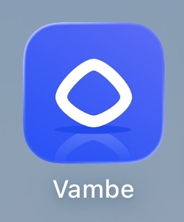
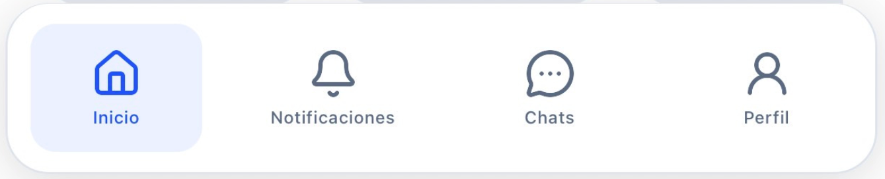

# App Móvil de Vambe: Tu Centro de Monitoreo y Gestión en Movimiento

<figure><figcaption></figcaption></figure>

Es fundamental entender su propósito principal: la app es un centro de monitoreo y respuesta. Mientras que la plataforma web es tu "cuartel general" para diseñar estrategias, flujos y asistentes, la aplicación móvil es tu herramienta táctica para el día a día, permitiéndote responder rápido y mantenerte al tanto de lo que ocurre con tus clientes en tiempo real.

#### ¿Qué puedes hacer en la App?

La aplicación está optimizada para la interacción directa y la supervisión de tu operación. Sus principales funcionalidades incluyen:

* **Chatear en tiempo real**: Enviar mensajes de texto, audios, imágenes, documentos y plantillas predefinidas.
* **Gestión de Tickets**: Cambiar la etapa del cliente en el embudo, asignar agentes responsables y añadir etiquetas (tags) para clasificar conversaciones.
* **Notificaciones Push**: Recibir alertas inmediatas en tu dispositivo cuando un cliente requiere atención o entra en una etapa crítica.
* **Tareas y Notas**: Crear tareas de seguimiento con fechas específicas y dejar notas internas rápidas para dar contexto a tu equipo.
* **Filtrado Avanzado**: Buscar y organizar conversaciones por embudo, etapa, estado de atención (atendido/no atendido) o agente asignado.
* **Soporte** con Luis directamente desde la app
* **Deep Links:** abrir conversaciones desde enlaces externos

***

#### Navegando por la Aplicación

<figure><figcaption></figcaption></figure>

Para dominar la aplicación móvil de Vambe, hemos dividido la documentación en las cuatro áreas clave de la interfaz. Haz clic en cada sección para ver el detalle paso a paso:

**1. Home e Inicio Rápido**

Es tu panel de aterrizaje. Aquí encontrarás botones de acceso rápido a conversaciones y configuraciones, además de accesos directos a tus embudos más importantes. Es el punto de partida para ver el estado general de tu operación.

**2. Centro de Notificaciones**

Aprende a gestionar qué te avisa la app. Desde mensajes nuevos hasta alertas generadas por IA que resumen el contexto de un cliente antes de que abras el chat.

* _Clave:_ Diferenciar entre notificaciones al dispositivo y notificaciones dentro de la plataforma.

**3. El Chat y Gestión de Clientes**

El corazón de la app. Aquí aprenderás a:

* Usar filtros para encontrar conversaciones específicas.
* Responder mensajes (respetando la ventana de 24 horas de WhatsApp).
* Enviar audios y archivos.
* Mover clientes de etapa y asignar responsables.

**4. Perfil y Soporte**

Configura tus preferencias personales, activa o desactiva las notificaciones en tu teléfono y aprende a usar la herramienta de "Reportar un problema", que te conecta directamente con el equipo de producto para feedback o reporte de errores.

***

#### Disponibilidad

La aplicación de Vambe está disponible para los dos sistemas operativos principales. Asegúrate de tenerla actualizada para acceder a las últimas funciones (como la grabación de audios en Android y iOS).

* iOS (iPhone)
* Android

***

#### Importante: Qué NO se gestiona desde la App

Para evitar confusiones y garantizar la seguridad de tu operación, ciertas configuraciones estructurales están reservadas exclusivamente para la plataforma web.

Desde la App NO podrás:

* Crear cuentas: No existe registro desde la app; debes ingresar con una cuenta ya creada y con el onboarding completado en la web.
* Editar Asistentes: La configuración de los bots, prompts y personalidad se gestiona solo en la web.
* Modificar Embudos (Pipelines): No puedes crear etapas, editar la estructura de tus embudos ni cambiar configuraciones de la organización.
* Configuraciones avanzadas: Integraciones, facturación y ajustes profundos de la cuenta.

> Nota: Esta decisión de diseño busca que la app sea ligera y eficiente para la respuesta rápida, evitando cambios accidentales en la configuración crítica de tu negocio.

***

### Secciones principales de la aplicación

<table data-card-size="large" data-view="cards"><thead><tr><th></th><th data-hidden data-card-cover data-type="image">Cover image</th><th data-hidden data-card-target data-type="content-ref"></th></tr></thead><tbody><tr><td><h4>INICIO</h4></td><td><a href=".gitbook/assets/Cover-Inicio.png">Cover-Inicio.png</a></td><td><a href="secciones-de-la-aplicacion/home-tu-panel-de-control-y-acceso-rapido.md">home-tu-panel-de-control-y-acceso-rapido.md</a></td></tr><tr><td><h4>Centro de Notificaciones</h4></td><td><a href=".gitbook/assets/Cover-notificaciones.png">Cover-notificaciones.png</a></td><td><a href="secciones-de-la-aplicacion/centro-de-notificaciones-tu-bandeja-de-entrada-inteligente.md">centro-de-notificaciones-tu-bandeja-de-entrada-inteligente.md</a></td></tr><tr><td><h4>Chats</h4></td><td><a href=".gitbook/assets/Cover-chat.png">Cover-chat.png</a></td><td><a href="secciones-de-la-aplicacion/chats-conversaciones-multimedia-y-tickets.md">chats-conversaciones-multimedia-y-tickets.md</a></td></tr><tr><td><h4>Perfil</h4></td><td><a href=".gitbook/assets/Cover-perfil.png">Cover-perfil.png</a></td><td><a href="secciones-de-la-aplicacion/perfil-y-soporte-configuracion-de-usuario.md">perfil-y-soporte-configuracion-de-usuario.md</a></td></tr></tbody></table>
