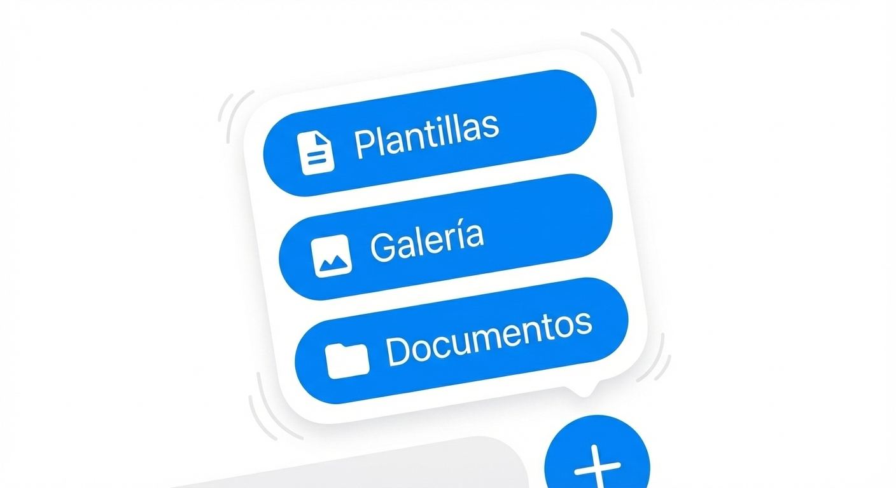

# Chats: Conversaciones, Multimedia y Tickets

Para acceder, pulsa el botón "Conversaciones" en el Home o el icono de globo de chat en la barra de navegación inferior.

<figure><figcaption></figcaption></figure>

#### 1. Organización y Filtros

Vambe te ofrece tres niveles de filtrado para que encuentres exactamente lo que buscas sin distracciones.

**A. Filtros Superiores (Embudos y Canales)**

<figure><figcaption></figcaption></figure>

En la parte más alta de la pantalla verás las opciones de navegación macro:

1. **Selector de Embudos**: Por defecto verás "Todos los embudos". Al pulsarlo, se despliega una lista para que selecciones un proceso específico (ej: _Ventas MX_). Al hacerlo, la lista de chats mostrará solo los clientes que se encuentran en ese embudo.
2. **Filtro por etapas**: Puedes filtrar por las distintas etapas que están en los embudos seleccionados.
3. **Filtro de Canales**: Debajo del selector, tienes botones rápidos para filtrar por origen (ej: _Solo WhatsApp_, _Solo Messenger_). Si quieres ver todo mezclado, mantén seleccionado "Todos los canales".

**B. Buscador Inteligente**

<figure><figcaption></figcaption></figure>

La barra de búsqueda en Vambe es potente. No solo busca por el Nombre del contacto, sino que también puedes encontrar conversaciones buscando por:

* **Número de teléfono**.
* **Nombre del contacto**
* **Contenido del mensaje**: Encuentra palabras específicas dentro del historial de la conversación.

**C. Filtros Avanzados (Botón Azul)**

<figure><figcaption></figcaption></figure>

A la derecha de la barra de búsqueda encontrarás el botón de Configuración de Filtros (icono de ajustes). Este menú te permite refinar la lista con precisión quirúrgica:

* **Estado de Atención**:
  * _Todos / Atendidos / No atendidos / Atendidos por IA / IA ausente / No leídos._
* **Tiempo**:
  * _Por defecto / Más antiguo / Más reciente._
* **Tipo de Etapa**:
  * _Todas / Etapa IA / Etapa humana._

#### 2. La Tarjeta del Ticket: Información a primera vista

<figure><figcaption></figcaption></figure>

Antes de abrir una conversación, la tarjeta del cliente en la lista ya te da toda la información crítica:

* **Identidad**: Nombre del cliente y sus iniciales.
* **Estado**: Etiqueta visual de "Atendido" o "No atendido" (en rojo).
* **Canal**: Icono pequeño indicando la red social (ej: logo de WhatsApp).
* **Agente**: Círculo pequeño con las iniciales del agente asignado al caso (ej: _YA_).
* **Contexto**:
  * Último mensaje enviado por el cliente.
  * Hora del último mensaje.
  * Etiquetas (Tags): Visualización rápida de etiquetas importantes (ej: _Chile_, _Soporte_).
* **Etapa Actual**: Una barra azul indica en qué etapa del embudo se encuentra (ej: _Nuevo Ticket - Soporte_).

#### 3. Dentro de la Conversación

<figure><figcaption></figcaption></figure>

Al pulsar sobre un ticket, entras al área de trabajo. Aquí dispones de tres pestañas funcionales en la parte inferior:

<figure><figcaption></figcaption></figure>

1. **Responder**: El chat estándar para hablar con el cliente.
2. **Notas Internas**: Un espacio privado donde puedes dejar comentarios que solo tu equipo verá. Ideal para dar contexto a otros agentes.
3. **Tareas**: Para crear recordatorios y asignaciones vinculadas a este cliente.

**Envío de Audios con Revisión**

Una funcionalidad clave en la app móvil es la gestión de voz. Al grabar un audio:

* Puedes pulsar el micrófono para grabar un audio.
* Importante: Antes de enviarlo, la app te permite escuchar una previsualización. Así aseguras que el mensaje sea claro y correcto antes de que le llegue al cliente.

**Enviando Multimedia y Archivos (+)**

<figure><figcaption></figcaption></figure>

A la izquierda de la barra de escritura encontrarás un botón con el símbolo (+). Al pulsarlo, se desplegará un menú con herramientas para enriquecer tu respuesta:

*   📄 Plantillas: Te permite enviar mensajes pre-aprobados (HSM) para iniciar conversaciones o responder rápidamente.

    > Nota: Solo aparecerán las plantillas que ya tengas configuradas en tu cuenta. _¿No te aparecen? Revisa nuestra guía sobre_ [_\[Cómo crear plantillas aquí\]_](https://academy.vambe.ai/canal/plantillas/como-crear-plantillas)_._
* 🖼️ Galería: Abre la biblioteca de fotos de tu dispositivo para enviar imágenes o capturas de pantalla.
* 📁 Documentos: Te permite adjuntar y enviar archivos PDF u otros documentos almacenados en tu teléfono.

#### 4. Perfil del Cliente

Si necesitas más detalles o quieres cambiar el estado del cliente manualmente, pulsa sobre el Nombre del Cliente en la parte superior del chat. Esto abrirá la ficha de perfil.

<figure><figcaption></figcaption></figure>

Desde aquí puedes visualizar y editar:

* **Etapa**: Mueve al cliente a otra etapa del embudo manualmente.
* **Agentes**: Asigna o cambia el responsable del ticket.
* **Tags**: Agrega o quita etiquetas para clasificar al contacto.
* **Canal**: Confirma el canal de origen y el número de teléfono.
