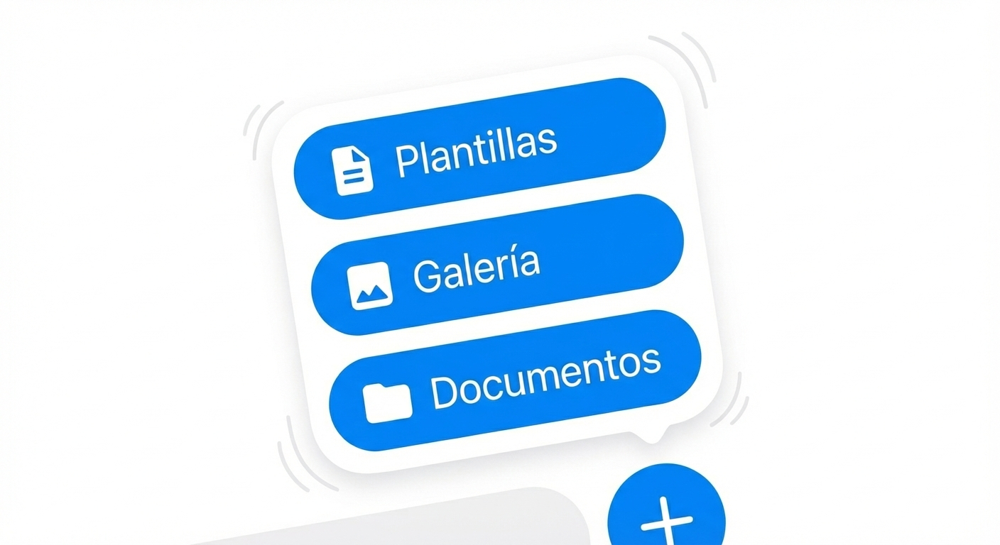
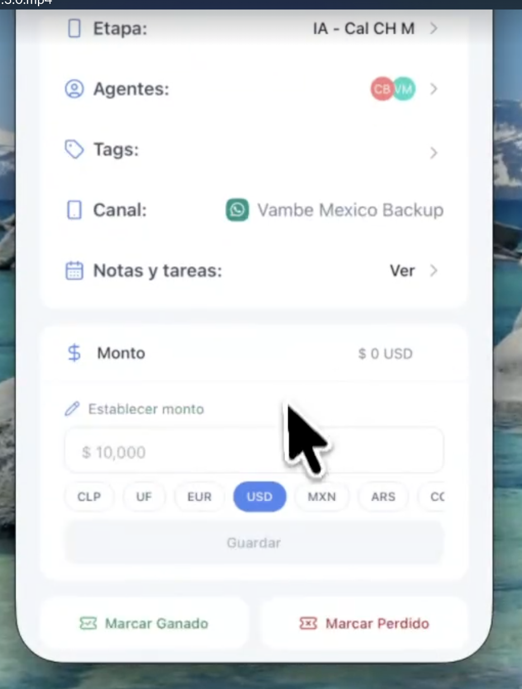

# Chats: Conversaciones, Multimedia y Tickets

Para acceder, pulsa el botón "Conversaciones" en el Home o el icono de globo de chat en la barra de navegación inferior.

<figure><figcaption></figcaption></figure>

#### Conceptos clave: contacto, ticket, conversación y chat

Antes de entrar a la gestión, conviene tener claros cuatro términos que usamos en toda la aplicación. Se relacionan entre sí, pero no significan lo mismo.


En una frase: un **contacto** puede tener varios **tickets** a lo largo del tiempo; cada ticket contiene una **conversación**, y el **chat** es la pestaña desde donde respondes esa conversación.


* **Contacto (o cliente):** es la persona con la que hablas. Representa su perfil **permanente** dentro de Vambe: nombre, teléfono, correo, ciudad, preferencias y demás datos que no cambian de un caso a otro. Un mismo contacto se mantiene aunque abra varios casos distintos con el tiempo.
* **Ticket:** representa **cada caso o gestión activa con un contacto**. Mientras el contacto es permanente, el ticket describe la situación puntual: en qué etapa del embudo está, el tipo de ticket, el ejecutivo asignado y los datos propios del caso (producto que cotiza, fecha de visita, monto, motivo de atención, etc.). Un contacto puede acumular varios tickets a lo largo del tiempo.
* **Conversación:** es el **hilo de mensajes** intercambiados con el contacto dentro de un ticket: lo que escribe el cliente, lo que responde el asistente de IA o el ejecutivo, los audios, imágenes y archivos. Es el historial de comunicación del caso, y sobre él puedes buscar por contenido del mensaje.
* **Chat:** es la **pestaña donde respondes** al contacto y llevas adelante la conversación. En la vista de un ticket, el chat es el espacio estándar para hablar con el cliente, separado de las Notas Internas (privadas para tu equipo) y las Tareas.

***

#### 1. Organización y Filtros

Vambe te ofrece tres niveles de filtrado para que encuentres exactamente lo que buscas sin distracciones.

**A. Filtros Superiores (Embudos y Canales)**

<figure><figcaption></figcaption></figure>

En la parte más alta de la pantalla verás las opciones de navegación macro:

1. **Selector de Embudos**: Por defecto verás "Todos los embudos". Al pulsarlo, se despliega una lista para que selecciones un proceso específico (ej: _Ventas MX_). Al hacerlo, la lista de chats mostrará solo los clientes que se encuentran en ese embudo.
2. **Filtro por etapas**: Puedes filtrar por las distintas etapas que están en los embudos seleccionados.
3. **Filtro de Canales**: Debajo del selector, tienes botones rápidos para filtrar por origen (ej: _Solo WhatsApp_, _Solo Messenger_). Si quieres ver todo mezclado, mantén seleccionado "Todos los canales".

**B. Buscador Inteligente**

<figure><figcaption></figcaption></figure>

La barra de búsqueda en Vambe es potente. No solo busca por el Nombre del contacto, sino que también puedes encontrar conversaciones buscando por:

* **Número de teléfono**.
* **Nombre del contacto**
* **Contenido del mensaje**: Encuentra palabras específicas dentro del historial de la conversación.

**C. Filtros Avanzados (Botón Azul)**

<figure><figcaption></figcaption></figure>

A la derecha de la barra de búsqueda encontrarás el botón de Configuración de Filtros (icono de ajustes). Este menú te permite refinar la lista con precisión quirúrgica:

* **Estado de Atención**:
  * _Todos / Atendidos / No atendidos / Atendidos por IA / IA ausente / No leídos._
* **Tiempo**:
  * _Por defecto / Más antiguo / Más reciente._
* **Tipo de Etapa**:
  * _Todas / Etapa IA / Etapa humana._

**D. Filtros persistentes y favoritos**

Los filtros de la aplicación móvil son los mismos que los de la versión web de Vambe y se comportan igual: **persisten** entre sesiones, así que al volver a la app encuentras la vista tal como la dejaste.

Cuando armas una combinación que usas seguido, puedes **guardarla como favorita** y recuperarla desde el icono de estrella en la parte superior de la pantalla. Es la forma más rápida de saltar entre tus vistas de trabajo habituales sin volver a configurar los filtros cada vez.

#### 2. La Tarjeta del Ticket: Información a primera vista

<figure><figcaption></figcaption></figure>

Antes de abrir una conversación, la tarjeta del cliente en la lista ya te da toda la información crítica:

* **Identidad**: Nombre del cliente y sus iniciales.
* **Estado**: Etiqueta visual de "Atendido" o "No atendido" (en rojo).
* **Canal**: Icono pequeño indicando la red social (ej: logo de WhatsApp).
* **Ejecutivo**: Círculo pequeño con las iniciales del ejecutivo asignado al caso (ej: _YA_). Los ejecutivos pueden ser asignados automáticamente mediante estrategias avanzadas basadas en reglas y análisis de IA contextual. [Más información sobre asignación automática aquí.](https://academy.vambe.ai/usuarios/notificaciones/como-elegir-que-agente-recibe-un-ticket-y-activar-notificaciones-automaticas)
* **Contexto**:
  * Último mensaje enviado por el cliente.
  * Hora del último mensaje.
  * Etiquetas (Tags): Visualización rápida de etiquetas importantes (ej: _Chile_, _Soporte_).
* **Etapa Actual**: Una barra azul indica en qué etapa del embudo se encuentra (ej: _Nuevo Ticket - Soporte_).

#### 3. Dentro de la Conversación

<figure><figcaption></figcaption></figure>

Al pulsar sobre un ticket, entras al área de trabajo. Aquí dispones de tres pestañas funcionales en la parte inferior:

<figure><figcaption></figcaption></figure>

1. **Responder**: El chat estándar para hablar con el cliente.
2. **Notas Internas**: Un espacio privado donde puedes dejar comentarios que solo tu equipo verá. Ideal para dar contexto a otros ejecutivos.
3. **Tareas**: Para crear recordatorios y asignaciones vinculadas a este cliente.

**Envío de Audios con Revisión**

Una funcionalidad clave en la aplicación móvil es la gestión de voz. Al grabar un audio:

* Puedes pulsar el micrófono para grabar un audio.
* Importante: Antes de enviarlo, la aplicación te permite escuchar una previsualización. Así aseguras que el mensaje sea claro y correcto antes de que le llegue al cliente.

**Enviando Multimedia y Archivos (+)**

<figure><figcaption></figcaption></figure>

A la izquierda de la barra de escritura encontrarás un botón con el símbolo (+). Al pulsarlo, se desplegará un menú con herramientas para enriquecer tu respuesta:

*   📄 Plantillas: Te permite enviar mensajes pre-aprobados (HSM) para iniciar conversaciones o responder rápidamente.

    > Nota: Solo aparecerán las plantillas que ya tengas configuradas en tu cuenta. _¿No te aparecen? Revisa nuestra guía sobre_ [_\[Cómo crear plantillas aquí\]_](https://academy.vambe.ai/canal/plantillas/como-crear-plantillas)_._
* 🖼️ Galería: Abre la biblioteca de fotos de tu dispositivo para enviar imágenes o capturas de pantalla.
* 📹 Videos: Puedes enviar videos de 5 o 10 segundos para añadir dinamismo a tus conversaciones. No hay límite en el número de secuencias o variaciones de video que puedes usar.
* 📁 Documentos: Te permite adjuntar y enviar archivos PDF u otros documentos almacenados en tu teléfono.

**Notas del sistema dentro del hilo**

Además de los mensajes, la conversación muestra todo lo que ocurrió alrededor del caso: la ejecución de un workflow, una reunión agendada, una tarea creada, un formulario respondido o el detalle de una llamada.

Cada una de estas notas es interactiva: al pulsarla se despliega su información completa, sin que tengas que abrir la versión web para entender qué pasó. Así puedes retomar un ticket que avanzó automáticamente o que gestionó otro miembro del equipo con el contexto entero a la vista.

#### 4. Perfil del Cliente

Si necesitas más detalles o quieres cambiar el estado del cliente manualmente, pulsa sobre el Nombre del Cliente en la parte superior del chat. Esto abrirá la ficha de perfil.

<figure><figcaption></figcaption></figure>

Desde aquí puedes visualizar y editar:

* **Etapa**: Mueve al cliente a otra etapa del embudo manualmente.
* **Ejecutivos**: Asigna o cambia el responsable del ticket.
* **Tags**: Agrega o quita etiquetas para clasificar al contacto.
* **Canal**: Confirma el canal de origen y el número de teléfono.
* **Notas y tareas**: Accede al detalle de las notas internas y tareas asociadas al ticket.

**Monto del ticket**

<figure><figcaption>
Monto, moneda y cierre del ticket desde la ficha del cliente
</figcaption></figure>

En la ficha encontrarás el **Monto** asociado al ticket. Si el asistente no lo capturó durante la conversación, puedes establecerlo tú: pulsa **Establecer monto**, escribe la cifra, elige la moneda (CLP, UF, EUR, USD, MXN, ARS y otras) y pulsa **Guardar**.

Mantener el monto al día es lo que permite que la analítica de embudo refleje el valor real de tu pipeline.

**Lead Score**

La ficha muestra el **Lead Score** que Vambe le ha otorgado al contacto, es decir, qué tan calificado está según su comportamiento y sus respuestas. Te sirve para priorizar a quién contactar primero cuando tienes varios tickets abiertos.

**Cerrar el ticket: Ganado o Perdido**

Al final de la ficha están los botones **Marcar Ganado** y **Marcar Perdido**. Con ellos cierras el caso desde el celular y dejas registrado su resultado, que es el dato que alimenta tus tasas de conversión.

***

#### Llamar al contacto

Desde la parte superior del chat también puedes llamar al cliente con los números comerciales de tu empresa. Revisa la guía de [Llamadas desde la app móvil](llamadas-desde-la-app-movil-contacta-a-tus-clientes-estes-donde-estes.md) para conocer el flujo completo.
