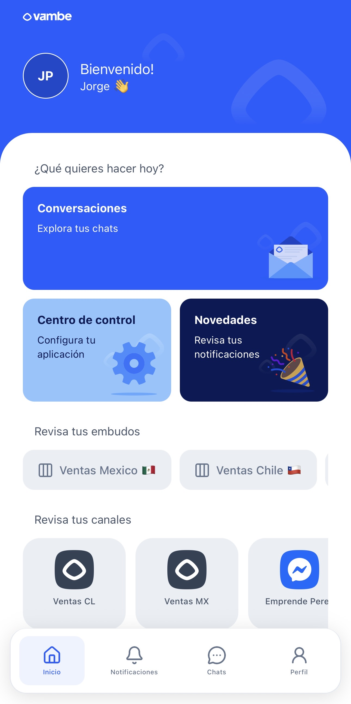

# Home: Tu Panel de Control y Acceso Rápido

<figure><figcaption></figcaption></figure>

#### 1. ¿Qué quieres hacer hoy? (Tarjetas Principales)

En la parte superior verás tres grandes tarjetas de colores. Son tus accesos generales:

* 📨 **Conversaciones**: _(Botón Azul Claro)_ Te lleva directamente a tu bandeja de entrada general. Al pulsar aquí, verás todos los chats sin ningún filtro aplicado. Es ideal para tener una visión global de toda la operación.
* ⚙️ **Centro de Control**: _(Botón Azul Pastel)_ Es el acceso a la configuración de tu aplicación. Desde aquí podrás gestionar tu perfil, ajustar preferencias y reportar problemas.
* 🎉 **Novedades**: _(Botón Azul Oscuro)_ Este es tu Centro de Notificaciones. Aquí revisarás las alertas de mensajes nuevos, asignaciones y avisos importantes. La app agrupa aquí todo lo que requiere tu atención inmediata.

#### 2. Revisa tus Embudos (Filtros por Proceso)

Justo debajo de las tarjetas, encontrarás una lista horizontal con tus Embudos (Pipelines) activos (por ejemplo: _Ventas México_, _Ventas Chile_, _Post-Venta_).

¿Para qué sirve esto? Es un atajo para la velocidad operativa. En lugar de entrar a la bandeja de entrada y buscar manualmente el filtro, tocas el nombre del embudo y la app te lleva a los chats filtrando automáticamente solo los clientes que están en ese proceso comercial.

#### 3. Revisa tus Canales (Filtros por Fuente)

En la sección inferior de la pantalla, verás cuadros con los iconos de las redes sociales conectadas (WhatsApp, Messenger, Instagram, etc.) y sus nombres (ej: _Ventas CL_, _Ventas MX_).

¿Cuál es la diferencia con los embudos? Mientras que los embudos filtran por "etapa del proceso", esta sección filtra por origen del mensaje.

* Caso de uso: Imagina que eres un agente que solo debe responder los mensajes que llegan al WhatsApp de Chile.
* Acción: En lugar de ver todos los mensajes mezclados, pulsas el botón "Ventas CL" en esta sección.
* Resultado: La app te llevará a la bandeja de entrada mostrándote únicamente las conversaciones provenientes de ese número o cuenta específica, ignorando el resto.

***

#### Barra de Navegación Inferior

Recuerda que, independientemente de dónde estés, siempre tendrás la barra inferior para volver a los puntos clave:

* Inicio: Vuelve a esta pantalla.
* Notificaciones: Acceso rápido a las novedades.
* Chats: Vuelve a tu última conversación o lista.
* Perfil: Tus ajustes de usuario.

***

####
