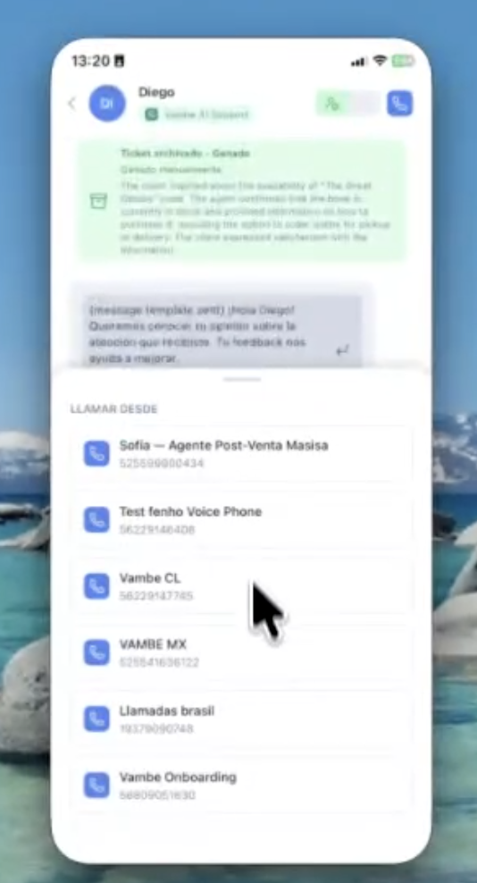

# Llamadas desde la app móvil: contacta a tus clientes estés donde estés

La app móvil de Vambe te permite llamar a tus clientes desde tu celular usando los números comerciales de tu empresa. No entregas tu número personal, no dependes de tu escritorio y cada llamada queda guardada en el ticket del contacto, con su duración, su resultado y su grabación.

Puedes llamar a un contacto que ya existe en Vambe o crear uno desde cero y llamarlo en el mismo flujo. En esta guía verás cómo verificar que tienes las llamadas habilitadas, cómo iniciar cada tipo de llamada y qué ocurre después de colgar.

> **Para entrar:** pulsa **Perfil** (icono de usuario) en la barra inferior para revisar tu estado de llamadas, y **Conversaciones** para llamar desde un ticket.

***

## Antes de empezar: revisa tu estado de llamadas

Las llamadas requieren que **Vambe Llamados** esté habilitado en tu cuenta. Para confirmarlo, entra a **Perfil** y busca la fila **Llamadas** dentro del bloque **Preferencias**.

Ahí verás dos indicadores, uno por cada vía de llamada:

* **Teléfono:** los números de telefonía tradicional conectados a tu cuenta.
* **WhatsApp:** los números de WhatsApp API habilitados para llamar.

Cada indicador tiene un punto de color que resume su estado. En **verde**, la vía está conectada y puedes llamar por ella. En **gris**, esa vía no logró conectarse y la app te avisará que no puedes usarla. Si tu cuenta no tiene Vambe Llamados habilitado, la misma fila te lo indicará.

<figure><figcaption>
Perfil: el estado de tus vías de llamada, junto a Notificaciones e Idioma
</figcaption></figure>

> 💡 Si un indicador aparece en gris o no ves la sección, contacta al equipo de soporte de Vambe o al ingeniero a cargo de tu cuenta para revisar la configuración.

***

## Llamar a un contacto existente

Esta es la vía más directa: si el cliente ya tiene un ticket abierto, la llamada nace desde su conversación y queda asociada a ese caso automáticamente.

1. Entra a **Conversaciones** y abre el ticket del cliente. También puedes buscarlo por nombre, número de teléfono o contenido del mensaje.
2. Pulsa el **icono de teléfono** en la parte superior del chat.
3. Se abrirá el panel **Llamar desde** con todos los números comerciales disponibles para ti.
4. Selecciona el número y la llamada comenzará.

<figure><figcaption>
Panel "Llamar desde": elige con qué número comercial saldrá la llamada
</figcaption></figure>

El número que elijas es el que verá tu cliente en su pantalla, así que conviene usar el que corresponda al país o a la línea de negocio del caso.

### Llamadas por WhatsApp y el permiso del cliente

WhatsApp exige que el cliente autorice las llamadas comerciales antes de que puedas marcarle. Vambe resuelve ese paso por ti.

Si eliges un número de WhatsApp y el contacto todavía no ha dado su autorización, Vambe le envía la **solicitud de permiso de llamada** por WhatsApp de forma automática. Una vez que el cliente la acepta, puedes llamarlo por ese número cuando lo necesites.

***

## Llamar a un contacto nuevo

Cuando el cliente todavía no existe en Vambe, puedes crearlo y llamarlo sin salir de la app.

1. Desde **Conversaciones**, pulsa la opción de **crear contacto**.
2. Ingresa el nombre y el número del contacto.
3. Selecciona desde qué número comercial quieres llamarlo.

> ⚠️ Las llamadas a contactos nuevos se realizan por números de telefonía tradicional, igual que en la versión web de Vambe. Si seleccionas un número de WhatsApp, Vambe enviará la solicitud de permiso de llamada al contacto; podrás llamarlo por WhatsApp una vez que la acepte.

***

## Durante la llamada

Cuando la llamada se conecta, la app muestra los controles habituales sobre la conversación:

* **Silenciar el micrófono** para hablar con tu equipo sin que el cliente te escuche.
* **Altavoz** para liberar las manos y seguir revisando el ticket.
* **Colgar** para terminar la llamada.

***

## Revisar el detalle y la grabación

Al colgar, la llamada queda registrada como parte del historial del ticket. Al abrir el detalle de una llamada encontrarás su información y podrás **escuchar la grabación** completa desde el celular.

Esto es útil para retomar un caso que atendió otro miembro del equipo, revisar un compromiso puntual que se acordó por teléfono o preparar el siguiente contacto con el cliente sin depender de tus apuntes.

***

## Compatibilidad de dispositivos

Las llamadas usan capacidades de audio y de red que dependen del dispositivo. En equipos muy antiguos o con conexión inestable la función puede no comportarse correctamente. Si te ocurre, usa **Reportar un problema** desde tu perfil para que el equipo pueda revisarlo.

***

## En resumen

Las llamadas en la app móvil llevan la operación telefónica al bolsillo de cada ejecutivo, sin exponer números personales y sin perder el registro. Revisa una vez tu estado en **Perfil**, elige el número comercial correcto al llamar y deja que Vambe se encargue del permiso de WhatsApp y de guardar cada conversación en el ticket.
