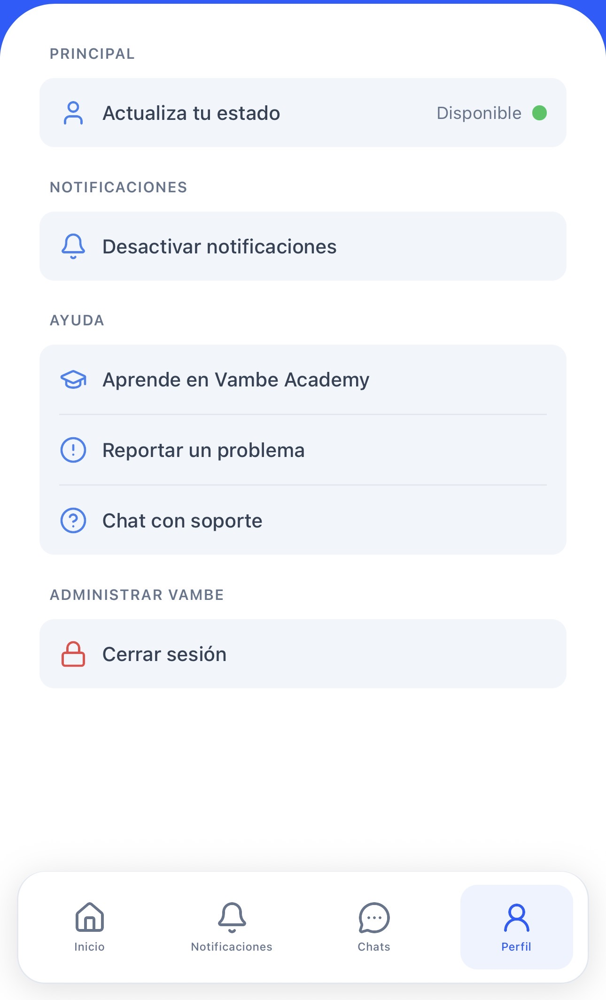
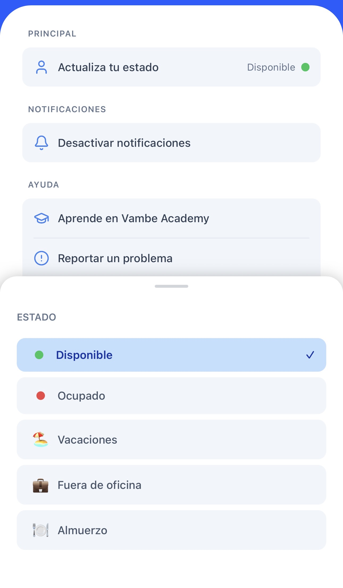

# Perfil y Soporte: Configuración de Usuario

Para acceder a tu configuración personal, pulsa el botón "Perfil" (icono de usuario) en la barra de navegación inferior o la tarjeta "Centro de Control" en la pantalla de inicio.

<figure><figcaption></figcaption></figure>

Esta sección es administrativa y te permite gestionar aspectos clave de tu experiencia con la aplicación, dividida en cuatro bloques visuales.

<figure><figcaption></figcaption></figure>

### 1. Identidad del Usuario

En la parte superior verás tu Avatar, Nombre y Correo Electrónico asociado a la cuenta. Esta sección es informativa y sirve para confirmar con qué usuario estás operando actualmente, algo útil si gestionas múltiples cuentas o espacios de trabajo.

### 2. Estado de Disponibilidad

<figure><figcaption></figcaption></figure>

Desde tu perfil puedes actualizar tu estado de disponibilidad en tiempo real. Pulsa **Actualiza tu estado** y elige entre las opciones disponibles:

* 🟢 **Disponible**
* 🔴 **Ocupado**
* 🏖️ **Vacaciones**
* 🤒 **Enfermo**
* 🍽️ **Almuerzo**

> 💡 Tu estado afecta la asignación automática de tickets. Si estás en "Vacaciones" u "Ocupado", el sistema puede omitirte al distribuir nuevos leads. Actualízalo siempre que cambies tu disponibilidad para que la distribución funcione correctamente.

### 3. Configuración de Notificaciones

*   🔔 **Desactivar/Activar notificaciones**: Aquí encontrarás un interruptor (toggle) para controlar las alertas.

    ⚠️ **Importante**: Entendiendo este interruptor Es fundamental distinguir entre este botón y la configuración de tu teléfono:

    * Este botón (App): Le dice a los servidores de Vambe si _deben_ o _no deben_ enviar alertas a este dispositivo específico. Es el "interruptor maestro" de la aplicación.
    * Configuración del iPhone/Android (Sistema): Le dice a tu teléfono si debe _mostrar_ las alertas que llegan.

    > Recomendación: Mantén este interruptor activado si eres un agente activo. Si lo desactivas aquí, no recibirás avisos aunque los permisos de tu teléfono estén encendidos.

### 4. Ayuda y Soporte

Desde la sección **Ayuda** tienes tres opciones:

#### 🎓 Aprende en Vambe Academy

Acceso directo a [academy.vambe.ai](https://academy.vambe.ai). Se abrirá el navegador para que puedas consultar guías, tutoriales y cursos sobre cómo sacar el máximo provecho a la plataforma.

#### ⚠️ Reportar un problema

Si encuentras un error, la app se cierra inesperadamente o algo no funciona como debería, usa este botón. Enviarás un reporte directo al equipo de desarrollo para que puedan revisarlo y solucionarlo.

#### 💬 Chat con soporte

Abre el chat con **Luis**, el asistente de soporte de Vambe — el mismo canal disponible en la plataforma web, ahora directamente en la app.

***

### 5. Cerrar Sesión

Usa esta opción para desconectar tu cuenta del dispositivo. Recomendable si compartes el teléfono o tablet con otros miembros del equipo.
