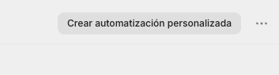

# Recuperación de carritos abandonados en Shopify

Potencia tus ventas con la recuperación automática de carritos abandonados en Shopify, una clave del **remarketing** en Vambe. Aprende a configurar esta funcionalidad para enviar mensajes de seguimiento a clientes que no finalizaron su compra, reactivando su interés y aumentando significativamente tu tasa de conversión.


Antes de empezar, asegúrate de probar el flujo con un carrito de test antes de usarlo en producción.


***

## Requisitos previos



#### Plan de Shopify requerido

Es obligatorio contar con el plan Grow de Shopify.

> Sin el plan Grow no es posible continuar con la recuperación de carritos abandonados, ya que se utiliza una funcionalidad que solo está disponible en este plan.



#### Número de teléfono del cliente

El mensaje se enviará únicamente a clientes que:

* Hayan abandonado un carrito, y
* Hayan dejado su número de teléfono (ya sea llegando desde Vambe o directamente desde la tienda).


No importa si el cliente llegó por Vambe o por la web: el mensaje se enviará en ambos casos siempre que exista un número de teléfono.




#### Definir el tiempo de envío

El tiempo de espera antes de enviar el mensaje (por ejemplo, 5 horas después del abandono) se configura dentro de Shopify y se ajusta en el flujo de automatización más adelante.



***

## ¿Cuándo y a quién se envía el mensaje?

* Cuándo: después del tiempo que determines en el flujo (recomendado: 5 horas).
* A quién: a cualquier persona que deje un carrito abandonado y tenga un número de teléfono registrado.

***

## Configuración paso a paso



#### Paso 1: Acceder a la integración de Shopify en Vambe

1. En Vambe, ve al menú inferior izquierdo y haz clic en **Ajustes**.
2. Ingresa a **Integraciones**.
3. Selecciona **Shopify**.

Dentro del módulo de Shopify encontrarás la sección **Recuperación de carritos abandonados**.

* Haz clic en el ícono de Video.

* Se abrirá un video explicativo.
* Desplázate hacia abajo hasta encontrar los códigos necesarios (URL, headers y body), ya que los usaremos más adelante.

 gif.gif>)

No cierres esta pestaña, ya que volveremos a copiar esta información.



#### Paso 2: Crear la automatización en Shopify

1. Ingresa a tu cuenta de **Shopify**.
2.  Busca en la barra superior "Automatizaciones"\
     

    <figure><figcaption></figcaption></figure>
3. Luego selecciona **Automatizaciones.**
4.  Haz clic en Crear automatizacion.

    <figure><figcaption></figcaption></figure>
5.  Seleccionar Crear **Automatizacion Personalizada** 

    <figure><figcaption></figcaption></figure>

6.  Seleccionar **Explorar Plantillas** 

    <figure><figcaption></figcaption></figure>

7. Selecciona la plantilla **Recuperar un pedido abandonado**.

6.  Instalar la automatización.\
     

    <figure><figcaption></figcaption></figure>
7.  Aparecera esta vista y entraremos a editarla 

    <figure><figcaption></figcaption></figure>



#### Paso 3: Configurar el tiempo de espera (Wait)

Dentro del flujo de automatización:

1. Identifica el bloque llamado **Wait**.
2. Aquí defines cuánto tiempo pasará desde que el cliente abandona el carrito hasta que se envía el mensaje.

Recomendación: 5 horas.

<figure><figcaption></figcaption></figure>

Este valor puedes ajustarlo según tu estrategia.



#### Paso 4: Eliminar el envío de correo por defecto

1. Al final del flujo encontrarás un bloque llamado **Send marketing email**.
2.  Elimínalo, ya que no utilizaremos correo electrónico para este flujo. 

    <figure><figcaption></figcaption></figure>



#### Paso 5: Agregar la acción HTTP Request

1. Haz clic en **Add action en verdadero** (Agregar acción).
2.  Busca y selecciona **HTTP request**.\
     

    <figure><figcaption></figcaption></figure>

**Configuración del HTTP request**

Usa la información de Vambe que obtuviste en el Paso 1. Copia y pega donde aparece CURL.

<figure><figcaption></figcaption></figure>

Volver a Shopify y seleccionar **Importar Curl** y pegar el copiado en Vambe 

<figure><figcaption></figcaption></figure>

Luego click en Importar y listo ! 



#### Paso 6: Activar el flujo

1. Guarda la acción.
2. Activa el flujo de trabajo.

3. Haz clic nuevamente en **Activar**.

Desde este momento, cada cliente que abandone un carrito recibirá automáticamente el mensaje de seguimiento luego del tiempo configurado.



#### Paso 7: Ver ejecuciones del flujo en Shopify

Para revisar las ejecuciones:

1. En Shopify, ve al menú izquierdo.
2. Ingresa a **Aplicaciones**.
3. Selecciona **Flow**.

Aquí podrás ver todas las veces que este flujo se ha ejecutado.



#### Paso 8: Ver carritos recuperados en Vambe

Para ver los resultados dentro de Vambe:

1. Ve al menú izquierdo.
2. Haz clic en **E-commerce**.
3. Luego selecciona **Recuperación**.

En esta sección podrás ver:

* Carritos abandonados.
* Carritos recuperados.
* Flujo completo de seguimiento realizado por Vambe.



***

## Resultado final

Con esta configuración:

* Automatizas la recuperación de carritos abandonados.
* Aumentas conversiones sin intervención manual.
* Centralizas la información y resultados directamente en Vambe.
