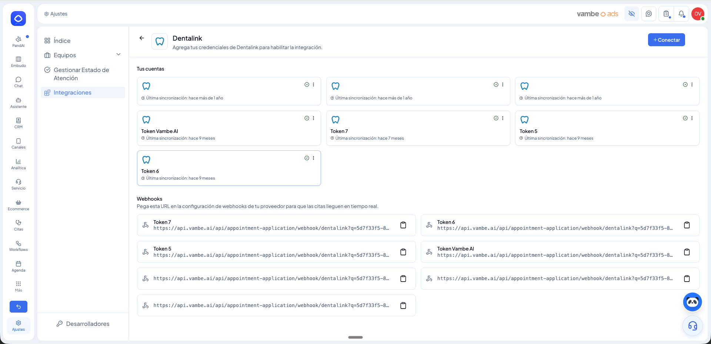
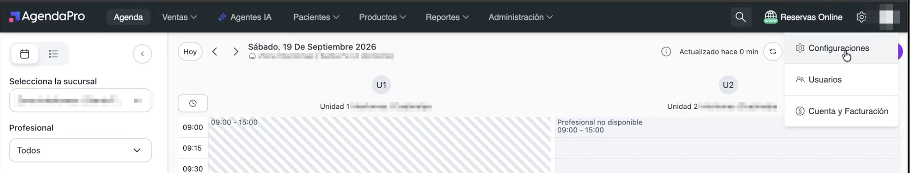
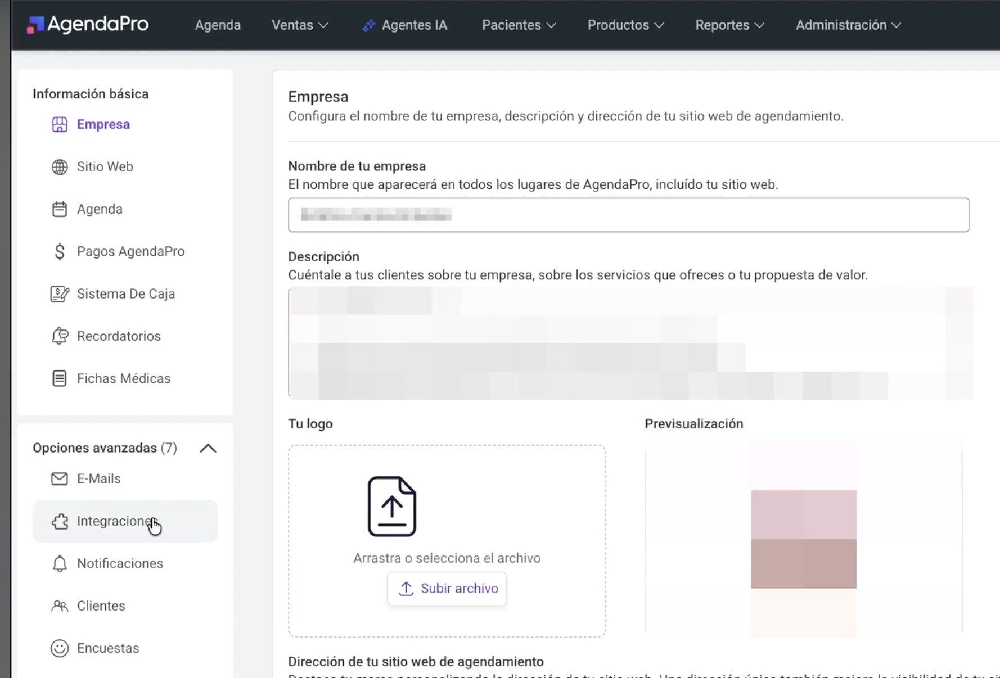
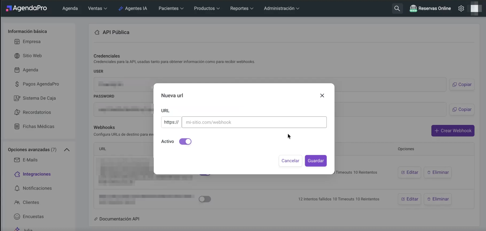
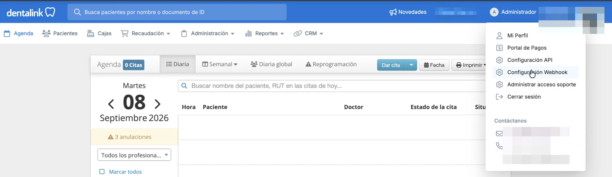
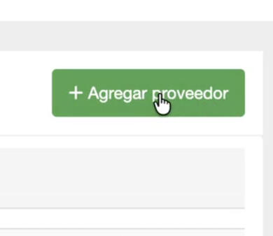
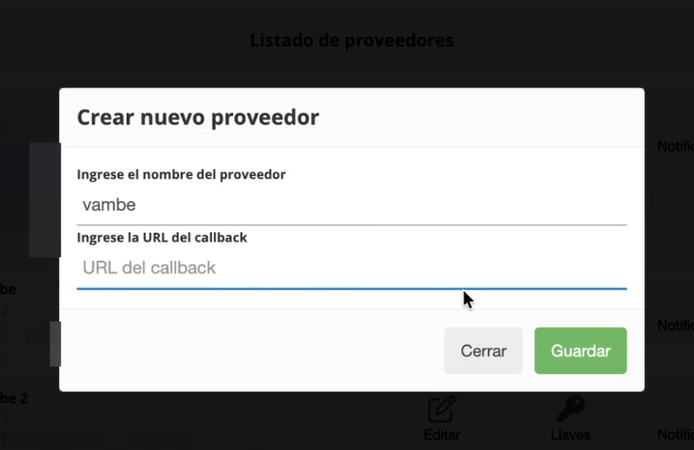

# Cómo activar webhooks de citas y pagos en tiempo real en AgendaPro y Dentalink/Medilink

En este artículo aprenderás a activar los webhooks que le permiten a Vambe recibir las citas y los pagos de AgendaPro, Dentalink o Medilink en tiempo real, apenas se crean o cambian de estado.

Al activarlos, cada vez que se cree, confirme, reagende o cancele una cita, o se registre un pago asociado, Vambe recibe el evento de inmediato. Esto mantiene siempre actualizada la información de tus citas y pagos, y permite que tus workflows en Vambe se activen en el momento exacto en que ocurre el cambio.


Esta configuración es distinta de las credenciales de la integración y de los webhooks de confirmaciones y recordatorios por WhatsApp. Aquí le indicas a AgendaPro, Dentalink o Medilink hacia dónde deben avisar cuando cambia una cita o un pago.


### Requisitos previos

* Tener la integración con AgendaPro, Dentalink o Medilink ya conectada en Vambe.
* Contar con **acceso administrador** en AgendaPro o en Dentalink/Medilink.

***

## Paso 1: Copiar la URL del webhook desde Vambe

Este primer paso es igual sin importar la plataforma que utilices.



#### Ubicar la URL en Ajustes

1. Ingresa a Vambe.
2. En el menú inferior izquierdo, haz clic en **Ajustes**.
3. Entra a **Integraciones** y selecciona la tarjeta de **AgendaPro**, **Dentalink** o **Medilink**, según corresponda.
4. Desplázate hasta la sección **Webhooks**.
5. Copia la URL que corresponde a la cuenta o token que quieres activar.


Si tienes más de una cuenta o token conectado, cada uno tiene su propia URL. Repite esta configuración una vez por cada uno.




***

## Paso 2: Pegar la URL en tu plataforma de agendamiento

Con la URL copiada, sigue la guía según la plataforma que utilices.

### En AgendaPro



#### Entrar a Configuraciones

* Inicia sesión en tu cuenta de **AgendaPro**.
* En la esquina superior derecha, haz clic en el ícono de ajustes y selecciona **Configuraciones**.




#### Abrir Integraciones

* En el menú lateral izquierdo, dentro de **Opciones avanzadas**, haz clic en **Integraciones**.




#### Crear el webhook

* Dentro de la sección **API Pública**, desplázate hasta **Webhooks**.
* Haz clic en **Crear Webhook**.
* Pega la URL que copiaste desde Vambe en el campo **URL**.
* Verifica que el interruptor **Activo** esté encendido.
* Haz clic en **Guardar**.




### En Dentalink o Medilink



#### Entrar a la configuración de Webhooks

* Inicia sesión en tu cuenta de **Dentalink** o **Medilink** con un usuario administrador.
* En la parte superior derecha, haz clic en **Administrador**.
* Selecciona la opción **Configuración Webhook**.




#### Agregar un nuevo proveedor

* Haz clic en el botón verde **+ Agregar proveedor**.




#### Completar los datos del proveedor

* En **Ingrese el nombre del proveedor**, escribe, por ejemplo, **Vambe**.
* En **Ingrese la URL del callback**, pega la URL que copiaste desde Vambe.
* Haz clic en **Guardar**.




***

## Qué sucede después de activarlo


Listo. Desde este momento, cada vez que se cree, actualice o cambie de estado una cita, o se registre un pago, en AgendaPro, Dentalink o Medilink, Vambe recibirá el evento automáticamente y lo reflejará en tiempo real.


* No es necesario repetir este paso, salvo que cambies de sede, de cuenta o generes una nueva URL desde Vambe.
* Si conectaste varias cuentas o tokens, recuerda repetir esta configuración por cada uno.

Errores comunes a evitar

* ❌ No usar una cuenta administrador en AgendaPro, Dentalink o Medilink.
* ❌ Pegar una URL incompleta o distinta a la que copiaste desde Vambe.
* ❌ En AgendaPro, dejar el interruptor **Activo** apagado.
* ❌ No hacer clic en **Guardar** después de pegar la URL.
* ❌ Configurar solo una cuenta o token cuando tienes varios conectados.

