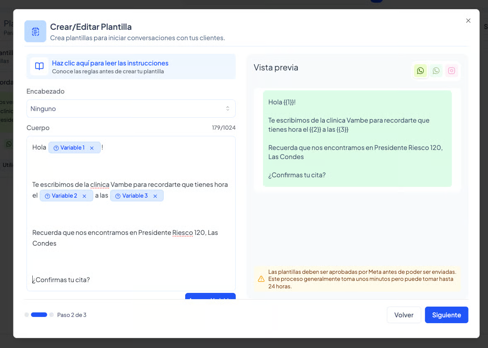

# Configuraciones Confirmación y Recordatorio

En este artículo, aprenderás a configurar el sistema para enviar recordatorios automáticos a todos tus clientes, ya sea que utilices **Medilink, Dentalink, Agenda Pro o Reservo**. Mantener una comunicación activa con tus pacientes no solo mejora la experiencia del usuario, sino que reduce drásticamente el ausentismo.

#### Antes de comenzar: La importancia de las plantillas

Para que el sistema funcione, es fundamental que primero tengas creadas tus plantillas de confirmación y plantillas de recordatorio.


**¿Aún no tienes tus plantillas?** [\[Haz clic aquí para ir a crear la plantilla\]](https://app.gitbook.com/s/CFdmz6HrosBiYP1q1BJ6/plantillas/como-crear-plantillas) y vuelve a este artículo cuando estés listo.


***

#### Consideraciones clave al crear las plantillas

Al diseñar tus mensajes, asegúrate de incluir variables que Vambe pueda completar automáticamente. Esto permitirá que cada mensaje sea único y contenga la información precisa de la cita.

Variables recomendadas:

* **Nombre del paciente**: Para un trato cercano.
* **Nombre del profesional / doctor**: Para que el paciente sepa quién lo atenderá.
* **Fecha de la cita:** Día exacto del compromiso.
* **Hora de la cita**: El bloque horario agendado.
* **Sede o sucursal:** Fundamental si manejas más de un punto de atención.

<figure><figcaption></figcaption></figure>

👉 _Puedes revisar el artículo específico de_ [_\[cómo crear plantillas\]_](https://app.gitbook.com/s/CFdmz6HrosBiYP1q1BJ6/plantillas/como-crear-plantillas) _para más detalle sobre variables y buenas prácticas._

***

#### Paso a paso: Configurando tu agenda

Para iniciar la configuración, sigue estos pasos en la plataforma:

1. En el menú de la izquierda, haz clic en **Agenda**.
2.  Entra en la sección de **Ajustes** y haz clic en **Administrar**.\
     

    <figure><figcaption></figcaption></figure>

3.  Verás el listado de tus sedes. Identifica la sucursal que quieres configurar y haz clic en el botón Confirmaciones y recordatorios.\
     

    <figure><figcaption></figcaption></figure>

**1. Selección de Canal**

Una vez dentro, verás la sucursal seleccionada. En la sección **Canal - notificación a cliente**, elige el medio (por ejemplo, WhatsApp) por el cual quieres que se envíen los mensajes. 

<figure><figcaption></figcaption></figure>

**2. Configuración de la Confirmación**

Aquí definiremos el primer contacto para validar la asistencia:

* **Selecciona la plantilla**: Elige la que creaste previamente para confirmar citas.
* **Etapa de confirmación:** Selecciona a qué etapa del CRM llegará el cliente cuando se le envíe este mensaje (ej: "Agendados").
*   **Tiempo de envío:** Configura con cuánta anticipación quieres que se envíe (desde 1 hasta 4 días antes) y define la hora exacta.\
     

    <figure><figcaption></figcaption></figure>
* **Filtro Vambe:** Verás un switch que dice _"Enviar confirmación solo a citas realizadas a través de Vambe"_.
  * **Activado**: Solo se enviará a citas creadas por la IA.
  * **Desactivado**: Se enviará a absolutamente todos los clientes, incluidos los creados manualmente o en otras plataformas.
*   **Mensajes de seguimiento:** Si el paciente no responde al primer mensaje, puedes activar esta opción. Define cuántos mensajes adicionales enviar y el tiempo de espera entre ellos.\
     

    <figure><figcaption></figcaption></figure>

**3. Configuración del Recordatorio**


**Nota importante:** El recordatorio solo se enviará si el cliente ya está marcado como Confirmado en el sistema.


* **Selecciona la plantilla:** Usualmente una más breve recordándole que "falta poco" para su cita.
* **Rango** Horario: Haz clic en **"Agregar rango"** para definir a quiénes notificar según su hora de cita (ej: citas programadas entre las 10:00 y las 23:00).
* **Tipo de aviso:**
  * **Horario fijo:** Envía el aviso a todos a una hora específica (ej: el día anterior a las 08:00 AM).
  * **Horario relativo:** Envía el aviso X tiempo antes de la cita (ej: 1 hora antes de su hora agendada).

<figure><figcaption></figcaption></figure>

**4. Ajustes finales**

Al final encontrarás dos opciones adicionales:

* **Enviar recordatorio solo a citas realizadas en Vambe**
* **Eliminar contacto del pipeline cuando la cita es cancelada**: > ⚠️ Recomendación: Sugerimos mantener esta opción apagada para no perder el historial del contacto en tu CRM.

Una vez configurado todo, haz clic en Guardar y ¡listo! Tu sistema de seguimiento ya está trabajando por ti.
