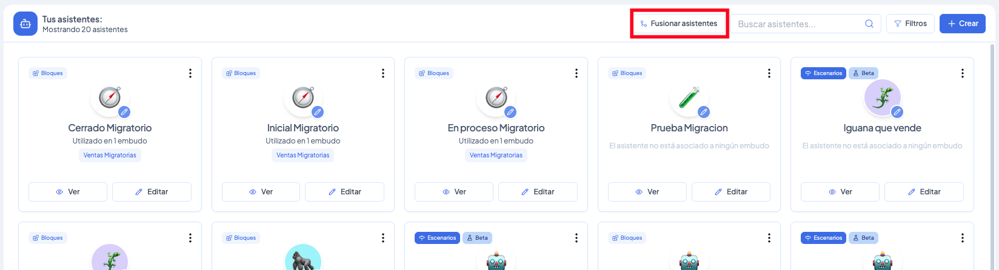

# Cómo fusionar asistentes v2 en un asistente v3

### ¿Para qué sirve esta función?

Si tienes un embudo con varios asistentes v2 configurados para distintas etapas (por ejemplo, uno para Inicial, otro para En proceso y otro para Cerrado), ahora puedes unirlos en un solo asistente v3 sin perder la lógica de cada uno.

Esto es especialmente útil porque los asistentes v3 permiten manejar toda esa lógica dentro de un único asistente mediante escenarios y rutas, eliminando la necesidad de tener múltiples asistentes por embudo.

> ⚠️ **Importante:** Tener asistentes v2 y v3 conviviendo en distintas etapas del mismo embudo genera incompatibilidades. Si ya migraste parte de tu embudo a v3, lo recomendable es fusionar los v2 restantes cuanto antes.

***

### ¿Qué se conserva al fusionar?

Al crear el asistente fusionado, Vambe asigna automáticamente:

* **Bloques sin conflicto** → se asignan directamente al nuevo asistente
* **Escenarios y rutas** → se convierten a partir de la lógica de los asistentes originales
* **Funciones** → todas se transfieren al nuevo asistente
* **Carpetas de base de conocimiento** → también se asignan al nuevo asistente
* **Identidad visual (emoji, color, nombre)** → se hereda del asistente que elijas como Principal, pero puedes modificarla después

***

### Paso a paso

#### 1. Accede a la sección Asistente

Desde el menú lateral de Vambe, ingresa a **Asistente**. Verás el listado de todos tus asistentes.

<figure><figcaption></figcaption></figure>

#### 2. Haz clic en "Fusionar asistentes"

En la parte superior derecha encontrarás el botón **Fusionar asistentes**. Haz clic en él para iniciar el proceso.

#### 3. Selecciona los asistentes a fusionar

Se abrirá un panel con todos tus asistentes disponibles. Debes:

* Marcar **al menos 2 asistentes** v2 que quieras fusionar
* Elegir cuál será el **Principal** (define el emoji, color y nombre del nuevo asistente — puedes cambiarlo después)

Una vez seleccionados, haz clic en **Previsualizar fusión**.

<figure><figcaption></figcaption></figure>

#### 4. Resuelve los conflictos de bloques

Vambe detectará automáticamente los bloques donde hay conflicto (es decir, donde más de un asistente tiene configuración distinta para el mismo tipo de bloque). Para cada conflicto, tendrás dos opciones:

* **Fusionar todos** → combina los bloques en uno solo
* **Seleccionar un bloque** → elige con cuál de los asistentes originales quedarte

Los bloques sin conflicto se asignan solos. En esta misma pantalla también puedes personalizar el nombre del nuevo asistente fusionado.

<figure><figcaption></figcaption></figure>

#### 5. Confirma la fusión

Una vez que hayas resuelto todos los conflictos, haz clic en **Fusionar asistentes**. El nuevo asistente v3 quedará creado con toda la lógica unificada.

***

### Recomendaciones

* **Revisa tus embudos después de fusionar** para asegurarte de que el nuevo asistente v3 esté correctamente asignado a las etapas que antes cubrían los asistentes v2.
* Si tienes dudas sobre qué bloque elegir en un conflicto, opta por **Fusionar todos** en bloques de tipo "No hacer", y **Seleccionar un bloque** en bloques de contenido específico como información de productos o formato de respuesta.
* Esta función está en **Beta**, por lo que si encuentras comportamientos inesperados, puedes reportarlos desde el botón **Sugerir mejora** en la barra superior de Vambe.
