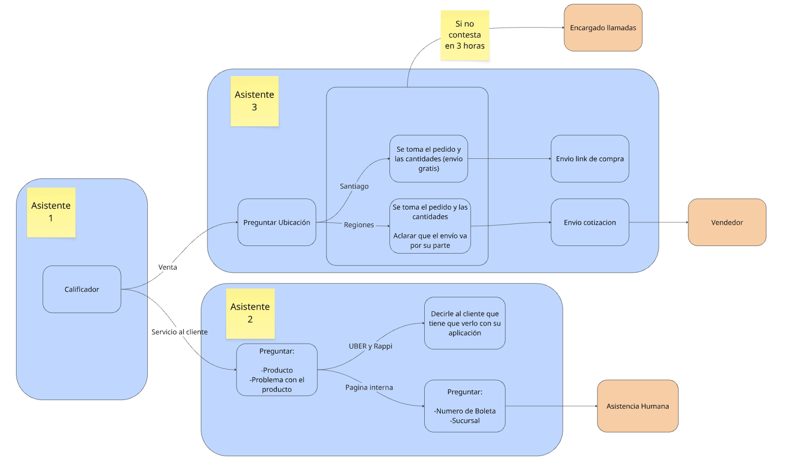

# Parte 1: La Mentalidad

Crear un asistente de Inteligencia Artificial en Vambe es mucho más que escribir un texto largo en un recuadro. Para que tu IA funcione perfectamente, no alucine y realmente venda o atienda a tus clientes, primero debemos entender **cómo piensa.**

Antes de entrar a la configuración técnica, revisemos las 4 reglas de oro que todo creador de asistentes debe conocer.

#### 1. La Analogía del Lego (El Modelo Mental)

Un error común es pensar que la IA es un solo cerebro al que le arrojas toda la información junta. En realidad, construir un asistente en Vambe es como armar una figura de Lego.

Tienes distintas piezas (bloques) y cada una cumple una función específica:

*   **Bloques de Identidad:** Definen la personalidad (quién es). 

    <figure><figcaption></figcaption></figure>

*   **Bloques de Instrucciones:** Definen el comportamiento (qué hace y qué no hace).\
     

    <figure><figcaption></figcaption></figure>

*   **Bloques de Información:** Definen su conocimiento (qué sabe, como precios o productos).\
     

    <figure><figcaption></figcaption></figure>

Si juntas las piezas correctamente, la figura toma forma. Si te falta una (por ejemplo, le dices que venda pero no le das el bloque de precios), la IA se confundirá e inventará respuestas.

#### 2. La Regla de Oro: Divide y Vencerás (Múltiples Asistentes)

Muchos usuarios intentan crear un "Súper Asistente" que salude, califique, venda, agende y además resuelva problemas de soporte técnico. **Esto es un error.**

**¿Por qué no debes hacerlo?**

* Las instrucciones se vuelven kilométricas y confusas.
* Si el cliente cambia de tema, la **IA puede saltarse pasos importantes** y arruinar el flujo.
* Si hay un error, es una pesadilla encontrar dónde falló.

Si flujo se resuelve con muchos asistentes, un ejemplo:

<figure><figcaption></figcaption></figure>

La solución: Crea un asistente diferente para cada etapa de tu embudo. Por ejemplo: Un asistente "**Inicial**" para perfilar al cliente, y luego lo derivas a un asistente de "**Ventas**" o a uno de "**Servicio al Cliente**". Así mantienes el orden y la IA siempre tiene un objetivo claro.

<figure><figcaption></figcaption></figure>

#### 3. El Mindset "A Prueba de Balas" (Bulletproof)

Cuando pruebes tu asistente por primera vez, probablemente funcione bien. Pero debes diseñar tus instrucciones pensando en que ese asistente **se ejecutará un millón de veces, con un millón de clientes diferentes.**

Para que tu prompt sea "Bulletproof" (a prueba de balas), debes recordar algo vital: **La IA no asume nada.**

* No asumas que la IA saludará por cortesía; dile explícitamente "Saluda y preséntate".
* No dejes vacíos legales. Si no quieres que haga algo, díselo claramente en un bloque de "No hacer". (Ej: "Nunca pidas fotos personales de los clientes").

#### 4. La Cadena de Pensamiento (Secuencialidad)

La IA funciona de maravilla cuando la llevas de la mano paso a paso. En lugar de darle una orden gigante, estructura tus procesos de forma lógica y condicional ("Si pasa X, entonces haz Y").

* **Ejemplo del Nutricionista:** Si tu asistente necesita el peso y la estatura para agendar una cita, y el cliente solo le da la estatura, la IA no debe avanzar. Debe detenerse y decir: "Gracias por tu estatura, ahora indícame tu peso para poder agendarte".

Darle esta secuencialidad evita que la IA se salte reglas o intente adivinar datos faltantes.

Te invito a revisar como se crea cada una de las partes del asistente, importante que **TODAS** son necesarias para crear un asistente de forma completa.

<table data-view="cards"><thead><tr><th></th><th data-hidden data-card-target data-type="content-ref"></th></tr></thead><tbody><tr><td>Bloques de identidad</td><td><a href="parte-2-bloques-de-identidad.md">parte-2-bloques-de-identidad.md</a></td></tr><tr><td>Bloques de instrucciones</td><td><a href="parte-3-bloques-de-instrucciones.md">parte-3-bloques-de-instrucciones.md</a></td></tr><tr><td>Bloques de información y base de conocimiento</td><td><a href="parte-4-bloques-de-informacion-y-base-de-conocimiento.md">parte-4-bloques-de-informacion-y-base-de-conocimiento.md</a></td></tr></tbody></table>
