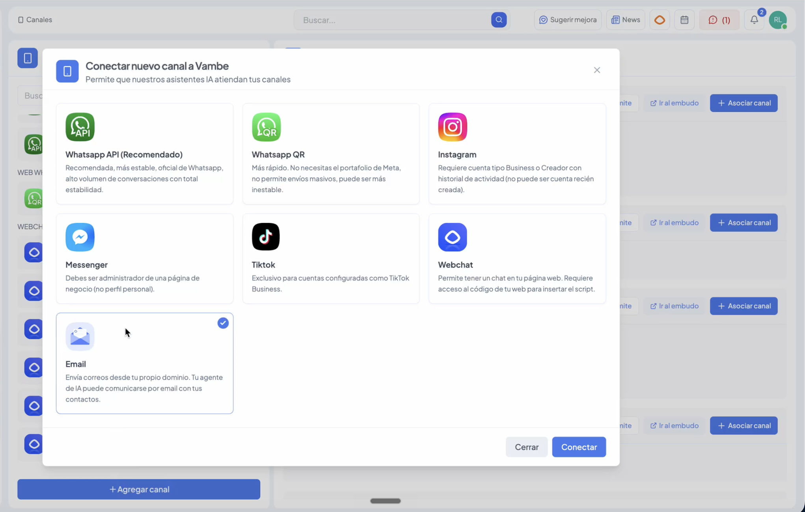

# Cómo usar el canal de Email en Vambe

### ¿Para qué sirve?

El canal de Email te permite enviar correos directamente desde Vambe usando tu propio dominio. Puedes crear campañas masivas con plantillas personalizadas, enviar emails individuales desde la vista de un ticket, o automatizar envíos mediante Workflows.

> ⚠️ **Versión actual — Outbound:** Por ahora, el canal de email funciona de forma outbound (envío hacia tus contactos). La integración con el sistema de tickets y la IA está en desarrollo y llegará próximamente.

***

### Paso 1: Conectar tu canal de Email

#### 1.1 Agrega el canal

Desde el menú lateral, ve a [**Canales**](../conexion-de-canales-de-vambe/como-ingresar-a-la-seccion-de-conexion-de-canales.md) y haz clic en **+ Asociar canal**. En las opciones disponibles, selecciona **Email**.

<figure><figcaption></figcaption></figure>

#### 1.2 Elige tu método de conexión

Al configurar el canal de Email en Vambe, puedes elegir entre dos métodos de conexión:

* **Dominio Vambe** _(recomendado)_ — Vambe te provee un dominio. Solo necesitas ingresar un subdominio y nosotros nos encargamos del resto.
* **Dominio propio** — Conecta tu propio dominio si no quieres que los correos aparezcan con `@subdominio.vambe-mail.com`.

#### Opción A: Dominio Vambe (recomendado)

Con este método, Vambe te ofrece un dominio directamente, eliminando la necesidad de configurar registros DNS manualmente.

1. Selecciona la opción **Dominio Vambe** al configurar el canal.
2. Ingresa el **subdominio** que quieras usar (ej: `tuempresa`).
3. Vambe configurará el resto automáticamente.

Los correos se enviarán y visualizarán con el formato: `@{subdominio}.vambe-mail.com`


✅ El canal queda operativo en **menos de 30 Segundos**


<figure><figcaption></figcaption></figure>

#### Opción B: Dominio propio

Usa este método si deseas que los correos se envíen desde tu propio dominio y no quieres que aparezca `vambe-mail.com`.

Completa los siguientes campos:

* **Dominio:** el dominio desde el que enviarás (ej: `tuempresa.com`)
* **Email del remitente:** el prefijo del correo (ej: `noreply`)
* **Nombre del remitente:** el nombre que verán tus contactos al recibir el mail

Haz clic en **Continuar**.

<figure><figcaption></figcaption></figure>

#### 1.3 Agrega los registros DNS

Vambe te mostrará los registros que debes agregar en el administrador de tu dominio (GoDaddy, Dynadot, Cloudflare, etc.). Los registros son:

* **SPF (Return Path):** un registro CNAME en tu dominio
* **DKIM Selector 1 y 2:** dos registros CNAME adicionales para autenticación

Copia cada valor desde Vambe y pégalo en la configuración DNS de tu proveedor. Si no lo haces de inmediato, puedes hacer clic en **Verificar después** y completarlo más tarde.


⏱️ **Ten en cuenta:** La propagación DNS puede tomar hasta 48 horas. Puedes revisar el estado de verificación en cualquier momento desde la sección **Canales**, donde verás el indicador **Verificar DNS** junto a tu canal de email.


<figure><figcaption></figcaption></figure>

***

### Paso 2: Crear plantillas de email

Una vez conectado el canal, puedes diseñar las plantillas que usarás en tus campañas o envíos individuales.

#### Cómo crear una plantilla

1. En el menú lateral, ve a **Canales → Plantillas Email**
2. Haz clic en **+ Nueva plantilla** (o en el botón de agregar en la parte inferior del panel izquierdo)
3. Ponle un **nombre** a la plantilla y define el **asunto** del correo
4. Usa el editor visual para construir el contenido: arrastra bloques desde el panel derecho o haz clic en **+** dentro del canvas

<figure><figcaption></figcaption></figure>

#### Bloques disponibles

El editor incluye los siguientes elementos:

* **Bloque libre** — texto con formato personalizable
* **Título** — encabezados en distintos tamaños y colores
* **Botón** — llamada a la acción con enlace
* **Imagen** — para agregar imágenes al correo
* **Divisor** — separador visual entre secciones
* **Columnas** — diseño en dos o más columnas
* **Firma** — puedes vincular una firma creada previamente
* **Redes sociales** — íconos con enlaces a tus perfiles

#### Vista previa

Antes de enviar, usa la pestaña **Vista previa** para ver cómo se verá el correo tanto en versión de escritorio como en móvil.

***

### Paso 3: Enviar una campaña

Las campañas permiten enviar un email masivo a una lista de destinatarios.

<figure><figcaption></figcaption></figure>

#### Cómo crear una campaña

1. Desde **Plantillas Email**, haz clic en **Nueva campaña** (esquina superior derecha)
2. Completa los campos:
   * **Título de la campaña:** nombre interno para identificarla
   * **Canal de email:** selecciona el canal conectado
   * **Plantilla:** elige la plantilla que quieres enviar
3. En **Programar (opcional):** selecciona fecha, hora y zona horaria si quieres enviarla más tarde. Si dejas este campo vacío, se envía de inmediato.
4. En **Destinatarios:** agrega los correos de dos formas:
   * **Seleccionar archivo:** sube un Excel con la lista
   * **Agregar destinatario:** ingresa los emails a mano, separados por comas
   * También puedes usar CC y CCO, y adjuntar archivos globales para todos los destinatarios
5. Haz clic en **Enviar**

<figure><figcaption></figcaption></figure>

#### Ver métricas de la campaña

Una vez enviada, puedes revisar el estado de cada campaña desde la pestaña **Envíos** en la sección de Plantillas Email. Ahí verás nombre de la campaña, cantidad de destinatarios, fecha de envío y estado.

<figure><figcaption></figcaption></figure>

***

### Paso 4: Enviar un email desde un ticket

También puedes enviar emails directamente desde la vista de conversación de un contacto, sin necesidad de crear una campaña.

#### Cómo hacerlo

1. Abre el ticket del contacto en la vista **Chat**
2. En la barra inferior, haz clic en el ícono **+** (más opciones)
3. Selecciona **Email**
4. Elige entre dos opciones:
   * **Desde plantilla:** selecciona una plantilla existente. Se mostrará una previsualización y puedes adjuntar archivos antes de enviar
   * **Email personalizado:** redacta el contenido directamente, con opciones de formato básico

El email enviado quedará registrado en el historial del ticket como una nota, junto a los demás eventos de la conversación.

<figure><figcaption></figcaption></figure>

***

### Paso 5: Automatizar envíos con Workflows

Puedes disparar envíos de email automáticamente usando Workflows, igual que con otros canales de Vambe.

#### Cómo configurarlo

1. Ve a **Workflows** en el menú lateral
2. Crea un nuevo Flow o edita uno existente
3. Define el **evento disparador** (ej: ejecutivo asignado, etapa cambiada, etc.)
4. Agrega una acción del tipo **Enviar plantilla de email**
5. Selecciona la **plantilla** y el **canal de email** que quieres usar
6. Si corresponde, adjunta archivos que acompañen el correo
7. Guarda el Workflow

Cada vez que se cumpla la condición del disparador, Vambe enviará el email automáticamente. La ejecución queda registrada en el historial del ticket como **Ejecución de Workflow — Exitoso**.

<figure><figcaption></figcaption></figure>

***

### Firmas

Las firmas son bloques de texto o diseño que se agregan al pie de los correos. Puedes crearlas desde la pestaña **Firmas** dentro de Plantillas Email. Tanto la IA como los usuarios pueden tener sus propias firmas configuradas.
