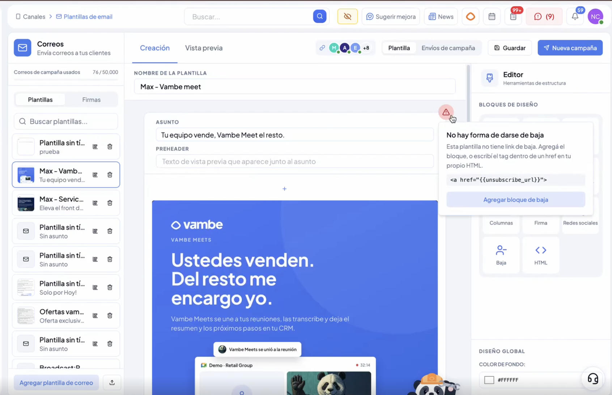
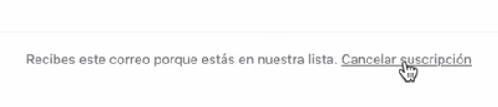
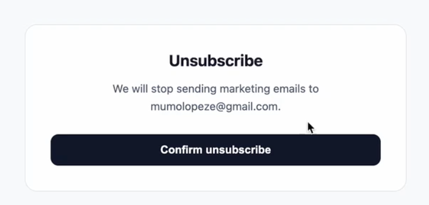
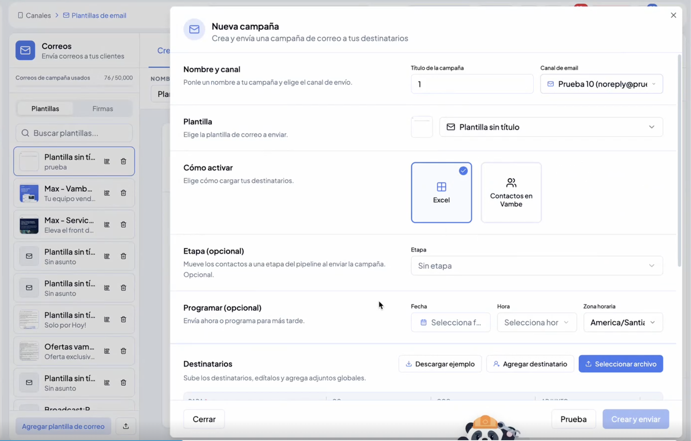
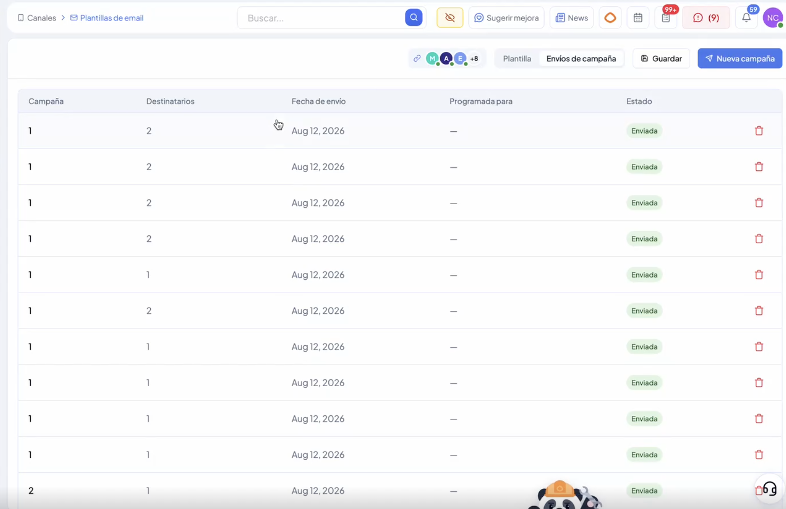
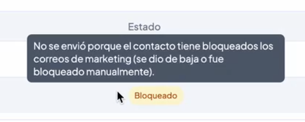
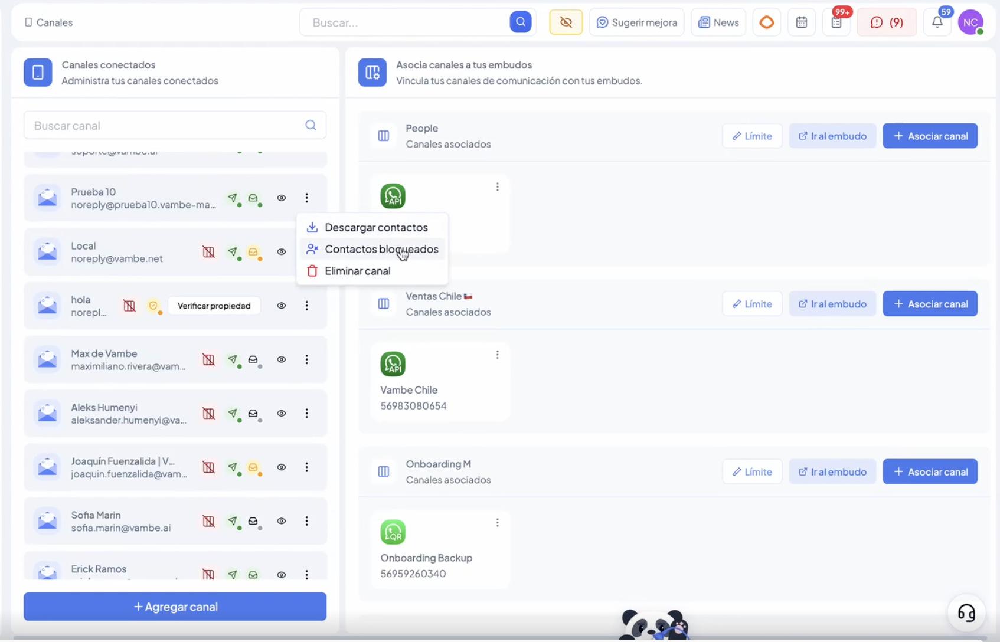

# Desuscripción en campañas de email

Cada contacto que recibe tus correos de marketing tiene derecho a dejar de recibirlos cuando quiera, y Vambe se encarga de que eso funcione de punta a punta: incluye un link de baja en tus campañas, registra a quien se da de baja y evita que ese contacto vuelva a recibir correos tuyos, aunque siga apareciendo en tu lista de destinatarios.

Esto va más allá de cumplir una norma. Los proveedores de correo miden cuánta gente marca tus envíos como spam, y un contacto que no encuentra cómo salir de la lista termina reportándote. Cada reporte golpea la reputación de tu dominio y empuja tus siguientes correos a la carpeta de spam. Respetar las bajas es, en la práctica, lo que mantiene tus correos llegando a la bandeja de entrada.


Para entrar: en el menú lateral, ve a **Canales** y luego a **Plantillas Email**.


***

#### El link de baja en tus plantillas

Toda plantilla que uses en una campaña de marketing necesita una forma visible de darse de baja. Vambe te avisa cuando falta: sobre el editor aparece un ícono de advertencia con el mensaje **No hay forma de darse de baja**.

Tienes dos caminos para resolverlo:

* **Bloque Baja** — en el panel **Editor**, dentro de **Bloques de diseño**, arrastra el bloque **Baja** al pie de tu correo. Es la opción más rápida: ya viene con el texto y el enlace listos.
* **Tu propio HTML** — si construyes el correo con el bloque **HTML**, escribe el tag de baja dentro de un `href`: `<a href="{{unsubscribe_url}}">Cancelar suscripción</a>`. Vambe reemplaza esa variable por el enlace único de cada destinatario al momento del envío.

Si prefieres el camino corto, el mismo aviso trae el botón **Agregar bloque de baja**, que inserta el bloque por ti.


Revisa este aviso antes de guardar. Una plantilla sin link de baja deja a tus contactos sin salida y aumenta el riesgo de que te reporten como spam.


***

#### Qué ve tu contacto

Al pie del correo aparece la línea de baja, con el enlace **Cancelar suscripción**.

Al hacer clic, tu contacto llega a una página de confirmación donde ve su propia dirección de correo y un botón para confirmar la baja. Ese segundo paso existe para evitar bajas accidentales: sin él, un clic involuntario o un escáner de seguridad que abre los enlaces del correo podrían dar de baja a alguien que sí quería seguir recibiéndote.

Una vez confirmada, el contacto queda registrado como bloqueado para correos de marketing en ese canal.

***

#### Cómo se comportan tus campañas

Creas y envías tus campañas igual que siempre: desde **Plantillas Email**, haz clic en **Nueva campaña**, elige el canal y la plantilla, carga los destinatarios desde un Excel o desde **Contactos en Vambe**, y programa la fecha si no quieres enviarla de inmediato.

La diferencia está en el resultado. Si alguien de tu lista se dio de baja, Vambe no le envía el correo, aunque venga incluido en el Excel que subiste: la lista de bajas siempre tiene la última palabra.

Para revisarlo, entra a la pestaña **Envíos de campaña**. Ahí ves cada envío con su nombre, cantidad de destinatarios, fecha y estado.

Los envíos que salieron correctamente aparecen como **Enviada**. Los que quedaron fuera aparecen como **Bloqueado**, y al pasar el cursor sobre ese estado Vambe te explica el motivo: el contacto tiene bloqueados los correos de marketing, ya sea porque se dio de baja o porque lo bloqueaste manualmente.

***

#### La lista de contactos bloqueados de cada canal

Cada canal de correo mantiene su propia lista de contactos bloqueados, así puedes auditar en cualquier momento quién dejó de recibir tus campañas y por qué tu base efectiva es menor que tu base total.

Para revisarla, ve a **Canales**, ubica el canal de correo en la lista de canales conectados y abre el menú de tres puntos (⋮). Ahí encontrarás **Contactos bloqueados**, y también **Descargar contactos** si quieres exportar la base del canal para cruzarla con tus propios listados.


El bloqueo es por canal, no por cuenta. Si envías desde varios canales de correo, cada uno tiene su propia lista.


***

#### En resumen

Una plantilla con su bloque de baja, una página de confirmación clara y una lista de bloqueados por canal: con esas tres piezas, cada contacto que decide salir queda fuera de tus próximas campañas sin que tengas que hacer nada manual. Es la forma más simple de cuidar la reputación de tu dominio y asegurarte de que los correos que sí importan sigan llegando a la bandeja de entrada de quienes quieren leerlos.
