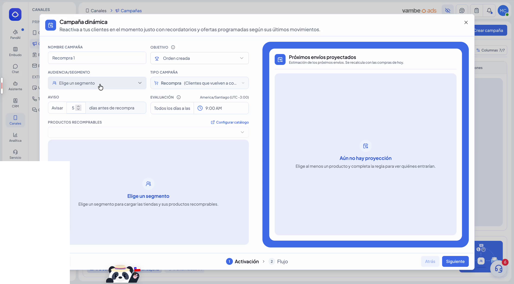
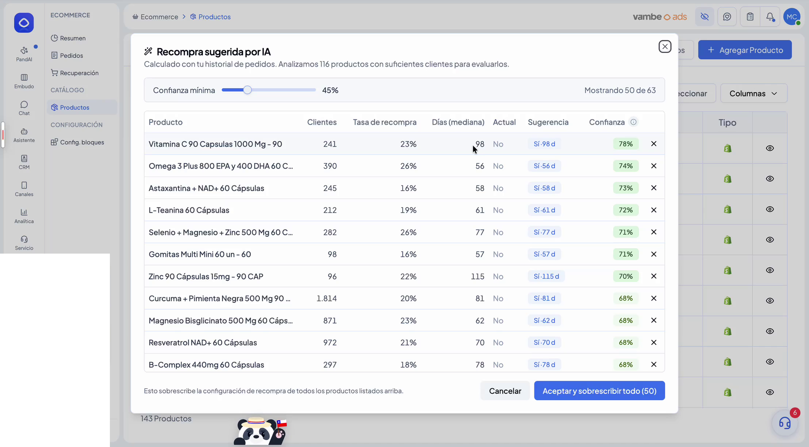
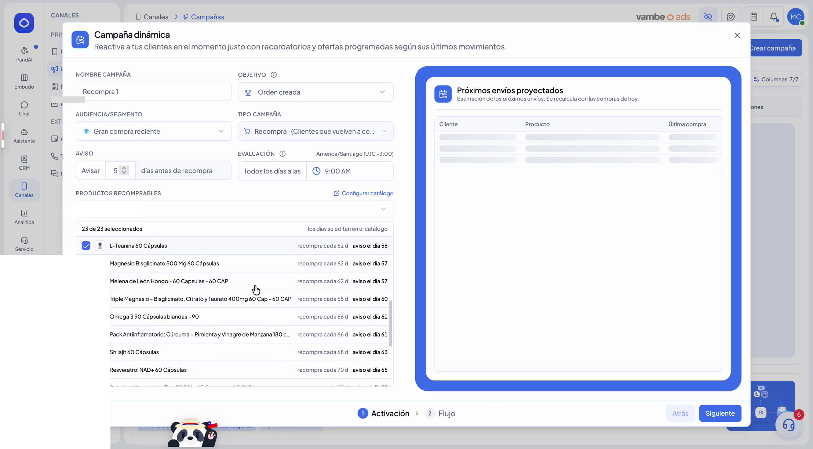
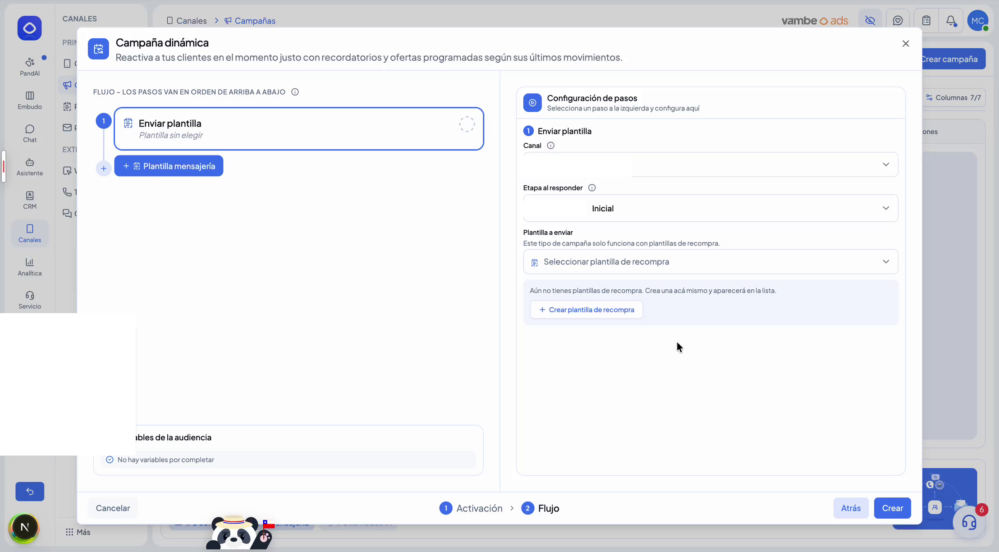
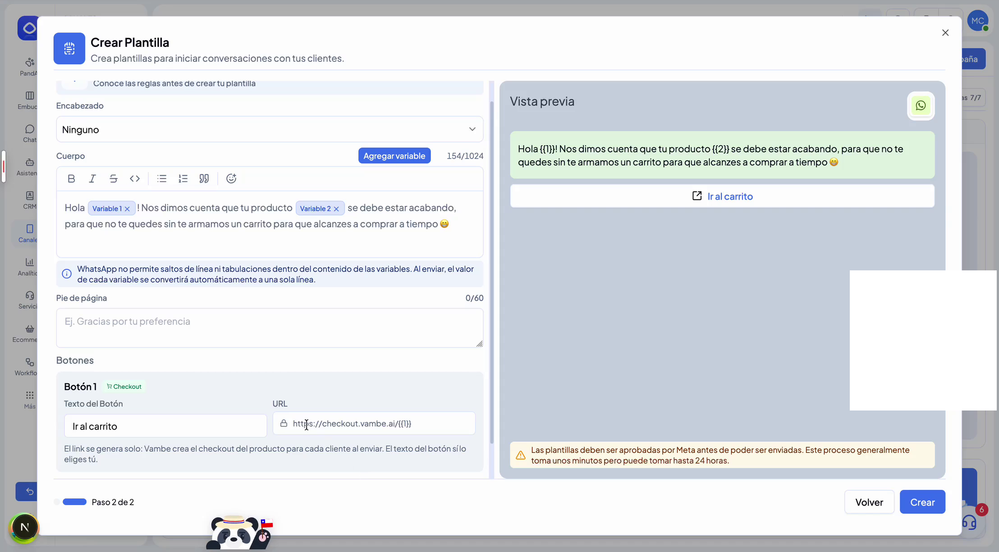
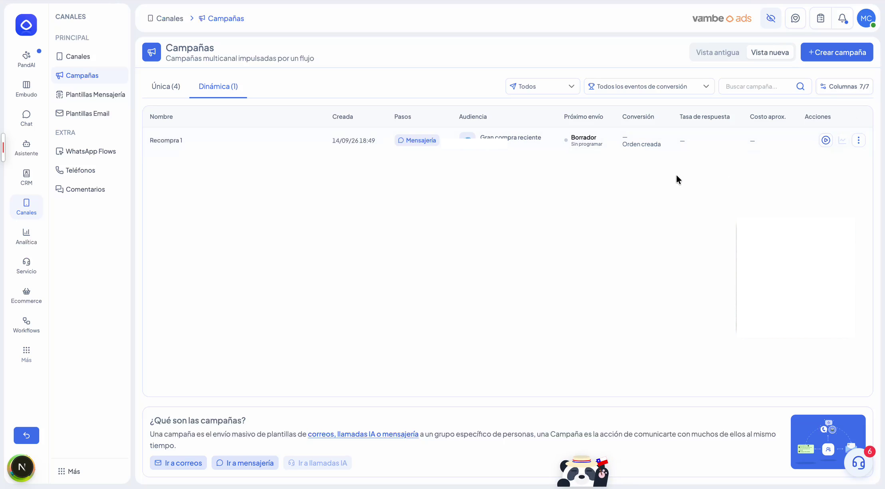

# Recompra recurrente Ecommerce

Si tu tienda vende productos de consumo recurrente —comida para mascotas, café, suplementos—, cada cliente tiene un momento aproximado en el que se le va a acabar lo que compró la última vez. Hasta ahora, asegurarte de que vuelva a comprar antes de ese momento dependía de que alguien de tu equipo lo tuviera en el radar. **Recompra recurrente Ecommerce** hace ese seguimiento por ti: identifica qué productos de tu catálogo se recompran, calcula cada cuánto lo hace cada cliente, y le escribe justo cuando se le está por acabar.


💡 **¿Dónde se encuentra?** Dentro de **Canales → Campañas**, en la pestaña **Dinámica** vas a ver la opción de **+ Crear campaña dinámica**.


***

### Cómo funciona

A diferencia de una campaña tradicional, que se dispara una vez a una lista fija de contactos, esta es una campaña dinámica: evalúa todos los días qué clientes están a punto de que se les acabe un producto, según la tendencia de recompra de ese producto, y les envía proactivamente una plantilla sugiriéndoles que vuelvan a comprarlo.

Para lograrlo, Vambe hace dos cosas por ti:

1. **Detecta qué productos son recomprables** dentro de tu catálogo —los que un mismo cliente tiende a volver a comprar, a diferencia de una compra única.
2. **Calcula cada cuánto se recompra** cada uno de esos productos, para saber cuándo corresponde avisarle a cada cliente.

Ese tiempo de recompra que calcula la IA no es fijo: puedes ajustarlo manualmente producto por producto si conoces mejor el ritmo real de tu negocio.

***

### Paso 1: crear la campaña

Ve a **Canales → Campañas**, entra a la pestaña **Dinámica** y haz clic en **+ Crear campaña dinámica**. Vas a completar:

* **Nombre de la campaña**
* **Objetivo**, normalmente **Orden creada**
* **Audiencia/Segmento**: a qué clientes apunta. Se recomienda partir de un segmento RFM de los que se generan automáticamente para cada tienda de e-commerce —por ejemplo, **Gran compra reciente**— en lugar de apuntar a toda tu base por igual
* **Tipo de campaña**: por ahora solo existe **Recompra**, así que viene seleccionado
* **Avisar X días antes de recompra**: cuántos días antes de la fecha estimada en que se le acabará el producto quieres contactar al cliente
* **Evaluación**: a qué hora del día se hace la evaluación diaria

<figure><figcaption></figcaption></figure>

Si al configurar esto no tienes productos declarados como recomprables, la campaña te lo va a advertir y te va a pedir ir a configurarlos.

***

### Paso 2: declarar productos recomprables

Declarar producto por producto si es recomprable y cada cuántos días se recompra puede ser lento y tedioso —y además es difícil recuperar esa información a mano para todo el catálogo. Por eso existe un algoritmo que lo hace por ti: entra a **Ecommerce → Productos** y haz clic en **Definir recompra**.

La IA analiza las compras pasadas de tus propios clientes, detecta qué tan seguido se repite cada producto y con qué probabilidad un cliente vuelve a comprarlo, y a partir de eso calcula un **score de confianza** de que ese producto efectivamente es recomprable, junto con el número de días de recompra.

<figure><figcaption></figcaption></figure>

Moviendo el slider de **confianza mínima** puedes ver más o menos productos sugeridos: con una confianza más baja aparecen más productos: con una confianza más alta, menos, pero con mayor certeza. Al aceptar, todos esos productos quedan marcados como recomprables, con los días que corresponde a cada uno.

***

### Paso 3: revisar los productos y la proyección

Volviendo a la campaña, la lista de productos recomprables ya viene cargada con los que superaron el umbral de confianza que elegiste. Puedes dejarlos todos aplicados o quitar los que no te interesen.

<figure><figcaption></figcaption></figure>

A la derecha, el panel de **Próximos envíos proyectados** te muestra qué pasaría si esta campaña se lanzara hoy, mañana y pasado mañana: qué cliente recibiría el mensaje y con qué producto, según sus compras y el ritmo de recompra calculado.

***

### Paso 4: construir el flujo de envío

En el segundo paso de la campaña defines el **canal** por el que se va a contactar a cada cliente y la **etapa** a la que se moverá al responder. Por ahora, este tipo de campaña solo funciona enviando **plantillas de recompra**: un tipo especial de plantilla de Meta.

<figure><figcaption></figcaption></figure>

Si todavía no tienes una plantilla de recompra creada, puedes crearla ahí mismo con el botón **Crear plantilla de recompra**.

***

### Paso 5: crear la plantilla de recompra

Una plantilla de recompra es una plantilla de Meta que viene con un botón de tipo **Checkout**: el link al carrito de compra se genera automáticamente para cada cliente, con el producto correspondiente ya cargado. Tú puedes editar el texto del mensaje y el texto del botón; el link se arma solo.

<figure><figcaption></figcaption></figure>

Como toda plantilla de WhatsApp, debe pasar por la aprobación de Meta antes de poder enviarse. Este proceso suele tomar minutos, pero puede tardar hasta 24 horas.

***

### Paso 6: aprobación y activación

Mientras la plantilla espera aprobación, tu campaña queda creada en estado **Borrador**, con el estado **Esperando aprobación de Meta** en la columna de próximo envío. No podrás activarla todavía, pero queda lista para cuando la plantilla sea aprobada.

Una vez que Meta aprueba la plantilla, el botón para activar la campaña queda disponible.

<figure><figcaption></figcaption></figure>

Al activarla, se envía de inmediato a todos los clientes a los que les corresponda ese día. Desde ahí, la campaña se vuelve a evaluar todos los días —buscando quién debe ser contactado hoy— y sigue así de forma permanente, hasta que decidas desactivarla.

***

### Casos de éxito

Varias tiendas de e-commerce con productos de consumo recurrente ya están usando esta campaña. En el rubro de alimento para mascotas, dos cuentas distintas generaron ventas del orden de los millones de pesos chilenos en solo unas semanas, con una inversión publicitaria de decenas de dólares —una relación de retorno que muestra el potencial de avisarle al cliente correcto en el momento correcto.

***

### Consideraciones


⚠️ Antes de activarla, ten en cuenta:

* **Solo plantillas de e-commerce para Meta.** Por ahora, esta campaña solo admite plantillas de Meta pensadas para e-commerce.
* **Requiere un token de e-commerce conectado.** La opción de campaña dinámica solo aparece en cuentas que tienen alguna integración de e-commerce activa; sin ella, esta sección aún no está disponible.


***

### En resumen

Recompra recurrente Ecommerce convierte el seguimiento manual de "a quién le toca comprar de nuevo" en un proceso que corre solo, todos los días, avisando a cada cliente en el momento justo antes de que se quede sin su producto —sin que tengas que revisar catálogos ni armar listas a mano.
