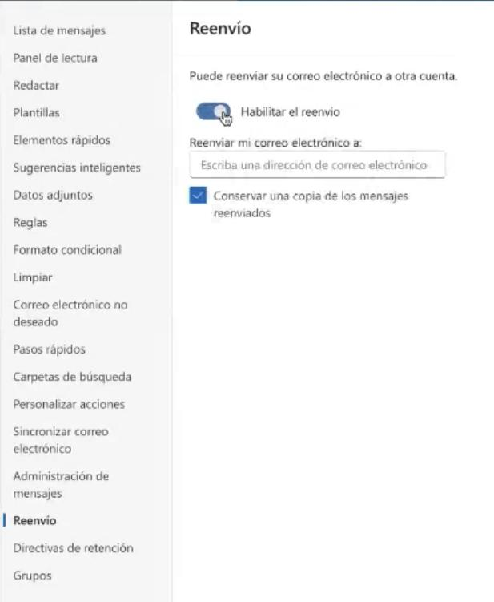
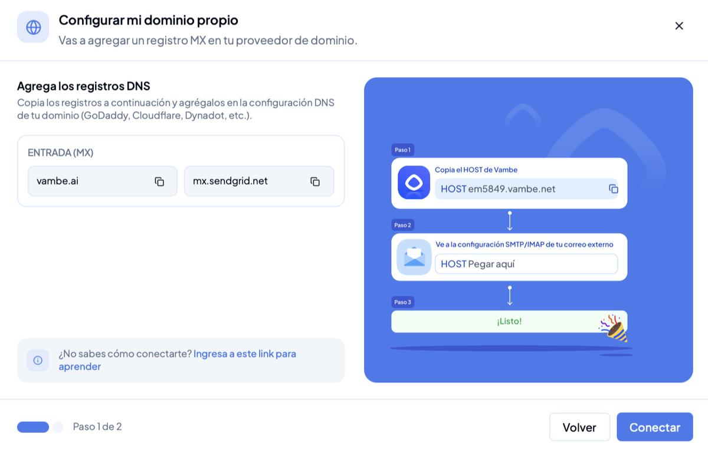

# Cómo activar la recepción de correos

## Cómo activar la recepción de correos

#### ¿Para qué sirve?

El canal de Email de Vambe no solo envía: también recibe. Al activar la recepción, las respuestas de tus contactos entran directamente a Vambe, se abren como tickets dentro del embudo que elijas y quedan registradas en el historial del contacto. Tu asistente puede leerlas y responderlas igual que en cualquier otro canal, y tus Ejecutivos pueden retomar la conversación desde la misma vista de Chat.

> Para entrar: en el menú lateral ve a **Canales** y ubica tu canal de email dentro de **Canales conectados**.

Cada canal de email muestra un ícono de bandeja que indica el estado de la recepción. Si aparece en gris, la recepción de respuestas todavía no está habilitada: al pasar el cursor verás el aviso _"La recepción de respuestas no está habilitada. Abre el canal para habilitarla."_ Ese mismo ícono es el punto de partida de la configuración. También llegas desde el menú de tres puntos del canal, en **Ver detalles → Recepción de respuestas → Configurar**.


¿Aún no tienes el canal de email conectado? Primero sigue la guía de [Cómo conectar el canal de Email](como-conectar-el-canal-de-email.md). La recepción se activa sobre un canal ya creado.


***

#### Paso 1: Elige cómo quieres recibir tus correos

Haz clic en el ícono de recepción del canal. Vambe te mostrará dos métodos de configuración, según cómo administres tu correo.

**Opción A: Reenvío desde tu correo (recomendada)**

Pensada para Gmail, Google Workspace, Outlook o Microsoft 365. Configuras un reenvío automático desde tu bandeja hacia una dirección que Vambe te entrega, y listo. Tu casilla conserva la copia de todo, así que nada cambia para quien te escribe.

Necesitas:

* Una cuenta de Gmail, Google Workspace, Outlook o Microsoft 365
* Acceso a la configuración de tu correo
* Escribir a tus clientes desde Vambe

**Opción B: Configurar mi dominio propio**

Apunta el registro MX de tu dominio hacia Vambe desde tu proveedor de DNS.

Necesitas:

* Acceso al panel de DNS de tu dominio
* Apoyo de tu equipo técnico, según el proveedor
* Considerar que los cambios pueden tardar entre 24 y 48 horas en propagarse


⚠️ **Por qué recomendamos el reenvío:** al cambiar el registro MX, los correos pueden dejar de llegar a tu bandeja de siempre y entrar únicamente a Vambe. Si quieres seguir viéndolos también en tu correo, elige el reenvío.



Para habilitar la recepción necesitas una cuenta de correo conectada. Conéctala en la primera tarjeta antes de continuar.


.png>)

***

#### Paso 2: Configura el reenvío desde tu correo

Al elegir esta opción, Vambe abre un asistente que te acompaña mientras haces los cambios en tu correo. Mantén ambas pestañas abiertas: vas a copiar un dato desde Vambe y pegarlo en tu bandeja.

**En Gmail o Google Workspace**

**1. Entra a la configuración de reenvío**

En Gmail, haz clic en el ícono de engranaje (arriba a la derecha) y elige **Ver toda la configuración**. Abre la pestaña **Reenvío y correo POP/IMAP**.

**2. Agrega la dirección de reenvío**

En la sección **Reenvío**, haz clic en **Añadir una dirección de reenvío**. Copia la dirección que te muestra Vambe —tiene el formato `fwd-xxxxxxxx@in.vambe-mail.com`— pégala en el campo y confirma con **Siguiente → Continuar → Aceptar**.

Google envía un correo de confirmación y **Vambe lo valida solo**: no tienes que buscar ningún código. Mientras tanto verás el mensaje _Esperando la confirmación de Gmail_. Google también puede pedirte que verifiques tu identidad; normalmente es una notificación en tu teléfono con un número que debes seleccionar.


Después de confirmar, recarga la página de configuración de Gmail. Recién ahí la dirección queda disponible en el desplegable del paso siguiente.


**3. Activa el reenvío y guarda**

De vuelta en **Reenvío y correo POP/IMAP**, selecciona la opción **Reenviar una copia del correo entrante a…**, elige en el desplegable la dirección que acabas de agregar y deja marcada la opción de **conservar la copia en Recibidos**. Baja hasta el final de la página y haz clic en **Guardar cambios**.


Este último clic es el que activa todo y es el que más se olvida. Si los correos no llegan a Vambe, vuelve al final de esa página y guárdala.


**En Outlook o Microsoft 365**

Es más corto, porque no hay correo de confirmación de por medio:

1. Entra a **Configuración → Correo → Reenvío**.
2. Activa **Habilitar el reenvío** y pega la dirección que te entrega Vambe.
3. Deja marcada la casilla **Conservar una copia de los mensajes reenviados** y guarda.

Cuando el reenvío queda activo, el asistente de Vambe te lo confirma con el mensaje **¡Reenvío confirmado!** y el ícono de recepción del canal cambia de estado en la lista de canales.


**Reenvía todo y filtra en Vambe.** Gmail te ofrece reenviar solo una parte de los correos creando un filtro; no uses esa opción. Lo que filtras en Gmail nunca llega a Vambe y desaparece del sistema. En cambio, lo que filtras con las [reglas de filtrado del canal](como-configurar-las-respuestas-de-tu-asistente-en-el-canal-de-correo.md) queda fuera del embudo pero sigue visible en Chat, sin perder información.


***

#### Paso 2 (alternativo): Configura tu dominio propio

Si elegiste esta ruta, en la práctica es un solo paso: copiar el registro de entrada que te entrega Vambe y pegarlo en el panel DNS de tu proveedor —GoDaddy, Cloudflare, Dynadot, el que uses—. El asistente muestra «Paso 1 de 2», pero el segundo es solo confirmar la conexión.

| Bloque           | Host                     | Valor             |
| ---------------- | ------------------------ | ----------------- |
| **Entrada (MX)** | El dominio de tu empresa | `mx.sendgrid.net` |

Nota técnica para quien lo cargue: el registro de entrada es de tipo **MX**.


Antes de tocar esto, confirma que entiendes el efecto sobre tu bandeja: por esta ruta los correos pueden dejar de llegarte a tu inbox y entrar solo a Vambe. Si no estás seguro, la ruta correcta es el reenvío.


***

#### Paso 3: Asocia el canal a un embudo

Para que las respuestas se conviertan en tickets, el canal debe estar asociado a un embudo. En **Canales**, ve al panel **Asocia canales a tus embudos**, busca el embudo donde quieres trabajar los correos y haz clic en **+ Asociar canal**. Vambe confirmará con el mensaje **Canal agregado al pipeline**.


Al asociar un canal de email a un embudo, el asistente ajusta su formato de respuesta al formato de correo y queda preconfigurado para ese canal. Si necesitas afinar el tono, las instrucciones o el contenido de las respuestas, revísalo en [Cómo configurar las respuestas de tu asistente en el canal de correo](como-configurar-las-respuestas-de-tu-asistente-en-el-canal-de-correo.md).


***

#### Paso 4: Dónde ves las respuestas

Desde ese momento el canal funciona igual que el resto de Vambe. En el menú lateral entra a **Chat** y usa el filtro **Correos** para ver solo las conversaciones de email: cada hilo aparece como un ticket, con su estado de atención y su asignación.

Al abrir un ticket verás el hilo completo del correo, la información del contacto a la derecha y el cuadro de respuesta abajo, con las opciones **Responder** y **Responder a todos**. Puedes editar el destinatario, el asunto y el cuerpo antes de enviar, y también agregar notas o tareas asociadas al contacto.

***

#### Comprueba que quedó bien

Antes de dar por terminada la configuración, envía un correo real desde una casilla externa con una pregunta típica de tu negocio, y confirma que llegó a los dos lados: tu bandeja de siempre y Vambe. Si no llegó a tu bandeja, revisa que la opción de conservar la copia haya quedado marcada.

***

#### En resumen

Activar la recepción convierte tu canal de email en una conversación de ida y vuelta: los correos que responden tus contactos llegan a Vambe, se ordenan como tickets dentro del embudo correcto y quedan disponibles para tu asistente y tus Ejecutivos, en el mismo lugar donde ya gestionas WhatsApp, Instagram y el resto de tus canales.
