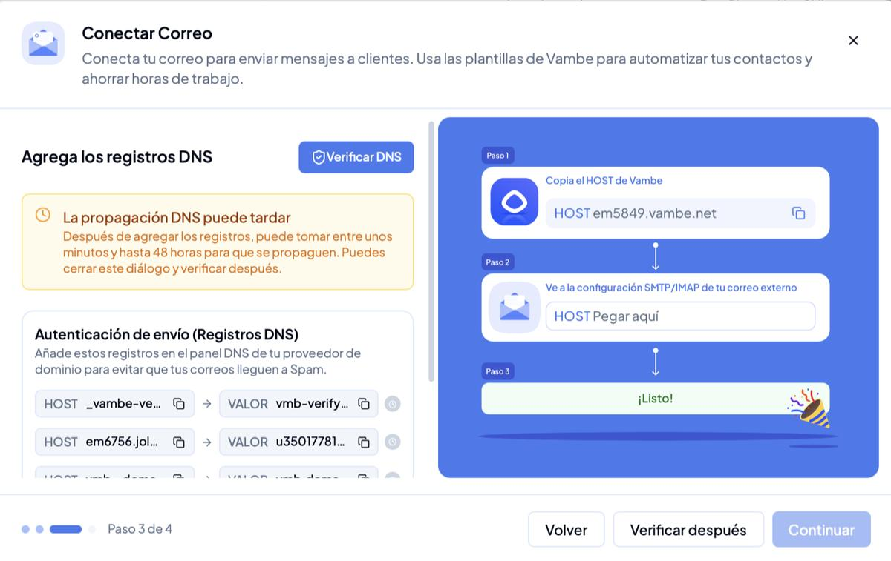
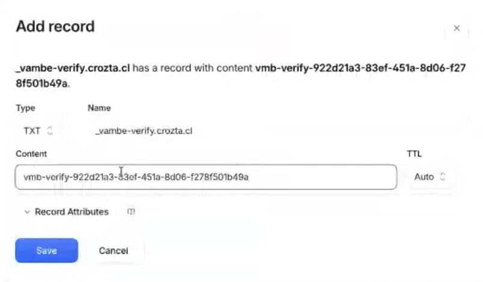
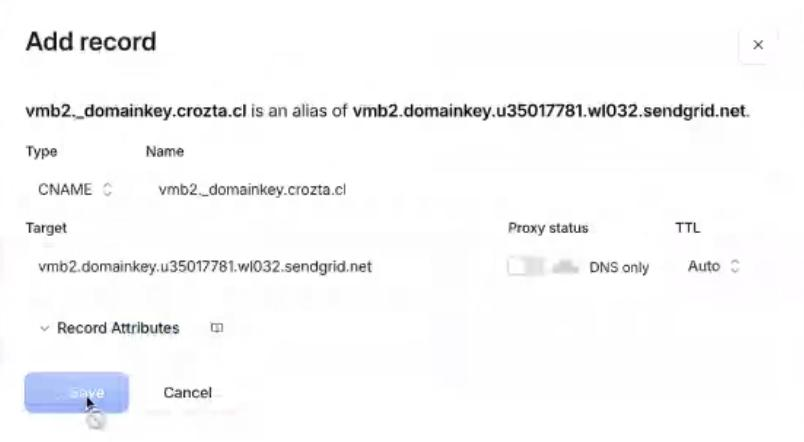
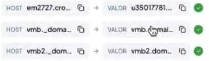
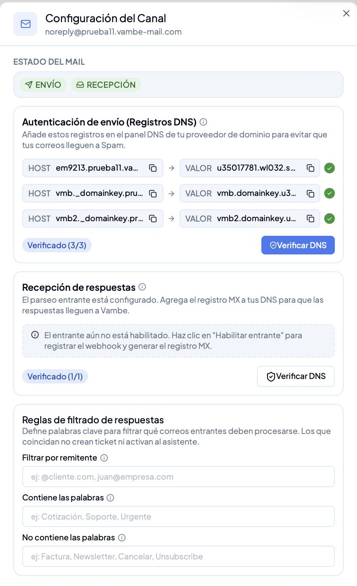

# Cómo conectar el canal de Email

## Cómo conectar el canal de Email

#### ¿Para qué sirve?

El canal de Email te permite enviar y recibir correos directamente desde Vambe usando tu propio dominio. Una vez conectado, podrás crear campañas masivas con plantillas personalizadas, enviar emails individuales desde la vista de un ticket, automatizar envíos mediante Workflows y recibir las respuestas de tus contactos como tickets dentro de tu embudo.


Una vez conectado el canal, aprende a crear plantillas, enviar campañas y automatizar envíos en [Cómo usar el canal de Email en Vambe](../campanas/como-usar-el-canal-de-email-en-vambe.md).


***

#### Antes de empezar

Ten esto a mano para completar la conexión de una sola vez:

* Permisos para crear canales en tu cuenta de Vambe.
* La casilla real que recibe los correos: `contacto@`, `ventas@`, `soporte@`.
* Alguien con acceso a esa casilla, si vas a activar la recepción en el momento.
* El embudo de destino, con su asistente ya configurado.
* Acceso al panel DNS de tu dominio, solo si conectarás con dominio propio.

***

#### Paso 1: Agrega el canal

Desde el menú lateral, ve a **Canales** y haz clic en **+ Asociar canal**. En las opciones disponibles, selecciona **Email**.

***

#### Paso 2: Elige tu método de conexión

Al configurar el canal de Email en Vambe, puedes elegir entre dos métodos de conexión:

* **Dominio Vambe** _(recomendado)_ — Vambe te provee un dominio. Solo necesitas ingresar un subdominio y nosotros nos encargamos del resto.
* **Dominio propio** — Conecta tu propio dominio si no quieres que los correos aparezcan con `@subdominio.vambe-mail.com`.


**Cómo elegir:** el criterio no es solo la imagen de marca, sino si administras tus propios DNS. Si tienes acceso al panel de tu dominio y sabes moverte en él, el dominio propio te sirve. Si no, el dominio de Vambe deja el canal andando en la misma sesión y sin depender de nadie.


**Opción A: Dominio Vambe (recomendado)**

Con este método, Vambe te ofrece un dominio directamente, eliminando la necesidad de configurar registros DNS manualmente.

1. Selecciona la opción **Dominio Vambe** al configurar el canal.
2. Ingresa el **subdominio** que quieras usar (ej: `tuempresa`).
3. Vambe configurará el resto automáticamente.

Los correos se enviarán y visualizarán con el formato: `@{subdominio}.vambe-mail.com`


✅ El canal queda operativo en **menos de 30 segundos**. Con esta ruta puedes saltar directamente al Paso 4.


.png>)

**Opción B: Dominio propio**

Usa este método si deseas que los correos se envíen desde tu propio dominio y no quieres que aparezca `vambe-mail.com`. El asistente pasa de tres pasos a cuatro al elegir esta ruta.

Completa los siguientes campos:

* **Dominio:** el dominio desde el que enviarás (ej: `tuempresa.com`)
* **Email del remitente:** el prefijo del correo, la parte antes de la arroba (ej: `contacto`, `ventas`)
* **Nombre del remitente:** el nombre que verán tus contactos al recibir el mail

Haz clic en **Continuar**.


Si tu asistente va a conversar por este canal, evita un remitente del tipo `noreply` y elige uno que invite a responder. En el **nombre del remitente** usa tu nombre comercial, no el nombre interno del proyecto.


.png>)

***

#### Paso 3: Agrega los registros DNS

Este paso aplica solo si conectaste con **dominio propio**. Vambe te mostrará los registros que debes agregar en el administrador de tu dominio (GoDaddy, Dynadot, Cloudflare, etc.). Son cuatro: uno confirma que el dominio es tuyo y los otros tres autentican el envío.

| Registro          | Tipo  | Para qué sirve                                            | Ojo con                                         |
| ----------------- | ----- | --------------------------------------------------------- | ----------------------------------------------- |
| `_vambe-verify`   | TXT   | Confirma la propiedad del dominio y evita la suplantación | Es el único TXT. Se pega tal cual, sin comillas |
| `em####`          | CNAME | Autenticación de envío                                    | Proxy desactivado                               |
| `vmb._domainkey`  | CNAME | Firma del dominio                                         | Proxy desactivado                               |
| `vmb2._domainkey` | CNAME | Firma del dominio                                         | Proxy desactivado                               |

Copia cada valor desde Vambe y pégalo en la configuración DNS de tu proveedor. Al terminar, presiona **Verificar DNS**. Si prefieres hacerlo más tarde, **Verificar después** no cancela la conexión: puedes cerrar el diálogo y retomarlo desde la sección **Canales**.


⚠️ **El error que más tiempo hace perder:** en los tres CNAME el proxy tiene que quedar desactivado. En Cloudflare el control se llama **Proxy status** y debe mostrar **DNS only**, con la nube gris y no naranja. Si el registro queda proxeado, la verificación nunca pasa y no aparece ningún error que lo explique.


**Entender los contadores**

Verás tres números distintos según dónde estés, y ninguno indica un error:

| Verás                | Cuándo                             | Qué cuenta                             |
| -------------------- | ---------------------------------- | -------------------------------------- |
| **0/4 verificados**  | Mientras cargas los registros      | El TXT de propiedad más los tres CNAME |
| **Verificado (3/3)** | En el canal ya conectado           | Solo los tres CNAME de autenticación   |
| **Verificado (1/1)** | En la recepción por dominio propio | El registro de entrada                 |


⏱️ **Ten en cuenta:** por lo general la verificación toma segundos, pero la propagación DNS puede tardar hasta 48 horas. Si pasan los dos días sin verificar, revisa primero el proxy y luego los registros carácter por carácter.


***

#### Paso 4: Verifica que el envío quedó activo

En **Configuración del Canal** la etiqueta **ENVÍO** debe aparecer activa. Ese es el estado correcto al terminar la conexión por cualquiera de las dos rutas: envío activo y recepción todavía pendiente.

***

#### Paso 5: Activa la recepción de respuestas

Con el canal conectado ya puedes enviar. Para que las respuestas de tus contactos lleguen a Vambe y se abran como tickets, activa la recepción desde el ícono de bandeja del canal.


Sigue el paso a paso en [Cómo activar la recepción de correos](como-activar-la-recepcion-de-correos.md).


***

¡Listo! Tu canal de Email quedó conectado. El siguiente paso es definir [cómo responde tu asistente en el canal de correo](como-configurar-las-respuestas-de-tu-asistente-en-el-canal-de-correo.md) y crear tus plantillas y campañas.
