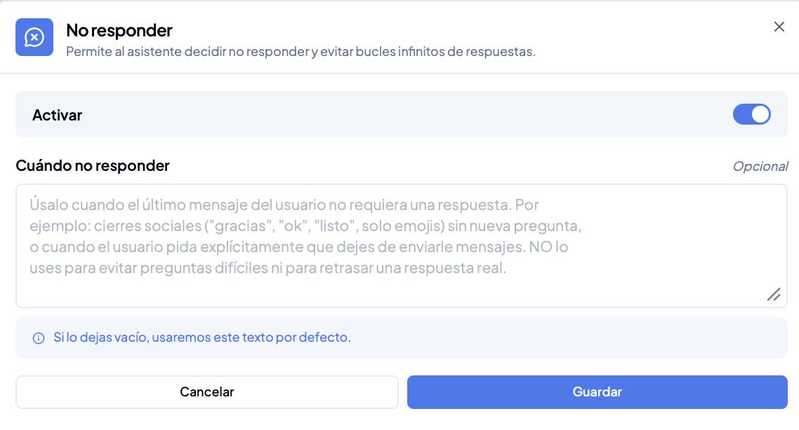
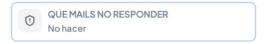
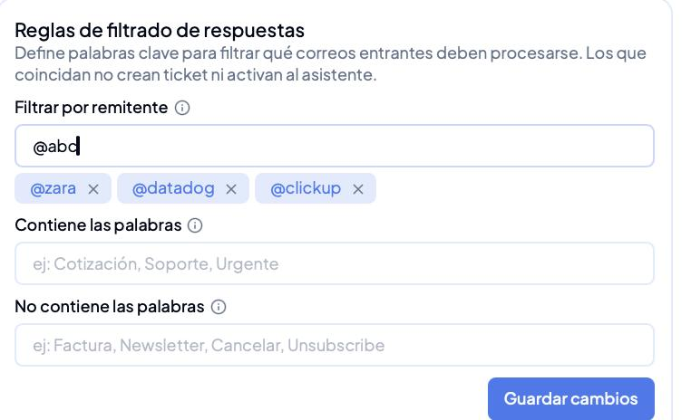
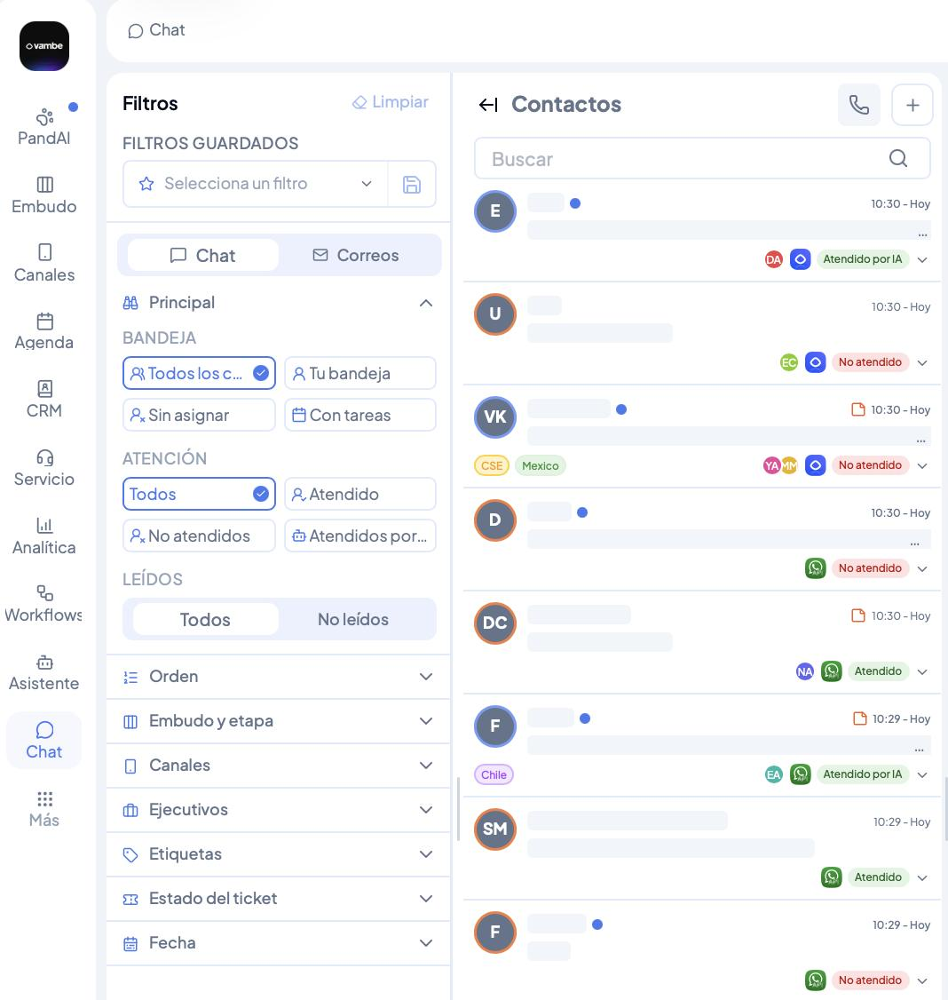
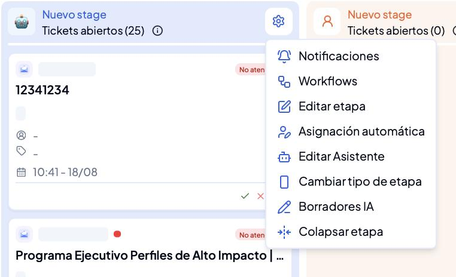
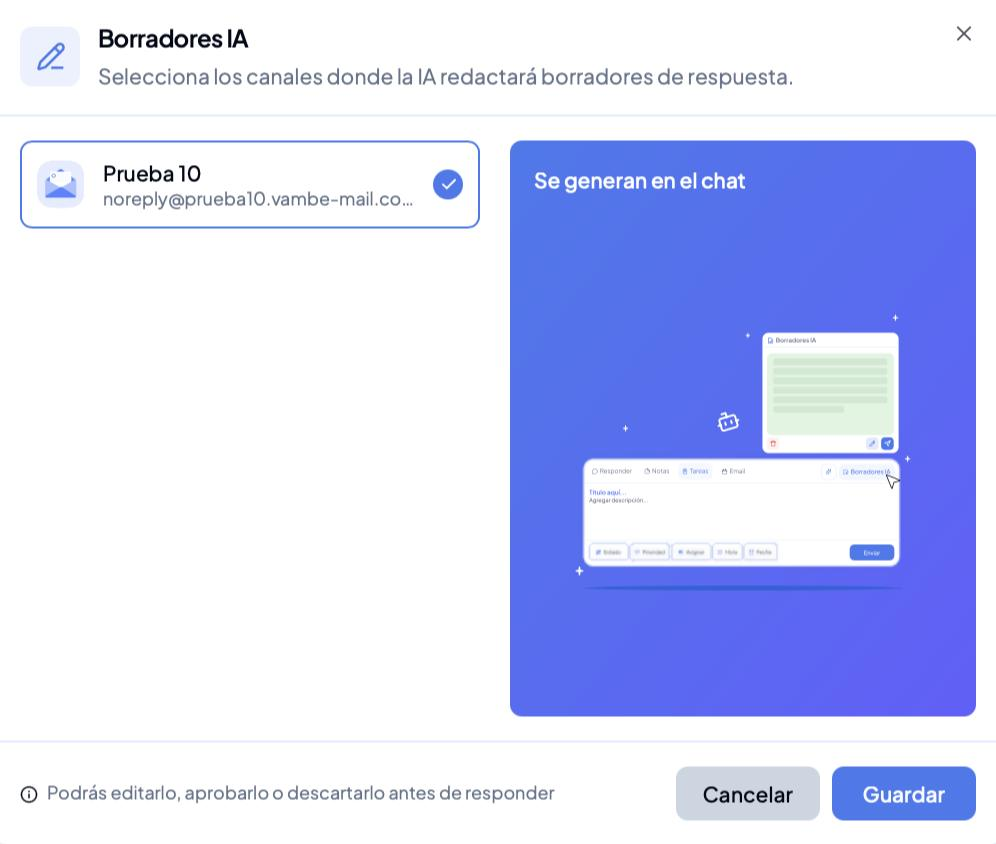

# Cómo configurar las respuestas de tu asistente en el canal de correo

Con el envío y la recepción activos, tu canal de correo ya funciona: los mensajes entran a Vambe y tu asistente los responde. Lo que define la calidad de esas respuestas es la configuración que viene después.

En esta guía verás los cuatro controles que determinan qué correos se procesan, cuándo tu asistente decide guardar silencio, cuándo redacta un borrador en lugar de enviar, y con qué tono escribe.

> Para entrar: en el menú lateral ve a **Canales**, abre el menú de tres puntos de tu canal de correo y entra a **Ver detalles**.


¿Todavía no tienes el canal listo? Empieza por [Cómo conectar el canal de Email](como-conectar-el-canal-de-email.md) y luego por [Cómo activar la recepción de correos](como-activar-la-recepcion-de-correos.md).


***

## Lo que Vambe deja configurado al conectar el canal

Al conectar el canal de correo, Vambe agrega dos protecciones a tu asistente para evitar respuestas innecesarias y bucles de correos automáticos. Ambas vienen con un texto general, así que conviene revisarlas y ajustarlas al caso de tu negocio.

### La función «No responder»

Permite que tu asistente decida no contestar cuando el último mensaje no requiere una respuesta. Queda activada al conectar el canal, y el campo **Cuándo no responder** es opcional: si lo dejas vacío, Vambe aplica el texto por defecto que ves en gris, pensado para cierres sociales —«gracias», «ok», solo emojis— y para contactos que piden expresamente dejar de recibir mensajes.


El propio texto por defecto trae una advertencia que conviene respetar: no uses esta función para evitar preguntas difíciles ni para retrasar una respuesta real. En esos casos tu contacto queda sin respuesta y percibe que lo ignoraron.


### El bloque «Qué mails no responder»

Es un bloque de tipo **No hacer** que aparece entre los bloques de tu asistente y repite la instrucción a nivel de contenido, como una segunda capa de verificación. Ábrelo y escribe los silencios propios de tu operación: confirmaciones de tus propios sistemas, respuestas a encuestas, avisos de vacaciones o cualquier correo que no amerite una respuesta.

### En qué se diferencian de las reglas de filtrado

Estos dos son **instrucciones para tu asistente**: le indican cuándo conviene callar, y la IA las interpreta. Las reglas de filtrado son otra cosa: un filtro que impide que el correo cree ticket o active al asistente. Para basura previsible —notificaciones, newsletters, dominios de proveedores— el filtro es más confiable que la instrucción.

***

## Reglas de filtrado de respuestas

A un canal de correo le llega mucho más que consultas de clientes: notificaciones de herramientas, publicidad y avisos automáticos. Sin filtros, todo eso entra al embudo y lo llena de tickets que no tienen relación con tu negocio.

Encuentras esta configuración en **Canales → ⋮ → Ver detalles → Reglas de filtrado de respuestas**. Lo más práctico es partir por los dominios: los escribes con arroba, confirmas cada uno y quedan guardados como etiquetas.

| Campo                        | Qué hace                                             | Ejemplos                         |
| ---------------------------- | ---------------------------------------------------- | -------------------------------- |
| **Filtrar por remitente**    | Ignora lo que venga de esos dominios o direcciones   | `@datadog`, `@clickup`           |
| **Contiene las palabras**    | Procesa solo los correos que incluyan estas palabras | Cotización, Soporte, Urgente     |
| **No contiene las palabras** | Descarta los correos que incluyan estas palabras     | Factura, Newsletter, Unsubscribe |

Recuerda presionar **Guardar cambios** al terminar.

### Qué pasa con un correo filtrado

Un correo filtrado no crea ticket ni activa a tu asistente, por lo que no aparece en el embudo. Pero **sigue estando disponible en la vista de Chat**: no se borra ni se bloquea nada. Tu embudo queda limpio y la información sigue ahí si alguien la necesita.

Para verlos, entra a **Chat** y activa el filtro **Correos**: ahí aparecen todos los correos del canal, incluidos los que el filtro dejó fuera del embudo.


Empieza conservador. Es preferible algo de ruido la primera semana a que un filtro demasiado amplio deje fuera a un cliente real. Agrega de entrada los dominios evidentes —proveedores, herramientas internas, newsletters— y suma el resto con casos reales durante las primeras semanas.


***

## Borradores IA: revisar antes de enviar

Si prefieres que nadie reciba una respuesta automática sin que alguien la haya leído, activa **Borradores IA**. Tu asistente redacta la respuesta y una persona de tu equipo la aprueba, la edita o la descarta antes de que el correo salga.

1. En el embudo, abre el menú de la etapa (ícono de engranaje) y elige **Borradores IA**.
2. Marca tu canal de correo en la lista y guarda.

La regla funciona **por etapa y por canal a la vez**: en una misma etapa puedes dejar el correo en borradores y WhatsApp en respuesta automática. Los borradores se generan en el chat, no en una bandeja aparte, así que tu equipo los ve donde ya trabaja. Funciona igual en etapas con asistente y en etapas humanas.


Una forma cómoda de partir: borradores durante la primera semana y respuesta automática una vez que hayas leído respuestas reales. También puedes decidirlo etapa por etapa, con respuesta automática al inicio del embudo y aprobación en negociación y cierre.


***

## El tono de las respuestas

Al conectar el canal, tu asistente recibe una regla de formato propia del correo: trato formal, firma y sin el límite de caracteres de la mensajería. Es el mismo asistente de tu embudo, con los modales del canal.

Ese formato usa un saludo formal por defecto, y no todas las marcas se dirigen así a sus clientes. Es una regla más de tu asistente y puedes editarla desde la sección **Asistente**: ajústala a la forma en que hablas normalmente con tus contactos antes de la primera respuesta real.

***

## Comprueba que quedó bien

Antes de dejar el canal andando, haz una prueba completa:

* **Envía un correo real** desde una casilla externa, con una pregunta típica de tu negocio. Tu asistente responde según el contexto del embudo, así que una prueba genérica no demuestra nada.
* **Confirma que llegó a los dos lados:** tu bandeja de siempre y Vambe.
* **Búscalo en Chat** con el filtro **Correos** y revisa que el ticket se haya creado con el contacto y el canal correctos.
* **Lee la respuesta completa** antes de que salga, si activaste Borradores IA.
* **Revisa el formato:** saludo, cuerpo y firma.
* **Prueba un filtro:** envía desde un remitente que hayas filtrado y confirma que no crea ticket, pero sí aparece en el chat.

***

## Cuando algo no funciona

| Síntoma                                    | Causa más probable                                          | Qué hacer                                                                                                                    |
| ------------------------------------------ | ----------------------------------------------------------- | ---------------------------------------------------------------------------------------------------------------------------- |
| Los DNS no verifican                       | El proxy quedó activado en los CNAME                        | Déjalos en **DNS only**. Es la causa en la mayoría de los casos                                                              |
| Pasaron 48 horas sin verificar             | Un registro mal copiado, o el dominio tiene mala reputación | Revisa los registros carácter por carácter y escríbenos a soporte                                                            |
| Los correos no llegan a Vambe              | Faltó presionar **Guardar cambios** en Gmail                | Vuelve al final de la página de reenvío y guarda                                                                             |
| Llegan a Vambe pero no a tu bandeja        | No quedó marcada la opción de conservar la copia            | Actívala. Si conectaste por dominio propio, este es el comportamiento esperado                                               |
| El embudo se llena de correos irrelevantes | Las reglas de filtrado están vacías                         | Agrega los remitentes en **Reglas de filtrado de respuestas** y guarda                                                       |
| Tu asistente responde lo que no debería    | Quedaron los textos generales que Vambe deja configurados   | Edita «No responder» y el bloque «Qué mails no responder» con tu caso. Si es basura previsible, va en las reglas de filtrado |
| Las respuestas suenan ajenas a tu marca    | El formato por defecto sin ajustar                          | Edita la regla de formato desde la sección **Asistente**                                                                     |
| Las respuestas llegan cortadas             | La regla de formato del canal no se está aplicando          | Verifica que tu asistente tenga la condición del canal de correo                                                             |
| Los correos caen en spam                   | Un dominio sin reputación enviando volumen alto             | Baja el volumen y súbelo de forma gradual                                                                                    |

***

## En resumen

Estos cuatro controles convierten el canal de correo en algo que puedes dejar andando con confianza: las reglas de filtrado deciden qué merece un ticket, «No responder» y su bloque le enseñan a tu asistente cuándo conviene callar, Borradores IA te deja revisar antes de enviar mientras tomas confianza, y la regla de formato hace que las respuestas suenen como tu marca. Dedicarles unos minutos al principio evita la mayor parte de los ajustes posteriores.
