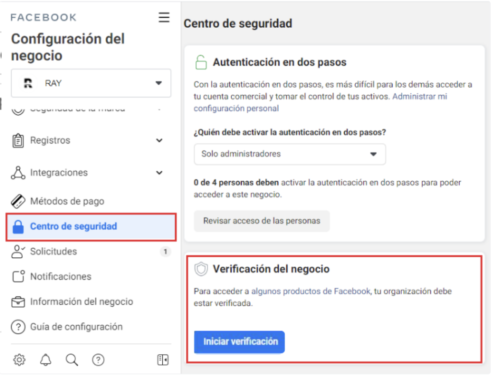

# Cómo verificar tu portafolio comercial de Meta

La verificación del portafolio comercial de Meta es un requisito para acceder a ciertos productos de Facebook y WhatsApp, como el uso del píxel de Meta para medir conversiones, optimizar campañas y crear audiencias de remarketing. Sin esta verificación, la publicidad funciona "a ciegas" — con ella, tu inversión se vuelve estratégica y medible.

***

### Antes de comenzar ¿Cómo saber si mi portafolio de Meta está verificado?

Verificar el estado de tu portafolio comercial de Meta toma menos de un minuto. Aquí te explicamos cómo comprobarlo.

### Pasos

1. Ingresa a tu portafolio comercial de Meta en: [business.facebook.com](http://business.facebook.com/)
2. En el menú lateral izquierdo, ve a **Centro de seguridad**.
3. Dentro del Centro de seguridad, busca la sección **Verificación del negocio**.

Si tu portafolio está verificado, verás el estado **✅ Verificada** junto con la fecha en que fue verificado originalmente.

<figure><figcaption></figcaption></figure>

SI no lo tienes verificado, puedes seguir adelante en este articulo

### Paso 1: Verificar si el botón de verificación está disponible

1. Ve al **Administrador de negocios de Meta** (Meta Business Suite).
2. En el menú lateral izquierdo, entra a **Centro de seguridad**.
3. Busca la sección **Verificación del negocio**.
4. Si aparece el botón **Iniciar verificación**, puedes proceder directamente a la sección _Cómo completar la verificación del portafolio_ más abajo.

<figure><figcaption></figcaption></figure>

#### ¿Qué pasa si no aparece el botón para verificar?

Si no ves el botón de verificación, necesitas realizar una de estas dos acciones primero para desbloquearlo:

* **Opción A:** Crear una app en Meta for Developers
* **Opción B:** Transformar una página de Facebook en página de noticias

Con cualquiera de las dos opciones aparecerá el botón.

***

### Opción A: Crear una app en Meta for Developers

#### Paso 1: Crear tu cuenta de desarrollador

1. Ingresa al link de Meta for Developers: [https://developers.facebook.com](https://business.facebook.com/business/loginpage/new/?next=https%3A%2F%2Fdevelopers.facebook.com%2F)
2.  Haz clic en **Empezar**. 

    <figure><figcaption></figcaption></figure>
3.  Haz clic en **Continuar**. 

    <figure><figcaption></figcaption></figure>
4. Envía un **SMS de verificación** a tu número de celular.
5. **Confirma tu correo electrónico.**

> ⚠️ Un problema común en este paso es que aparece un mail que no recuerdas. Esto ocurre porque ese fue el correo con el que se creó el Facebook del portafolio.

6. En el campo de perfil, selecciona **Desarrollador** (o cualquier otra opción, no afecta el resultado).

#### Paso 2: Crear la app

1. Haz clic en **Crear app**.\
   .png>)
2. **Nombra la app** (puede ser cualquier nombre) y confirma el correo electrónico de contacto.
3. En **Caso de uso**, selecciona cualquier opción — no es relevante para este proceso.
4. **Selecciona el portafolio comercial** al que quieres asociar la app.
5. En **Requisitos**, lo más probable es que no aparezca nada. Simplemente haz clic en **Siguiente**.
6. Revisa el resumen y haz clic en **Ir al panel**.

#### Paso 3: Verificar que la app fue creada

1. Ve a tu portafolio en el Administrador de negocios → **Cuentas** → **Apps**.
2. Verás que la app fue creada correctamente.

<figure><figcaption></figcaption></figure>

#### Paso 4: Volver al Centro de seguridad

1. Ve a **Centro de seguridad**.
2. Ahora verás que el botón de **Iniciar verificación** ya está disponible.

> ⚠️ Si en algún momento eliminas la app, el botón de verificación desaparece nuevamente.

<figure><figcaption></figcaption></figure>

***

### Opción B: Transformar una página de Facebook en página de noticias

**Requisito:** Tener una página de Facebook que no esté en uso activo.

1.  En el Administrador de negocios, ve al menú lateral → **Páginas de noticias**.\
     

    <figure><figcaption></figcaption></figure>
2. Haz clic en **Seleccionar páginas**.
3.  Selecciona una página de Facebook que no se esté usando y haz clic en **Listo**.\
     

    <figure><figcaption></figcaption></figure>

> ⚠️ Cuando seleccionas la página, el botón **Listo** puede ocultarse. Si eso pasa, haz clic en la parte blanca de la cajita para que aparezca y puedas confirmar.

4. Una vez registrada la página, ve a **Centro de seguridad** — el botón de verificación ya estará disponible.

***

### Cómo completar la verificación del portafolio

Una vez que el botón **Iniciar verificación** está disponible:

#### Paso 1: Iniciar el proceso

Haz clic en **Iniciar verificación** y luego en **Empezar**.

<figure><figcaption></figcaption></figure>

#### Paso 2: Seleccionar el país

Indica el país de tu organización.

#### Paso 3: Seleccionar el tipo de negocio

Elige el tipo que mejor describe tu empresa:

* **Empresa privada** — funciona en la gran mayoría de los casos.
* **Sociedad unipersonal** — también válida.

> 💡 Si tienes dudas, "Empresa privada" es la opción más segura y la que tiene mayor tasa de aprobación.

#### Paso 4: Agregar la información del negocio

Completa los datos de tu empresa: dirección, ciudad, región y código postal.


⚠️ Esta información **debe coincidir exactamente** con la que está configurada en el portafolio comercial.


#### Paso 5: Agregar información de contacto

Ingresa el número de teléfono y la página web de la empresa.

> 💡 **¿No tienes página web?** Puedes usar el link de tu página de Instagram o Facebook.
>
> 💡 **¿No tienes número de la empresa?** Usa el número de alguien que pueda recibir notificaciones, ya que Meta enviará un código de verificación. Más adelante puedes subir documentos adicionales para no depender de la verificación por teléfono.

#### Paso 6: Seleccionar el negocio en los registros públicos

Meta buscará tu empresa en registros públicos. Selecciona el resultado que coincida con tu empresa.

> 💡 Si ningún resultado es 100% igual al nombre de tu empresa, puedes elegir el más cercano o seleccionar **"Mi negocio no aparece"** — ambas opciones funcionan.

> ⚠️ Los datos que selecciones aquí deben coincidir con los ingresados en el paso anterior (los que aparecen con `***` en pantalla).

#### Paso 7: Confirmar dirección, RUT y nombre

Revisa el resumen con los datos que se enviarán para la verificación y confirma.

#### Paso 8: Verificar identidad

Meta te pedirá subir un documento que confirme tu conexión con el negocio. Puedes usar:

* Pasaporte
* Licencia de conducir
* Documento nacional de identidad


⚠️ A veces Meta también solicita un **documento que acredite la empresa** (con la dirección y nombre exactos ingresados). Un documento del SII es una buena opción para esto. Si no tienes ese documento, Meta pedirá verificar el número de teléfono — y ese es el paso donde más portafolios son rechazados, así que **se recomienda conseguir el documento empresarial**.


#### Paso 9: Esperar la revisión

Una vez enviada toda la información, el portafolio quedará en estado **En revisión**. Meta demora aproximadamente **2 días hábiles** en aprobar la verificación.

<figure><figcaption></figcaption></figure>
