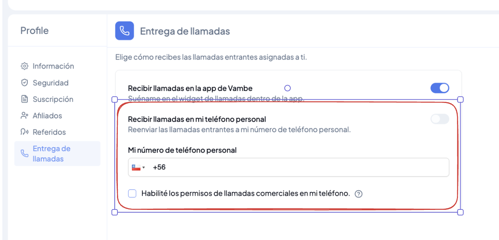
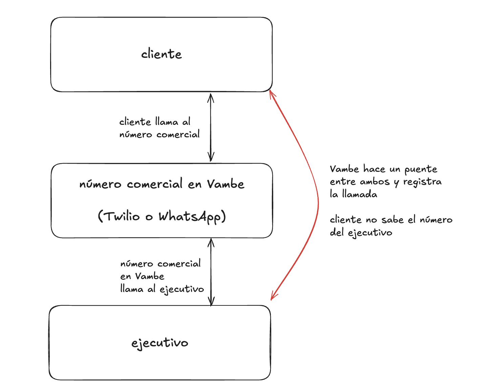

# Entrega de llamadas: recibe las llamadas donde te acomode

Cuando un cliente llama a uno de los números comerciales de tu empresa, esa llamada se asigna a un ejecutivo. La **Entrega de llamadas** define en qué dispositivo suena: dentro de Vambe o directamente en el teléfono personal del ejecutivo.

Es una configuración individual, así que cada persona del equipo decide cómo quiere trabajar. Quien pasa el día frente al computador puede atender desde Vambe; quien está en terreno puede recibir las llamadas en su celular sin necesidad de instalar la app móvil.

> **Para entrar:** en Vambe, abre tu **Perfil** y ve a la sección **Entrega de llamadas**. También puedes ir directo a [app.vambeai.com/profile?q=callProfile](https://app.vambeai.com/profile?q=callProfile).

***

## Las dos formas de recibir una llamada

<figure><figcaption>
Sección "Entrega de llamadas" en tu perfil
</figcaption></figure>

**Recibir llamadas en la app de Vambe.** La llamada suena en el widget de llamadas dentro de Vambe, en la misma ventana donde trabajas los tickets. Contestas desde el navegador, con el historial del contacto a la vista.

**Recibir llamadas en mi teléfono personal.** Vambe reenvía la llamada entrante a tu número de celular y la contestas como cualquier otra llamada. Al activar esta opción debes ingresar tu **número de teléfono personal** con su código de país.

Esta segunda opción no requiere la app móvil de Vambe: funciona con la telefonía normal de tu dispositivo.

***

## Cómo funciona el reenvío al teléfono personal

Vambe no le entrega tu número al cliente. Lo que hace es actuar como puente entre ambos:

<figure><figcaption>
Vambe conecta al cliente con el ejecutivo sin exponer el número personal
</figcaption></figure>

1. El cliente llama al **número comercial** de tu empresa configurado en Vambe.
2. Ese mismo número comercial llama a tu teléfono personal.
3. Vambe une ambas llamadas y registra la conversación completa.

El resultado: para el cliente la llamada es siempre con el número de la empresa, tu número personal queda protegido y la llamada aparece en el historial del contacto igual que si la hubieras atendido desde Vambe.

***

## Llamadas desde números de WhatsApp

Si el número comercial que recibe la llamada es un número de **WhatsApp API**, tu propio teléfono debe aceptar las llamadas comerciales de ese número. Es el mismo permiso que WhatsApp le pide a cualquier persona antes de recibir llamadas de una empresa.

Una vez que lo hayas autorizado en tu teléfono, marca la casilla **Habilité los permisos de llamadas comerciales en mi teléfono** para dejarlo registrado en tu perfil.

> ⚠️ Sin ese permiso, las llamadas que lleguen por números de WhatsApp no alcanzarán tu teléfono personal, aunque el reenvío esté activado.

***

## En resumen

La Entrega de llamadas asegura que ninguna llamada entrante se pierda por estar lejos del computador. Elige el widget dentro de Vambe, el reenvío a tu teléfono personal o ambos; en todos los casos el cliente ve el número comercial de la empresa y la conversación queda registrada en el contacto.

Si quieres repasar cómo se realizan y gestionan las llamadas dentro de Vambe, revisa [Cómo hacer y gestionar llamadas desde Vambe (Vambe Llamados)](como-hacer-y-gestionar-llamadas-desde-vambe-vambe-llamados.md).
