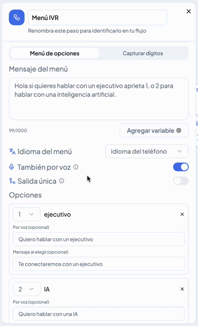
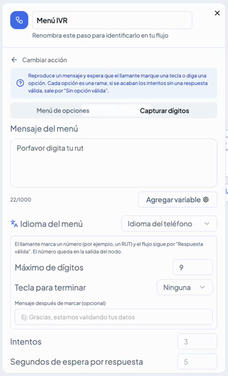
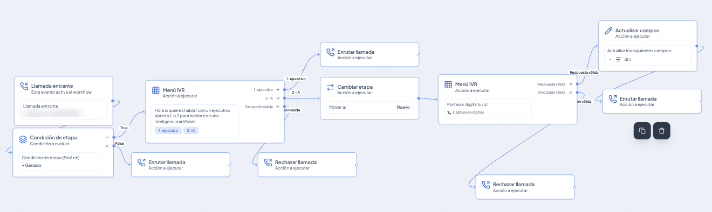

# Menú IVR en llamadas entrantes: deja que cada cliente elija cómo ser atendido

El **Menú IVR** es un nodo de los workflows que contesta una llamada entrante con un mensaje, espera a que la persona marque una tecla o diga su opción en voz alta, y continúa el flujo por la rama que corresponda. Así puedes derivar a cada cliente con un ejecutivo o con un asistente de IA, pedirle un dato como su RUT y registrarlo, sin que nadie de tu equipo tenga que atender la llamada primero.

Cada opción del menú es una rama del workflow, de modo que después de elegirla puedes encadenar cualquier otra acción de Vambe: cambiar la etapa del contacto, actualizar campos, enrutar o rechazar la llamada.


**Para entrar:** en el menú de la izquierda, ve a **Workflows** y luego a **Flows**. Crea un flow o edita uno existente cuyo trigger sea **Llamada entrante**, y agrega la acción **Menú IVR**. También puedes pedirle a PandAI que arme el flujo por ti describiéndole lo que necesitas.


***

## Dos formas de usar el Menú IVR

Al abrir el nodo encontrarás dos pestañas en la parte superior: **Menú de opciones** y **Capturar dígitos**. La primera sirve para que el cliente elija entre varias alternativas; la segunda, para que ingrese un número por teclado.

***

## Menú de opciones

Es el formato más conocido: una voz que dice "si quieres hablar con un ejecutivo, aprieta 1; si prefieres una inteligencia artificial, aprieta 2". Cada opción que defines se convierte en una salida del nodo.

### Mensaje y configuración general

En **Mensaje del menú** escribes lo que escuchará la persona al contestar (hasta 1.000 caracteres). Con el botón **Agregar variable** puedes personalizarlo con datos del contacto. Además puedes ajustar:

* **Idioma del menú:** por defecto usa el idioma del teléfono.
* **También por voz:** viene activado y permite que el cliente diga su opción en lugar de marcarla. Vambe interpreta lo que la persona dice y lo asocia a la opción correspondiente.

### Opciones

Cada opción tiene su propia configuración:

* **Número de tecla y nombre:** por ejemplo, tecla 1 con el nombre "ejecutivo" y tecla 2 con el nombre "IA".
* **Por voz (opcional):** la frase que representa esa opción cuando el cliente la dice, como "Quiero hablar con un ejecutivo".
* **Mensaje al elegir (opcional):** una confirmación que se reproduce al detectar la opción, como "Te conectaremos con un ejecutivo".

Con **Agregar opción** sumas todas las alternativas que necesites. Si la persona no elige ninguna opción válida, el flujo sale por la rama **Sin opción válida**, donde puedes decidir qué hacer, por ejemplo rechazar la llamada.

<figure><figcaption></figcaption></figure>

***

## Capturar dígitos

Úsalo cuando necesitas que el cliente ingrese un número con el teclado del teléfono. El caso más habitual es pedir el **RUT**, pero puedes capturar cualquier dato numérico que tu operación requiera.

El nodo reproduce tu mensaje (por ejemplo, "Por favor, digita tu RUT") y espera la respuesta. Puedes configurar:

* **Máximo de dígitos:** cuántos números acepta antes de continuar.
* **Tecla para terminar:** una tecla opcional con la que el cliente indica que terminó de digitar.
* **Mensaje después de marcar (opcional):** un aviso al terminar, como "Gracias, estamos validando tus datos".
* **Intentos y segundos de espera por respuesta:** cuántas veces puede reintentar y cuánto tiempo tiene para responder.

El número ingresado queda guardado como una variable en la salida del nodo, así que puedes usarlo en los pasos siguientes. Si la persona digita un valor válido, el flujo continúa por **Respuesta válida**; si se agotan los intentos sin una respuesta válida, sale por **Sin opción válida**.


**Considera el ruido ambiente.** La detección por voz funciona muy bien en condiciones normales, pero puede tener dificultades si la llamada capta mucho ruido, por ejemplo con el teléfono en altavoz. En un nodo que captura dígitos, como el RUT, lo más seguro es desactivar la voz y dejar solo el teclado.


<figure><figcaption></figcaption></figure>

***

## Ejemplo: derivar según la etapa del contacto

Este flujo muestra cómo se combina el Menú IVR con otras acciones. El trigger es **Llamada entrante** y el flujo responde distinto según la etapa en que esté el contacto:

1. Una **Condición de etapa** revisa si el contacto está en **Ganado**.
2. Si **no** está en Ganado, la llamada entra como siempre mediante **Enrutar llamada**.
3. Si está en Ganado, suena el **Menú IVR** con el mensaje "Hola, si quieres hablar con un ejecutivo aprieta 1, o 2 para hablar con una inteligencia artificial".
4. Con la **opción 1 (ejecutivo)**, la llamada se enruta directamente a un ejecutivo.
5. Con la **opción 2 (IA)**, el contacto pasa a la etapa **Nuevo** con **Cambiar etapa**, y un segundo **Menú IVR** en modo Capturar dígitos le pide su RUT por teclado. Si la respuesta es válida, **Actualizar campos** lo guarda en el campo **dni** y la llamada se enruta.

<figure><figcaption></figcaption></figure>

6. Si el cliente no marca una opción válida, en cualquiera de los dos menús, la llamada se rechaza con **Rechazar llamada**.

Como el cambio de etapa ocurre antes de enrutar la llamada, el asistente de IA asignado a la etapa **Nuevo** es quien la atiende.

***

## En resumen

El Menú IVR convierte la llamada entrante en un recorrido guiado: el cliente elige por teclado o por voz, entrega los datos que necesitas y llega a quien corresponde, ya sea un ejecutivo o un asistente de IA. Como cada opción es una rama del workflow, puedes combinarlo con condiciones, cambios de etapa y actualización de campos para adaptar la atención a cada tipo de contacto.
