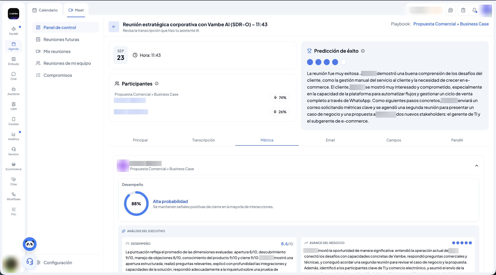
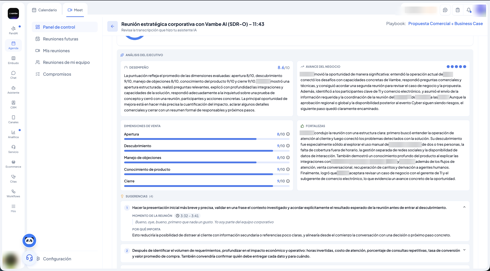
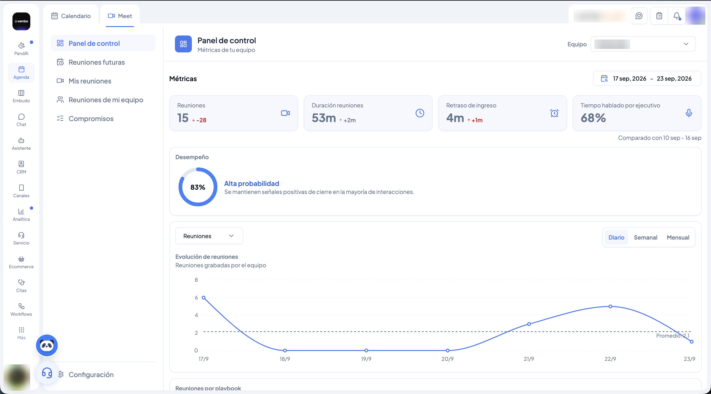
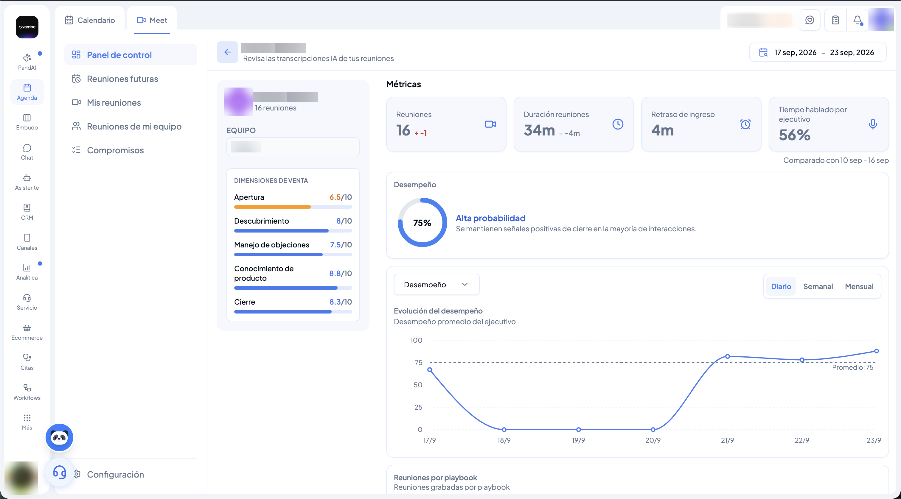

# Vambe Meet

Vambe Meet es un bot inteligente que se une automáticamente a tus reuniones para transcribirlas, analizarlas y convertirlas en información accionable. Una vez finalizada la reunión, tendrás acceso al video, la transcripción completa, un resumen generado con IA, y un análisis de desempeño con sugerencias concretas de mejora.

> ⚠️ **Importante:** Vambe Meet está disponible únicamente con la integración de **Google Calendar**.


**Para entrar:** ve a **Agenda** y luego a la pestaña **Meet**, junto a **Calendario**.


***

**¿Cómo funciona?**

Una vez configurado, Vambe Meet se agrega automáticamente como participante a cada reunión que tengas en tu calendario. No es necesario hacer nada adicional por reunión — el bot opera en segundo plano.

Al finalizar la reunión, se guardan automáticamente:

* 🎥 El **video** de la reunión
* 📝 La **transcripción** de lo que dijeron los asistentes
* 🤖 Un **resumen generado con IA**

***

**Configuración inicial**

**Conecta tu Google Calendar**

Dirígete a la sección **Agenda** en Vambe y conecta tu cuenta de Google Calendar. Deberás aceptar los permisos correspondientes. La sincronización toma aproximadamente **2 minutos**.

<figure><figcaption></figcaption></figure>

***

**¿Que ocurre ahora?**

A tus reuniones entrara "Vambe Meet" y comenzará a tomar apuntes de todo lo que pase en la reunión

**¿Dónde encuentro mis reuniones analizadas?**

Una vez finalizada una reunión, puedes acceder a toda la información directamente desde la pestaña **Meet**, dentro de **Agenda**. Ahí encontrarás, en el menú lateral, las secciones **Panel de control**, **Reuniones futuras**, **Mis reuniones**, **Reuniones de mi equipo** y **Compromisos**.

<figure><figcaption></figcaption></figure>

Desde **Mis reuniones** verás el listado de tus reuniones pasadas, con fecha, título del evento y un extracto del resumen. Al hacer clic en cualquiera, accedes al detalle completo de esa reunión.

<figure><figcaption></figcaption></figure>

***

**¿Qué información incluye el análisis?**

<figure><figcaption></figcaption></figure>

<figure><figcaption></figcaption></figure>

Al abrir una reunión analizada, encontrarás:

* 📋 **Resumen general** de lo que ocurrió en la reunión
* 🔑 **Temas clave** tratados durante la conversación
* ✅ **Decisiones tomadas**
* 📌 **Acciones pendientes**
* 🎬 **Transcripción** completa con identificación de participantes y video reproducible
* 📊 **Métricas** clave de la reunión
* ✉️ **Email sugerido** de seguimiento, listo para editar y enviar
* 🐼 **PandAI** para hacer preguntas y analizar la reunión en profundidad

La vista de detalle se organiza en pestañas —**Principal**, **Transcripción**, **Métrica**, **Email**, **Campos** y **PandAI**—, y dentro de **Métrica** encontrarás el análisis completo:

* **Predicción de éxito** — un indicador visual (de 1 a 5) de qué tan probable es que la oportunidad avance, junto con un párrafo que explica por qué.
* **Participantes** — quién participó y qué porcentaje del tiempo habló cada uno.
* **Análisis del ejecutivo** — un puntaje de **desempeño** (sobre 10) con la explicación de cómo se calculó, un resumen del **avance del negocio** logrado en la reunión, y las **fortalezas** que mostró el ejecutivo.
* **Dimensiones de venta** — el desempeño desglosado en cinco frentes, cada uno puntuado sobre 10: **Apertura**, **Descubrimiento**, **Manejo de objeciones**, **Conocimiento de producto** y **Cierre**.
* **Sugerencias** — recomendaciones concretas de mejora. Cada una indica el **momento exacto de la reunión** (con timestamp), cita textualmente lo que se dijo en ese momento, y explica **por qué importa** ese ajuste.


Las sugerencias no son genéricas: apuntan a una frase específica de esa reunión. Por ejemplo, si la apertura fue muy larga antes de acordar el objetivo de la llamada, la sugerencia va a citar exactamente esa parte de la transcripción y el minuto en que ocurrió.


***

**Panel de control: la evolución de tu equipo en un vistazo**

Desde **Panel de control**, dentro de Meet, ves el desempeño agregado de tu equipo en el rango de fechas que elijas, siempre comparado contra el periodo anterior:

* **Reuniones** — cuántas se realizaron, con la variación vs. el periodo anterior.
* **Duración de reuniones** — promedio de duración.
* **Retraso de ingreso** — promedio de atraso al entrar.
* **Tiempo hablado por ejecutivo** — balance entre ejecutivo y cliente.
* **Desempeño** — un porcentaje general con su calificación (por ejemplo, "Alta probabilidad").

Más abajo, el gráfico de **Evolución** te deja elegir qué métrica visualizar (reuniones, desempeño, etc.) y con qué frecuencia —**Diario**, **Semanal** o **Mensual**—, para ver la tendencia de tu equipo a través del tiempo. El panel también incluye **Reuniones por playbook**, que muestra la distribución de tus reuniones según su tipo.

<figure><figcaption></figcaption></figure>

***

**Reuniones de mi equipo**

Desde esta sección puedes seleccionar a cualquier Ejecutivo de tu equipo y ver su propio desempeño: cuántas reuniones tuvo, sus mismas métricas (duración, retraso de ingreso, tiempo hablado), su **Desempeño** general, la evolución de ese desempeño en el tiempo, y sus **Dimensiones de venta** promedio —Apertura, Descubrimiento, Manejo de objeciones, Conocimiento de producto y Cierre— para identificar en qué necesita reforzarse cada persona del equipo.

<figure><figcaption></figcaption></figure>


Para que este análisis sea relevante para tu tipo de reuniones, puedes crear equipos, agregar Ejecutivos y configurar instrucciones de IA personalizadas.


***

**Compromisos**

Puedes acceder rápidamente a todos los compromisos detectados por la IA en tus reuniones desde la sección **Compromisos**. Esto te permite hacer seguimiento sin tener que revisar cada reunión por separado.
