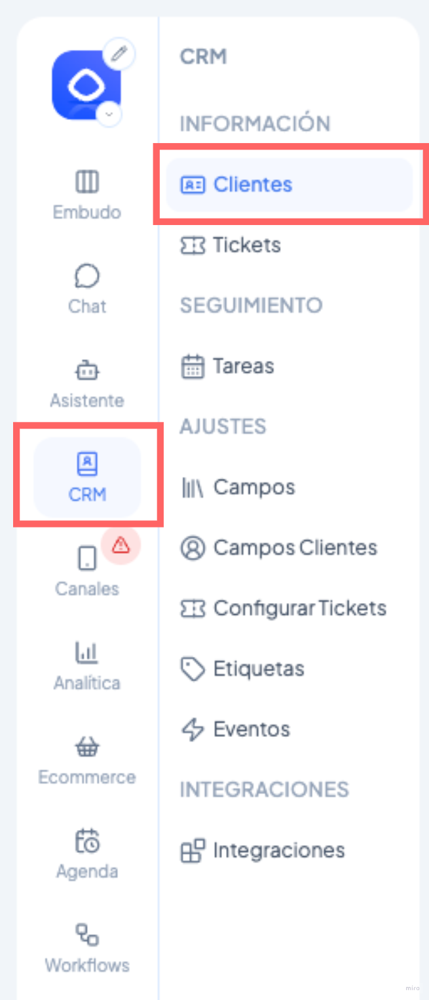

# Cómo exportar la información de mis tickets

Tener toda la información de tus tickets en un archivo descargable te permite analizar el rendimiento de tu equipo, hacer seguimiento de oportunidades y compartir datos con otras áreas sin depender de la plataforma. En este artículo aprenderás a exportar tus tickets en segundos, con la posibilidad de filtrar exactamente lo que necesitas o descargarlo todo de una vez.

***

### ¿Dónde encontrarlo?

1. Ve al menú lateral izquierdo → **CRM** → **Tickets**.
2. Aquí verás la tabla con todos tus tickets y su información asociada.

<figure><figcaption></figcaption></figure>

***

### Personalizar la vista antes de exportar

Antes de exportar puedes ajustar qué información quieres incluir:

**Filtros disponibles** (panel izquierdo):

<figure><figcaption></figcaption></figure>

* Etapa
* Estado de vida
* Estado de resolución
* Etiquetas
* Fecha de resolución
* Plataforma
* Estado de atención

**Columnas:** Usa el botón **Columnas** (arriba a la derecha de la tabla) para elegir qué columnas mostrar.

**Fechas:** Selecciona el rango de fechas que quieres revisar.


💡 Los filtros, columnas y búsquedas que tengas activos en el momento de exportar afectarán directamente el resultado si eliges exportar solo las columnas visibles.


***

### Exportar

1. Haz clic en el botón **Exportar** (arriba a la derecha).
2. Se abrirá un panel donde debes elegir qué quieres exportar:

| Opción                          | Descripción                                                                                              |
| ------------------------------- | -------------------------------------------------------------------------------------------------------- |
| **Exportar columnas visibles**  | Exporta solo las columnas actualmente visibles en la tabla, respetando los filtros y búsquedas aplicados |
| **Exportar todas las columnas** | Exporta todas las columnas predeterminadas y campos personalizados, sin importar los filtros activos     |

3. Opcionalmente puedes cambiar el **nombre del archivo**.
4. Haz clic en **Exportar**.

Se descargará automáticamente un archivo Excel con la información seleccionada, listo para usar.
