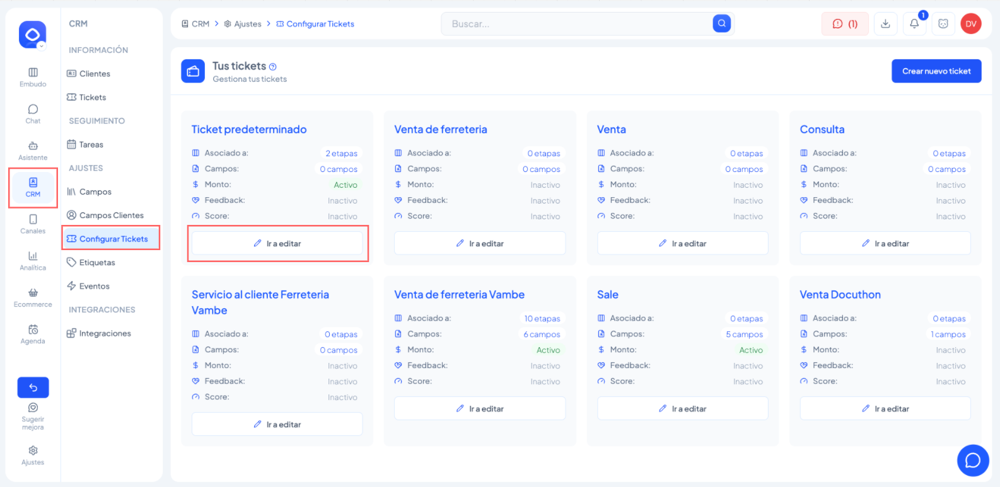

# Cómo enviar encuestas de satisfacción (NPS o CSAT) automáticamente en Vambe

En este artículo aprenderás a configurar el envío automático de encuestas de satisfacción NPS o CSAT a tus clientes a través de WhatsApp API, una vez que un ticket se cierra o alcanza una etapa determinada en Vambe.

Este seguimiento te permite medir la experiencia real de tus clientes y mejorar continuamente tus procesos de atención, ventas o soporte.

***

### ¿Cuándo se envían las encuestas?

Existen **dos formas** de enviar encuestas en Vambe, con comportamientos distintos:

| Método                       | ¿Cuándo se activa?                                                                              |
| ---------------------------- | ----------------------------------------------------------------------------------------------- |
| **Configuración de tickets** | Solo cuando el ticket se cierra formalmente                                                     |
| **Workflows**                | Cuando ocurra cualquier evento que tú definas (ingreso a etapa, cambio de campo, webhook, etc.) |

👉 Si un ticket no se cierra, la encuesta configurada por tickets **no** se enviará. Para mayor flexibilidad, usa el método por Workflows.

***

### Requisitos previos

Antes de comenzar, asegúrate de cumplir con lo siguiente:

* ✅ Tener [WhatsApp API correctamente conectado en Vambe](https://academy.vambe.ai/v1/docs/c%C3%B3mo-conectar-whatsapp-api-oficial)
* ✅ Tener al menos un tipo de ticket creado
* ✅ Tener ese tipo de ticket asignado a una o más etapas del embudo
* ✅ Saber cómo cerrar un ticket 👉 [Cómo y cuándo cerrar un ticket ganado o perdido](https://academy.vambe.ai/v1/docs/c%C3%B3mo-y-cu%C3%A1ndo-cerrar-un-ticket-ganado-o-perdido)

> ⚠️ La acción de enviar encuesta de feedback es **solo compatible con WhatsApp API y metodo dual**. No funciona con WhatsApp QR.

***

### Método 1: Configuración desde el tipo de ticket

Este es el método más simple. La encuesta se envía automáticamente cada vez que un ticket de ese tipo se cierra formalmente.

#### Paso 1: Acceder a la configuración de tickets

1. Ve al menú lateral izquierdo.
2. Ingresa a **CRM**.
3. Haz clic en **Configurar tickets**.
4. Selecciona el tipo de ticket al que deseas asociar la encuesta.
5. Haz clic en **Editar**.

<figure><figcaption></figcaption></figure>

#### Paso 2: Configurar el Feedback (NPS o CSAT)

1. Dentro del tipo de ticket, ve a la pestaña **Feedback**.
2. Haz clic en **Administrar**.

<figure><figcaption></figcaption></figure>

Se abrirá un panel donde deberás definir:

**Tipo de encuesta:**

* **NPS** (Net Promoter Score) — mide la probabilidad de que el cliente te recomiende a un amigo, con escala del 1 al 10.
* **CSAT** (Customer Satisfaction Score) — mide la satisfacción general con el servicio recibido.

<figure><figcaption></figcaption></figure>

#### Paso 3: Definir el tiempo de espera

Aquí defines cuánto tiempo después del cierre del ticket se enviará la encuesta. El contador comienza solo cuando el ticket se cierra.

Ejemplos:

* 3 minutos después del cierre
* 1 hora después
* 3 días después

#### Paso 4: Revisar y guardar

Una vez configurado el tipo de encuesta y el tiempo de espera, verás una vista previa de la encuesta que recibirá el cliente. Haz clic en **Guardar**.

> ✅ Con esto, la encuesta queda activa y se programará automáticamente cada vez que se cierre un ticket de ese tipo.

#### Paso 5: Revisar el mensaje que se enviará al cliente

**Opción A: WhatsApp Flows**

1. Ve al menú lateral izquierdo → **Canales** → **WhatsApp Flows**.
2. Ahí verás el flujo de la encuesta que se enviará al cliente.

<figure><figcaption></figcaption></figure>

**Opción B: Plantillas de WhatsApp**

1. Ve al menú lateral izquierdo → **Plantillas**.
2. Busca la plantilla asociada al feedback NPS o CSAT.

<figure><figcaption></figcaption></figure>

#### Paso 6: Ver encuestas programadas y respuestas por ticket

Dentro de cada ticket:

1. Abre el ticket correspondiente.
2. En la parte superior derecha, haz clic en el **ícono de calendario**.

Ahí podrás ver:

* El mensaje de feedback programado.
* Si el cliente ya respondió.
* La respuesta entregada (NPS o CSAT).

***

### Método 2: Enviar encuestas desde un Workflow

Este método es más flexible. Te permite enviar la encuesta en base a **cualquier evento de tu embudo**, no solo el cierre de ticket. Por ejemplo: cuando el cliente entra a una etapa específica, cuando se actualiza un campo, o cuando se recibe una señal vía webhook.


💡 Si tienes dudas sobre cómo funcionan los Flows y sus gatillantes disponibles, te recomendamos leer primero el [artículo de Workflows](https://academy.vambe.ai/workflows).


#### Paso 1: Crear el Flow

1. Ve al menú lateral izquierdo → **Workflows** → **Flows**.
2. Haz clic en **Crear Flow** (arriba a la derecha).

#### Paso 2: Seleccionar el trigger (gatillante)

Elige el evento que disparará el envío de la encuesta. _**Algunos ejemplos útiles:**_

| Trigger                        | Cuándo usarlo                                                             |
| ------------------------------ | ------------------------------------------------------------------------- |
| **Ingreso a etapa**            | Cuando el cliente entra a una etapa de cierre. Ej: _"Cliente Finalizado"_ |
| **Estado del ticket cambiado** | Cuando el ticket se marca como ganado o perdido                           |
| **Campos actualizados**        | Cuando se registra un dato específico en el contacto o ticket             |
| **Webhook**                    | Cuando un sistema externo te notifica que ocurrió algo                    |

Para el caso más común — enviar la encuesta al cerrar una venta — selecciona **Ingreso a etapa** y elige la etapa correspondiente. Ej: _"Cliente Finalizado"_.

<figure><figcaption></figcaption></figure>

#### Paso 3: Agregar una Espera

Después del trigger, haz clic en **+** y selecciona **Acción → Espera**.

Define cuánto tiempo esperar antes de enviar la encuesta:

* Tipo de espera: **Tiempo de espera**
* Cantidad: Ej: 4 hours, 1 day, 30 minutes
* **Espera inteligente** (opcional): Actívala si no quieres que la encuesta se envíe fuera de horario hábil.


💡 Dar un tiempo de espera antes de enviar la encuesta es una buena práctica: le da margen al cliente para recibir su producto o servicio antes de ser evaluado.


<figure><figcaption></figcaption></figure>

#### Paso 4: Agregar la acción de encuesta

Haz clic en **+** después de la espera y selecciona **Acción → Enviar encuesta de feedback**.

Elige el tipo de encuesta:

* **NPS** — _"¿Qué tan probable es que nos recomiendes a un amigo?"_
* **CSAT** — mide la satisfacción con el servicio recibido.

El cliente recibirá la encuesta directamente en WhatsApp como un formulario interactivo.

<figure><figcaption></figcaption></figure>

#### Paso 5: Guardar y activar el Flow

Una vez armado el flujo completo, haz clic en **Guardar** (arriba a la derecha). Asegúrate de que el Flow quede en estado **Activo** para que comience a ejecutarse.

El flujo completo se verá así:

```
Ingreso a etapa (Cliente Finalizado)
    └── Espera (4 horas)
            └── Enviar encuesta de feedback (NPS)
```

<figure><figcaption></figcaption></figure>

***

### ¿Cuál método usar?

|                              | Configuración de tickets | Workflows                               |
| ---------------------------- | ------------------------ | --------------------------------------- |
| **Simplicidad**              | ✅ Más simple             | Requiere crear un Flow                  |
| **Flexibilidad del trigger** | Solo al cerrar ticket    | Cualquier evento del embudo             |
| **Control del tiempo**       | ✅ Configurable           | ✅ Configurable + Espera inteligente     |
| **Personalización**          | Básica                   | Alta (puedes agregar condiciones antes) |
| **Recomendado para**         | Casos estándar de cierre | Flujos más complejos o personalizados   |

***

### Resumen rápido

* Las encuestas NPS y CSAT se envían automáticamente por WhatsApp API.
* Tienes dos métodos: desde la **configuración de tickets** (al cierre) o desde un **Workflow** (cualquier evento).
* El tiempo de envío es configurable en ambos métodos.
* Puedes revisar el mensaje, la programación y las respuestas desde dentro de cada ticket.
* Una vez creado el Workflow, recuerda **guardarlo y activarlo**.
