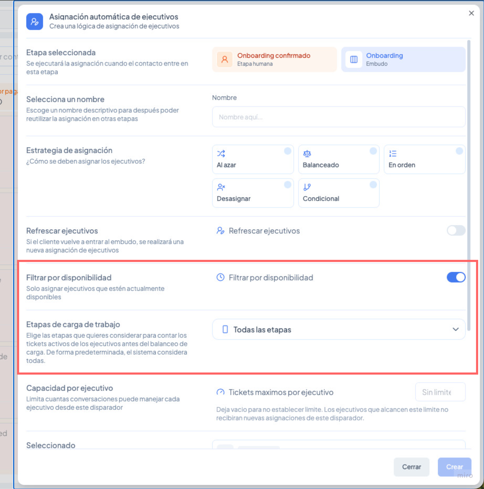

# Cómo gestionar la disponibilidad de tu equipo y controlar la carga de trabajo

Evita que tus agentes se saturen y asegúrate de que los tickets siempre lleguen a quien puede atenderlos. Con los estados de disponibilidad, los límites de capacidad y la nueva gestión de ejecutivos, tienes control total sobre cómo se distribuye el trabajo en tu equipo en tiempo real.

⚠️ **Nota:** La funcionalidad de estados de disponibilidad e indicador de presencia no está activada por defecto. Si quieres habilitarla para tu cuenta, contacta al equipo de soporte de Vambe.

***

### Parte 1: Estados de disponibilidad

#### ¿Qué es el estado de disponibilidad?

Cada ejecutivo puede indicar en qué situación se encuentra dentro de Vambe. Esto permite que el sistema sepa a quién puede asignarle un ticket en cada momento.

#### ¿Cómo actualizar tu estado?

1. Haz clic en tu **avatar** (arriba a la derecha).
2. Haz clic en **Actualiza tu estado**.

<figure><figcaption></figcaption></figure>

3. Se abrirá un panel donde podrás seleccionar uno de los cinco estados disponibles:

| Estado             | Descripción                                  |
| ------------------ | -------------------------------------------- |
| 🟢 **Disponible**  | Listo para recibir tickets                   |
| 🔴 **Ocupado**     | Con trabajo activo, no recibe nuevos tickets |
| 🏖️ **Vacaciones** | Fuera de la oficina                          |
| 🤒 **Enfermo**     | No disponible por salud                      |
| 🍽️ **Almuerzo**   | En pausa de almuerzo                         |

4. Selecciona tu estado y haz clic en **Guardar**.

<figure><figcaption></figcaption></figure>

> ⚠️ Algunos estados no permiten recibir nuevas asignaciones. El sistema te lo indicará en el panel.

#### Indicador de presencia

Además del estado, cada ejecutivo tiene un **punto verde** visible en su avatar que indica que tiene una pestaña de Vambe activa en su navegador en ese momento. Esto es distinto al estado: un agente puede estar "Disponible" pero no tener la plataforma abierta, o viceversa.

***

### Parte 2: Filtrar asignaciones por disponibilidad

Puedes configurar tus asignaciones automáticas para que solo asignen tickets a ejecutivos que estén en estado **Disponible**.

#### ¿Dónde se configura?

Al crear o editar una asignación automática desde la configuración de una etapa, verás las siguientes opciones nuevas:

<figure><figcaption></figcaption></figure>

**Refrescar ejecutivos** Si el cliente vuelve a entrar al embudo, se realizará una nueva asignación de ejecutivos. Por defecto está inactivo.

**Filtrar por disponibilidad** Cuando está activo, el sistema solo asignará tickets a ejecutivos cuyo estado sea "Disponible". Si un agente se pone en "Ocupado" o "Almuerzo", no recibirá nuevas asignaciones hasta volver a "Disponible".

> 💡 Por defecto este filtro está desactivado, ya que requiere que los ejecutivos tengan el estado de disponibilidad habilitado en la cuenta.

***

### Parte 3: Control de carga de trabajo por agente

#### Etapas de carga de trabajo

Puedes definir qué etapas del embudo cuentan como "trabajo activo" al momento de calcular la carga de un agente. Esto es especialmente útil para la estrategia **Balanceada**, que asigna al agente con menos tickets activos.

Por ejemplo, si tienes una etapa de "Espera de respuesta" donde los agentes no están activamente trabajando, puedes excluirla para que no infle artificialmente la carga del agente.

<figure><figcaption></figcaption></figure>

Por defecto el sistema considera **todas las etapas**.

#### Capacidad por agente (Tickets máximos por agente)

<figure><figcaption></figcaption></figure>

Puedes definir un límite máximo de tickets activos que un ejecutivo puede tener asignados desde un disparador en particular al mismo tiempo.

* Por defecto es **sin límite**.
* Cuando un agente alcanza el límite definido, no recibirá nuevas asignaciones de ese disparador hasta que cierre o mueva alguno de sus tickets activos.
* Cuando un ticket se mueve de etapa o se desasigna, el sistema automáticamente reasigna los tickets pendientes a los agentes que tengan capacidad disponible.


💡 **Buena práctica:** Cuando tu equipo se desconecta en la noche y vuelve a conectarse al día siguiente, los tickets pendientes se irán asignando en orden de llegada a medida que los agentes se reconecten y liberen capacidad.


***

### Parte 4: Nueva gestión de ejecutivos y equipos

La sección de gestión de ejecutivos fue rediseñada completamente. Puedes encontrarla en **Ajustes → Equipos**.

<figure><figcaption></figcaption></figure>

#### Vista de Ejecutivos

La nueva pestaña **Ejecutivos** te muestra todos los agentes de tu cuenta en formato de tarjetas, con su rol, equipos, embudos y canales asignados de un vistazo.

Desde cada tarjeta puedes:

* **Ver equipo** — ver a qué equipos pertenece ese ejecutivo.
* **Editar** — modificar sus permisos de canales, embudos y rol.

#### Invitar un ejecutivo con permisos desde el inicio

Al hacer clic en **Agregar ejecutivo**, ahora puedes definir desde el mismo formulario de invitación:

* Nombre y apellido
* Rol (Super Admin, Admin, Agente)
* Embudos disponibles
* Canales a los que tendrá acceso (todos o algunos específicos)

<figure><figcaption></figcaption></figure>

Antes había que invitar al agente y luego configurar sus permisos por separado. Ahora todo se hace en un solo paso.

#### Crear y gestionar equipos

En la pestaña **Equipos** puedes crear grupos de ejecutivos y agregar miembros directamente al momento de crear el equipo, sin tener que hacerlo uno por uno después.

Desde la vista de equipos también puedes:

* Ver los miembros de cada equipo.
* Desasignar miembros.
* Buscar ejecutivos dentro del equipo.

***

### Resumen

| Funcionalidad                       | Dónde configurarla                                      |
| ----------------------------------- | ------------------------------------------------------- |
| **Estado de disponibilidad**        | Avatar (arriba a la derecha) → Actualiza tu estado      |
| **Filtrar por disponibilidad**      | Configuración de etapa → Asignación automática → Editar |
| **Tickets máximos por agente**      | Configuración de etapa → Asignación automática → Editar |
| **Etapas de carga de trabajo**      | Configuración de etapa → Asignación automática → Editar |
| **Gestión de ejecutivos y equipos** | Ajustes → Equipos                                       |
