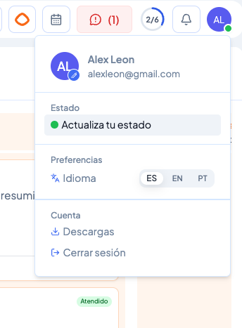

# Disponibilidad y asignación inteligente de ejecutivos

Evita que tus agentes se saturen y asegúrate de que los tickets siempre lleguen a quien puede atenderlos. Con los estados de disponibilidad, los límites de capacidad y la transferencia automática de tickets, tienes control total sobre cómo se distribuye el trabajo en tu equipo en tiempo real.

***

### Parte 1: Estados de disponibilidad

#### ¿Qué es el estado de disponibilidad?

Cada ejecutivo puede indicar en qué situación se encuentra en Vambe. Esto permite que el sistema sepa a quién puede asignarle un ticket en cada momento, influyendo directamente en las decisiones de las estrategias de asignación automática.

#### ¿Cómo actualizar tu estado?

1. Haz clic en tu avatar (arriba a la derecha).
2. Haz clic en **Actualiza tu estado**.
3. Selecciona uno de los cinco estados disponibles y haz clic en **Guardar**.

<figure><figcaption></figcaption></figure>

Los estados disponibles son:

| Estado                     | Descripción                                                                                                        |
| -------------------------- | ------------------------------------------------------------------------------------------------------------------ |
| 🟢 **Disponible**          | Activo y listo para recibir nuevas asignaciones.                                                                   |
| 🔴 **Ocupado**             | En Vambe pero temporalmente sin capacidad (ej: reunión). No recibe nuevos tickets, pero los suyos no se reasignan. |
| 🍽️ **Almuerzo**           | Ausencia corta. Los tickets activos pueden reasignarse.                                                            |
| 🏠 **Fuera de la oficina** | Ausencia del día. Los tickets activos pueden reasignarse.                                                          |
| 🌴 **Vacaciones**          | Ausencia extendida. Los tickets activos pueden reasignarse.                                                        |

> ⚠️ Algunos estados no permiten recibir nuevas asignaciones. El sistema te lo indicará en el panel al seleccionarlo.

#### Opciones avanzadas al configurar un estado

Al seleccionar un estado, puedes configurar opciones adicionales:

* **Quitar después de:** programa cuándo expira el estado (ej: en 1 hora, o hasta una fecha específica).
* **Revertir a:** define a qué estado vuelve automáticamente al expirar (ej: Disponible el lunes a las 9:00 h).
* **Pausar notificaciones push:** las notificaciones al celular se pausan mientras el ejecutivo no está disponible. Los mensajes siguen registrándose en Vambe, pero no interrumpen el descanso del equipo.

> 💡 Desde la app móvil también puedes cambiar tu estado, pero por ahora las opciones de expiración automática y pausa de notificaciones no están disponibles en mobile.

#### Indicador de presencia

Además del estado, cada ejecutivo tiene un **punto verde** visible en su avatar que indica que tiene una pestaña de Vambe activa en su navegador en ese momento. Esto es distinto al estado: un agente puede estar marcado como "Disponible" pero no tener la app abierta, o viceversa.

#### Cambio de estado por un administrador

Un administrador puede cambiar el estado de cualquier ejecutivo desde **Ajustes → Equipos**, haciendo clic en el estado del ejecutivo. Esto es útil cuando alguien no tiene acceso a Vambe en ese momento.

***

### Parte 2: Transferencia de tickets al ausentarse

Cuando un ejecutivo elige un estado de ausencia (Almuerzo, Fuera de la oficina, Vacaciones), puede transferir sus conversaciones activas a otros miembros del equipo. Hay tres estrategias disponibles:

#### Directo

Transfiere todos los tickets a un ejecutivo específico que tú eliges.

#### Balanceado

Distribuye los tickets entre varios ejecutivos priorizando a quienes tienen **menor carga de trabajo activa** en ese momento. El sistema va nivelando la distribución hasta equilibrar las cargas.

#### Equitativo

Reparte los tickets de forma igualitaria entre los ejecutivos seleccionados, sin considerar la carga actual. Por ejemplo, si hay 8 tickets y 4 ejecutivos, cada uno recibe 2.

***

### Parte 3: Filtrar asignaciones por disponibilidad

Puedes configurar tus asignaciones automáticas para que solo asignen tickets a ejecutivos en estado Disponible, asegurando que los leads solo lleguen a agentes que puedan atenderlos activamente.

#### ¿Dónde se configura?

<figure><figcaption></figcaption></figure>

Al crear o editar una asignación automática desde la configuración de una etapa, encontrarás estas opciones en los ajustes avanzados:

**Refrescar ejecutivos** Si el cliente vuelve a entrar al embudo, se realiza una nueva asignación de ejecutivos. Por defecto está inactivo.

**Filtrar por disponibilidad** Cuando está activo, el sistema solo asigna tickets a ejecutivos cuyo estado sea Disponible. Si un agente pasa a Ocupado o Almuerzo, no recibirá nuevas asignaciones hasta volver a Disponible.

> 💡 Por defecto este filtro está desactivado.

**Refrescar por disponibilidad** Si un ejecutivo recibe un ticket y luego pasa a un estado de ausencia (Vacaciones, Almuerzo, Fuera de la oficina), el sistema lo **desasigna automáticamente** cuando el cliente vuelve a escribir y reasigna la conversación a un ejecutivo disponible.

> ⚠️ Esta reasignación **no ocurre si el ejecutivo está en estado Ocupado**, ya que se asume que sigue en Vambe y puede responder después.

También puedes definir en qué **etapas del pipeline** aplica esta lógica. Por ejemplo, puedes activarla solo en la etapa de soporte activo (donde el tiempo de respuesta es crítico) y no en etapas donde estás esperando respuesta del cliente.

***

### Parte 4: Control de carga de trabajo por agente

#### Etapas de carga de trabajo

<figure><figcaption></figcaption></figure>

Puedes definir qué etapas del embudo cuentan como "trabajo activo" al calcular la carga de un agente. Esto es especialmente útil para la estrategia Balanceada y para que la asignación condicional tome decisiones más informadas.

Por ejemplo, si tienes una etapa de "Espera de respuesta del cliente" donde los agentes no están trabajando activamente, puedes excluirla para que no infle artificialmente la carga del ejecutivo.

> Por defecto, el sistema considera todas las etapas.

#### Capacidad por agente (tickets máximos)

<figure><figcaption></figcaption></figure>

Puedes definir un **límite máximo de tickets activos** que un ejecutivo puede tener asignados desde un trigger en particular al mismo tiempo.

* Por defecto es sin límite.
* Cuando un agente alcanza el límite, no recibirá nuevas asignaciones de ese trigger hasta que cierre o mueva alguno de sus tickets activos.
* Este límite es respetado por todas las estrategias de asignación, incluidas las condicionales y de IA.
* Cuando un ticket se mueve de etapa o se desasigna, el sistema automáticamente reasigna los tickets pendientes a los agentes que tengan capacidad disponible.

> 💡 **Buena práctica:** Cuando tu equipo se desconecta en la noche y vuelve al día siguiente, los tickets pendientes se irán asignando en orden de llegada a medida que los agentes se reconecten y liberen capacidad.

#### ¿Qué pasa si no hay ejecutivos disponibles?

Si todos los ejecutivos están no disponibles o han alcanzado su límite de capacidad:

* Pueden seguirse haciendo asignaciones manuales.
* Los tickets quedan en una **cola de espera** dentro del trigger.
* En cuanto un ejecutivo vuelva a estar disponible o libere capacidad, el sistema le asigna automáticamente los tickets en espera.

> 💡 La regla por defecto (fallback) en la asignación condicional juega un rol clave aquí. Si todos los agentes de una regla están al límite, el sistema puede recurrir a la regla por defecto para asegurar que ningún ticket quede sin atención.

***

### Parte 5: Gestión de ejecutivos y equipos

La sección de gestión fue rediseñada completamente. Puedes encontrarla en **Ajustes → Equipos**.

<figure><figcaption></figcaption></figure>

#### Vista de ejecutivos

La pestaña **Ejecutivos** muestra todos los agentes de tu cuenta en formato de tarjetas, con su rol, equipos, embudos y canales asignados de un vistazo. Desde cada tarjeta puedes:

* **Ver equipo** — ver a qué equipos pertenece ese ejecutivo.
* **Editar** — modificar sus permisos de canales, embudos y rol.

#### Invitar un ejecutivo con permisos desde el inicio

<figure><figcaption></figcaption></figure>

Al hacer clic en **Agregar ejecutivo**, puedes definir desde el mismo formulario de invitación:

* Nombre y apellido
* Rol (Super Admin, Admin, Agente)
* Embudos disponibles
* Canales a los que tendrá acceso (todos o específicos)

Antes había que invitar al agente y luego configurar sus permisos por separado. Ahora todo se hace en un solo paso.

#### Crear y gestionar equipos

En la pestaña **Equipos** puedes crear grupos de ejecutivos y agregar miembros directamente al crear el equipo. Desde esta vista también puedes ver los miembros de cada equipo, desasignar miembros y buscar ejecutivos dentro del equipo.

***

### Resumen

| Funcionalidad                | ¿Qué resuelve?                                                          |
| ---------------------------- | ----------------------------------------------------------------------- |
| Estados de disponibilidad    | El sistema sabe a quién puede asignarle un ticket en cada momento.      |
| Transferencia al ausentarse  | Los tickets no quedan sin atención cuando un ejecutivo se ausenta.      |
| Filtrar por disponibilidad   | Solo asigna a ejecutivos que pueden atender activamente.                |
| Refrescar por disponibilidad | Si el ejecutivo asignado no está, el sistema reasigna al instante.      |
| Control de carga por etapa   | Evita que los ejecutivos se saturen con tickets de etapas activas.      |
| Capacidad por agente         | Limita el máximo de tickets simultáneos por ejecutivo.                  |
| Cola de espera               | Ningún ticket se pierde aunque no haya nadie disponible en ese momento. |

> 💡 **Buena práctica:** Los agentes deben cerrar sus tickets asignados cuando terminen para que la asignación balanceada funcione correctamente. En la asignación condicional, asegúrate de que los campos usados en las condiciones estén siempre completos para evitar que todos los tickets caigan en el Default.
