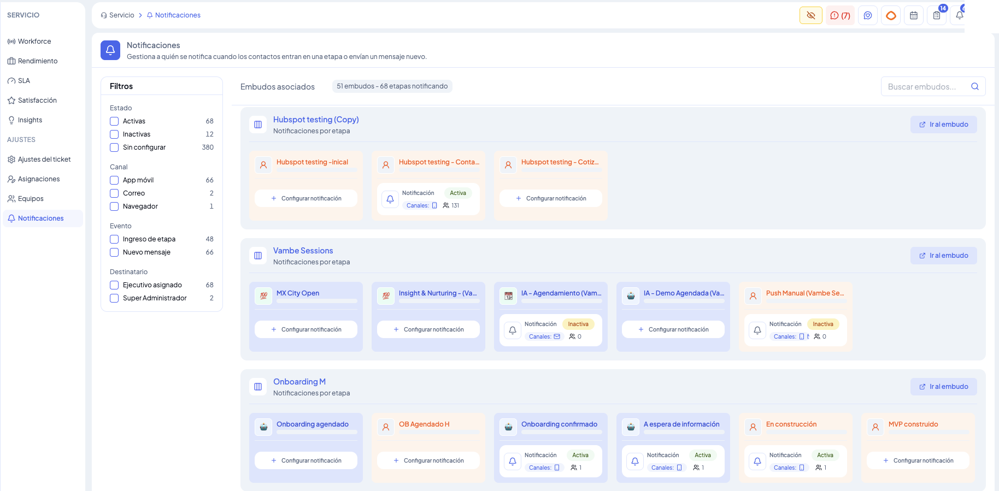
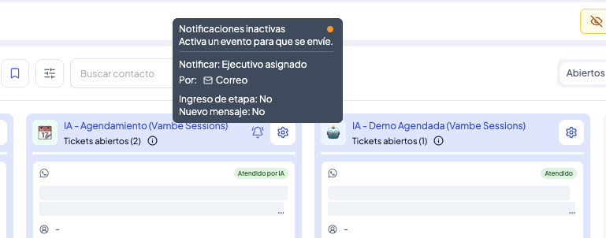

# Notificaciones en Servicio: todo el mapa de avisos en una sola pantalla

Cada etapa de un embudo puede avisarle a alguien cuando un contacto entra a ella o le llega un mensaje nuevo. El problema es que, cuando esa configuración vive escondida dentro de cada etapa, es fácil perder de vista quién se está enterando de qué — o descubrir tarde que una notificación que creías activa en realidad no le llega a nadie. El panel de **Notificaciones** reúne toda esa información en una sola pantalla: para cada etapa de cada embudo puedes ver si tiene una notificación configurada, si de verdad se está enviando y a cuántas personas llega.

> Para entrar: en el menú de la izquierda, dentro de **Servicio**, ve a **Ajustes** y haz clic en **Notificaciones**.

***

#### Cómo está organizado el panel

El panel agrupa las notificaciones por **embudo**: cada uno aparece como una tarjeta con su nombre y, dentro de ella, una tarjeta por cada etapa que tiene (o podría tener) una notificación configurada. En cada tarjeta de etapa ves el estado de la notificación, los canales por los que se envía y cuántas personas la reciben.

A la izquierda, los filtros te dejan encontrar rápido lo que buscas sin recorrer los embudos uno por uno: por **estado** (activas, inactivas o sin configurar), por **canal** (correo, app móvil, navegador), por **evento** que la dispara (ingreso de etapa, nuevo mensaje) o por **destinatario** (ejecutivo asignado, súper administrador). Arriba del listado, un contador te da la foto completa — cuántos embudos tienen notificaciones asociadas y cuántas etapas están notificando en total.

***

#### Los tres estados de una notificación

Cada etapa puede estar en uno de tres estados, y el panel lo deja ver de un vistazo:

* **Activa** — la notificación está configurada y se está enviando con normalidad.
* **Inactiva** — la etapa tiene una configuración propia, pero no le llega a nadie porque falta alguna pieza: el canal, el destinatario o el evento que la dispara. El panel te dice exactamente cuál de los tres falta, para que no tengas que adivinar.
* **Sin configurar** — la etapa no tiene ninguna notificación creada todavía. Desde su tarjeta puedes configurarla directamente.

Por ejemplo, una etapa puede tener ya definido a quién avisar (el **Ejecutivo asignado**) y por qué canal (**Correo**), pero si ni el ingreso de etapa ni el nuevo mensaje están activados como evento disparador, la notificación queda marcada como inactiva: está lista, pero nadie la está gatillando.

***

#### El estado también se ve dentro del embudo

No hace falta entrar al panel para saber si una etapa está avisando o no: el ícono de notificación en cada etapa, dentro del propio embudo, muestra un punto **verde** cuando está activa y **naranjo** cuando está inactiva. Al pasar el cursor sobre ese ícono aparece el mismo detalle que ves en el panel — a quién notifica, por qué canal y si el ingreso de etapa o el nuevo mensaje están activados como evento — así identificas al instante qué le falta a esa notificación para empezar a enviarse.

***

#### En resumen

El panel de Notificaciones te ahorra revisar embudo por embudo: en una sola vista, ordenada por estado, canal, evento y destinatario, confirmas de un vistazo qué etapas están avisando, cuáles necesitan un ajuste puntual y cuáles todavía no tienen ninguna notificación, sin perder de vista a cuántas personas le está llegando cada aviso.
