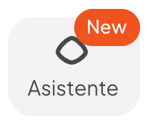

# Conoce al Nuevo Asistente Inteligente de Vambe Ads: Tu Copiloto de Marketing

<figure><figcaption></figcaption></figure>

Hemos transformado por completo la forma en que interactúas con tus campañas. En nuestra última actualización, le decimos adiós al tradicional "dashboard" estático y le damos la bienvenida a una vista principal impulsada por un Asistente Inteligente.

El objetivo de Vambe Ads ya no es solo mostrarte métricas, sino convertirse en tu aliado estratégico: un copiloto capaz de analizar datos, ejecutar tareas operativas y sugerir decisiones de negocio en tiempo real.

#### De un Panel Estático a una Mesa de Trabajo Conversacional

La nueva interfaz se divide en dos áreas clave diseñadas para la productividad:

1. Panel de Asistente (Izquierda): Tu centro de comando. Aquí conversas con la IA, haces preguntas sobre tus campañas o le pides que ejecute tareas.
2. Mesa de Trabajo (Derecha): El espacio donde ocurre la magia. Aquí aparecerán los reportes que pidas, las imágenes generadas, o los scripts listos para copiar y pegar.

<figure><figcaption></figcaption></figure>

#### ¿Qué puede hacer el nuevo Asistente por ti hoy?

El asistente está entrenado para gestionar tu marketing de punta a punta:

*   Análisis de Datos y Decisiones Estratégicas: Al iniciar, le indicas al asistente cuál es tu KPI principal (por ejemplo, "agendamientos" o "ventas"). Luego, simplemente puedes preguntarle: _"¿Cómo rindieron mis campañas en marzo?"_. El asistente analizará la data y te dirá exactamente qué campañas tienen mejor eficiencia, cuáles traen más volumen y, lo más importante, cuáles están desperdiciando tu presupuesto, para que sepas dónde reasignar tu dinero.
*   Generación de Creatividades Simplificada: Pídele al asistente que cree un anuncio o una variación de uno existente (por ejemplo, "modifica este anuncio para el mercado de Chile"). La IA incluso puede absorber el _branding_ de tu empresa simplemente pasándole un link.
*   **Creación y Gestión de Campañas Completas:** La IA comprende tu negocio, lo que te permite crear campañas de marketing desde cero o gestionar las existentes con solo conversar. Simplemente describe tu objetivo ("Quiero lanzar una campaña para promover mi nuevo producto con un descuento del 15%") y el asistente se encargará de configurar los detalles, seleccionar audiencias o ajustar presupuestos.
*   Gestión Operativa sin Fricción: Olvídate de navegar por menús complejos. Pídele al chat que:
    *   Cree y edite columnas personalizadas.
    *   Configure nuevos eventos y te recomiende cuáles optimizar.
    *   Te ayude a configurar el trackeo (generando los links de TikTok a WhatsApp o de tu sitio web).
    *   Exporte reportes listos para descargar con los filtros que le pidas.
