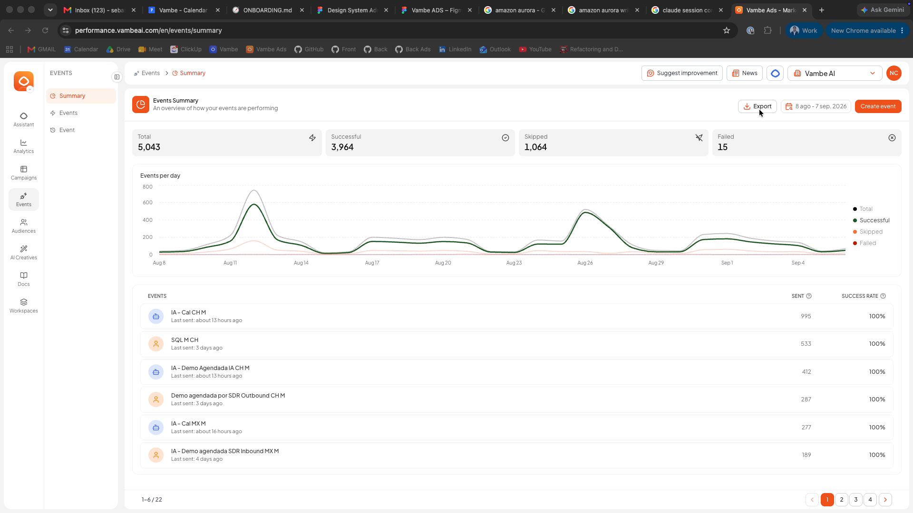
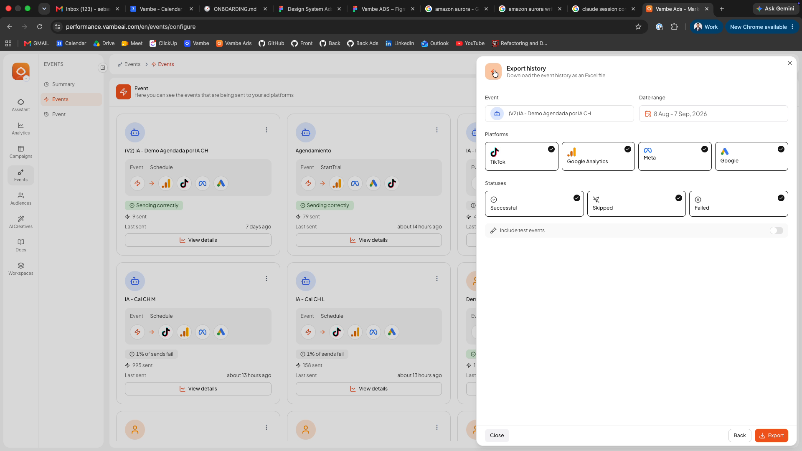
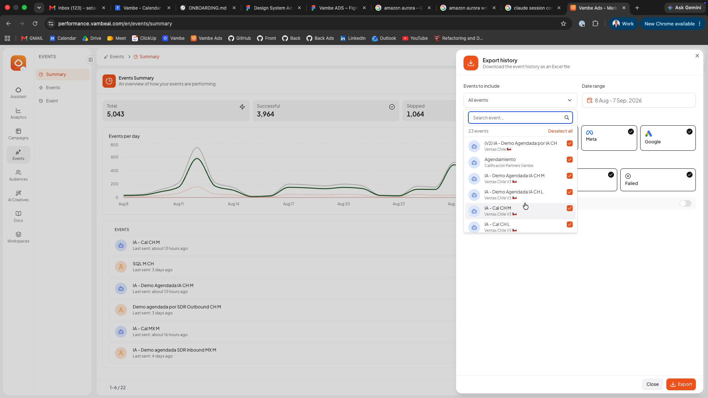
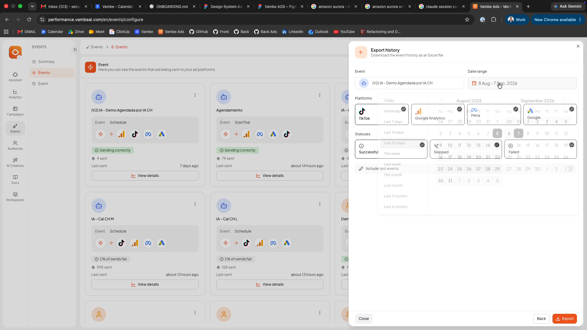
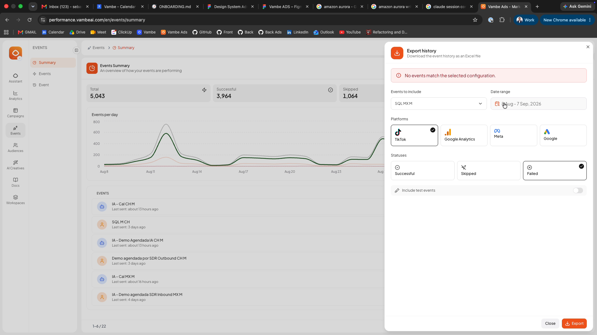
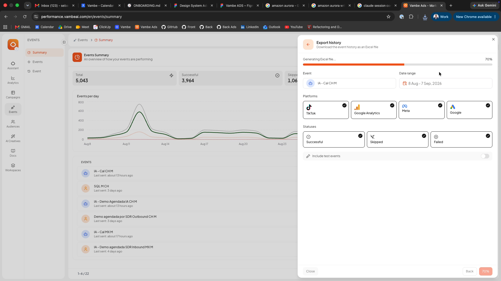
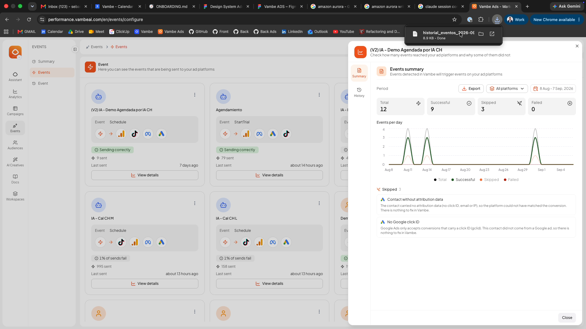

# Eventos en Vambe Ads: cómo optimizar tus campañas con retroalimentación real

## Eventos en Vambe Ads: cómo optimizar tus campañas con retroalimentación real

### ¿Qué es la funcionalidad de Eventos en Vambe Ads?

La funcionalidad de **Eventos** permite enviar información de retroalimentación directamente a los píxeles de tus plataformas publicitarias, como **Meta Ads** y **TikTok Ads** (Google Ads estará disponible próximamente).

Estos eventos informan a las plataformas cuándo ocurren acciones reales dentro de Vambe, como por ejemplo un **agendamiento**, lo que permite que sus algoritmos aprendan de conversiones reales y no solo de clics o impresiones.


Requisito previo: antes de configurar eventos, debes tener tu píxel correctamente conectado.\
Si aún no lo has hecho, revisa: 👉 [Cómo conectar el Meta Pixel en Vambe Ads](https://academy.vambe.ai/vambe-ads/conecta-tus-cuentas/como-conectar-el-meta-pixel-capi-en-vambe-ads)


### ¿Para qué sirven los eventos?

Los eventos permiten que tus campañas publicitarias se optimicen automáticamente en base a lo que realmente importa: **acciones reales de tus leads**.

Beneficios principales

* Mejor optimización del algoritmo de las plataformas publicitarias
* Reducción de costos en campañas
* Mejores tasas de conversión
* Leads de mayor calidad

(Video: explicación general — 0:27 a 0:55)



### Paso a paso: cómo configurar Eventos en Vambe Ads



**Acceder a la sección de Eventos**

(Video: 1:07 – 1:14)

* [Ingresa a Vambe Ads](https://academy.vambe.ai/vambe-ads/como-ingresar-a-vambe-ads):
* En el menú lateral izquierdo, haz clic en **Eventos**

.png)

* Si es tu primera vez, verás la vista vacía de eventos

.png)



**Conectar tu píxel (si no lo has hecho)**

(Video: 1:17 – 1:22)

* Haz clic en **Conectar píxel**
* Serás redirigido a la vista de **Workspaces**
* Aquí se encuentran todas las configuraciones de integraciones

(Véase también: https://academy.vambe.ai/vambe-ads/conecta-tus-cuentas/como-conectar-el-meta-pixel-capi-en-vambe-ads)



**Configurar la conexión del píxel**

(Video: 1:29 – 1:48)

* Puedes conectar:
  * Píxel de **Meta**
  * Píxel de **TikTok**
* El sistema te guiará con un **tutorial paso a paso** y mostrará imágenes con la información necesaria en cada plataforma.



**Ingresar las credenciales del píxel**

(Video: 1:56 – 2:14)

* Ingresa el **ID del píxel**
* Ingresa la **llave secreta**
* El sistema validará la conexión (toma solo unos segundos)

✅ Una vez validado, el píxel quedará conectado y listo para recibir eventos



**Configurar eventos específicos**

(Video: 2:18 – 2:41)

* Vuelve a la vista de **Eventos**
* Selecciona el **embudo (pipeline)** donde quieres trabajar

.png)

* Define el evento que deseas enviar

.png)

Ejemplo práctico:

.png)

* Evento: **Cambio de etapa**
* Etapa: _Schedule Leads_
* Resultado: se envía un evento al píxel indicando que ocurrió un **agendamiento**



**Guardar y activar el evento**

(Video: 2:48 – 2:58)

* Guarda la configuración

A partir de ese momento, cada contacto que entre a la etapa configurada enviará automáticamente el evento a **Meta** y **TikTok**.

.png)



**Probar la configuración (Test Event)**

(Video: 3:18 – 3:37)

* Haz clic en **Test Event**
* Simula un contacto entrando a la etapa configurada
* Podrás ver:
  * El movimiento del contacto en el embudo
  * Que el evento se esté enviando correctamente



**Monitoreo y seguimiento de eventos**

(Video: 3:41 – 4:09)

* Una vez configurados, los eventos aparecen en el panel principal y se muestran cuando están siendo enviados.
* Esto te permite verificar en tiempo real que todo esté funcionando correctamente.



### Revisa el resumen de tus eventos

Dentro de **Eventos**, la pestaña **Resumen** te muestra de un vistazo cómo está funcionando el envío de tus eventos a las plataformas publicitarias, sin tener que revisar cada evento configurado por separado.

Arriba a la derecha eliges el **período** que quieres analizar, con rangos predefinidos (hoy, últimos 7/14/30 días, este mes, mes pasado, últimos 3/6 meses) o un rango personalizado en el calendario.

Para ese período, cuatro indicadores resumen el estado general:

* **Total**: todos los eventos generados.
* **Exitosos**: los que llegaron correctamente a la plataforma publicitaria.
* **Omitidos**: los que no se enviaron porque el contacto no traía la información necesaria para atribuirse (por ejemplo, sin click ID ni datos de contacto).
* **Fallidos**: los que la plataforma publicitaria rechazó, normalmente por un problema de configuración.

Debajo, el gráfico **Eventos por día** muestra la evolución diaria de cada una de estas categorías, útil para detectar picos o caídas en el envío. Más abajo, la tabla de **Eventos** lista cada evento configurado junto con su cantidad de **enviados** —los que efectivamente salieron hacia la plataforma publicitaria, sin contar los omitidos— y su **tasa de éxito** sobre esos enviados.

Al hacer clic en cualquier fila de la tabla se abre un panel con el detalle de ese evento en particular, dividido en dos pestañas:

* **Resumen**: repite los mismos indicadores y el gráfico diario acotados a ese evento, y agrega el detalle de por qué se omitió o falló cada envío —por ejemplo, que el clic sea más antiguo que la ventana de conversión configurada, o que el contacto no traiga datos de atribución— junto con una breve explicación de qué hacer en cada caso.

* **Historial**: un registro cronológico de cada envío de ese evento, con la plataforma de destino, el contacto asociado, la fecha y hora exactas, y si el envío fue exitoso u omitido.

### Exporta el historial a Excel

Si necesitas revisar en detalle qué conversiones se enviaron a tus plataformas publicitarias, o auditar por qué algunas no llegaron, puedes descargar ese historial completo en un archivo Excel en vez de recorrerlo pantalla por pantalla dentro de Vambe.

En la vista **Resumen**, el botón **Export** (esquina superior derecha) abre el panel **Export history**, donde eliges exactamente qué incluir en el archivo.

También puedes exportar desde el detalle de un evento puntual: dentro del mismo panel que se abre al hacer clic en una fila de la tabla, encontrarás tu propio botón **Export**. Ahí el evento ya viene seleccionado y el rango de fechas llega con el mismo período que tenías aplicado en la vista anterior; el botón **Back** te devuelve al detalle del evento sin perder la selección.

El panel te deja acotar la exportación por varios criterios a la vez:

* **Eventos a incluir**: por defecto trae todos, pero puedes buscar y elegir uno o varios puntuales desde un buscador con selección múltiple.
* **Plataformas**: Meta, Google Analytics, TikTok y Google Ads, todas activas por defecto.
* **Estados**: exitosos, omitidos y fallidos, para quedarte solo con lo que necesitas auditar.
* **Rango de fechas**: con las mismas opciones rápidas del selector de período (últimos 7/14/30 días, este mes, etc.) o un rango personalizado en el calendario.

Por defecto, los eventos de prueba quedan fuera del archivo; si los necesitas para una revisión puntual, actívalos con el interruptor **Include test events**.


Si la combinación de filtros que armaste no tiene ningún evento asociado, Vambe te lo dice de inmediato con un aviso en el mismo panel, para que ajustes la selección antes de intentar de nuevo.


El archivo trae una fila por cada evento enviado, con fecha y hora en la zona horaria de quien descarga (no en UTC), el evento y la plataforma, el estado con su motivo explicado en español —incluyendo los rechazos que llegan directamente desde las plataformas publicitarias—, los datos del cliente final y las columnas de atribución UTM del clic que originó la conversión, para cruzar campañas con resultados sin salir del Excel.

Como algunos historiales pueden ser muy grandes, la exportación corre en segundo plano: verás una barra de progreso dentro del mismo panel mientras Vambe arma el archivo, y la descarga comienza sola apenas termina.


Si la combinación de filtros que elegiste supera las 50.000 filas, Vambe no falla en silencio: te muestra una alerta pidiéndote acotar el rango de fechas o los eventos seleccionados.


### Tipos de eventos disponibles

(Video: 3:08 – 3:16)

Vambe Ads permite configurar distintos tipos de eventos según tu proceso comercial (por ejemplo, agendamientos, avances de etapa, entre otros). Se recomienda analizar qué tipo de evento se ajusta mejor a la estrategia de tu negocio antes de configurarlos.

### Resultados esperados al usar Eventos

(Video: 3:55 – 4:07)

Una correcta configuración de eventos permite:

* Reducir el costo de las campañas
* Obtener leads con mayor probabilidad de conversión
* Optimizar automáticamente los algoritmos publicitarios
* Mejorar la eficiencia del gasto publicitario

### Notas importantes

* Google Ads estará disponible próximamente
* Configura solo eventos relevantes para tu proceso real
* Usa siempre **Test Event** para validar
* Los eventos se envían automáticamente una vez activos

### Conclusión

La funcionalidad de **Eventos en Vambe Ads** es una herramienta clave para conectar tus campañas publicitarias con lo que realmente ocurre dentro de tu embudo. Al enviar retroalimentación directa a los píxeles, las plataformas publicitarias dejan de optimizar por clics y comienzan a optimizar por **resultados reales**, permitiéndote reducir costos y mejorar la calidad de tus leads.
