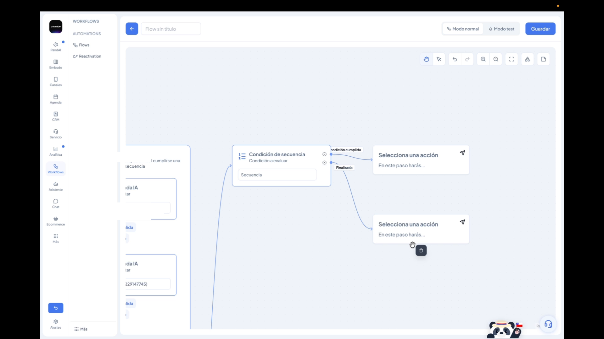

# Secuencias: agrupa reintentos sin duplicar nodos

Armar un workflow con reintentos —llamar, esperar, reintentar, esperar, reintentar de nuevo— significaba hasta ahora duplicar la misma lógica de nodos y condiciones una y otra vez. Un flujo de cuatro intentos podía terminar con más de 30 nodos, difíciles de leer y de mantener.

Las **secuencias** son un nuevo tipo de nodo que resuelve esto: agrupan varios nodos que se ejecutan en orden, con esperas y condiciones de salida configurables entre cada uno, y terminan apenas se cumple una condición o al llegar al final de la lista.


**Para entrar:** dentro del editor de un Flow, agrega un nodo y selecciona **Secuencia** desde el listado de tipos de nodo disponibles.


***

### Cómo funciona una secuencia

Una secuencia ejecuta sus pasos **en orden, de arriba hacia abajo**. En cada paso puedes configurar dos cosas, independientes entre sí:

* **Esperar después de este paso** — cuánto tiempo esperar una vez terminado el paso, antes de evaluar su condición de salida.
* **Condición de salida** — la regla que, si se cumple, hace que la secuencia termine ahí mismo.

Si la condición de salida de un paso **no se cumple**, la secuencia continúa con el siguiente paso. Si se cumple, la secuencia termina de inmediato. Y si se llega al final sin que se haya cumplido ninguna condición, la secuencia también termina —esto equivale a haber agotado los intentos.

<figure><figcaption></figcaption></figure>


Puedes agregar **cualquier tipo de nodo de la plataforma** dentro de una secuencia: una llamada, una plantilla, un mensaje con IA, una espera manual, lo que necesites. Y puedes **reordenarlos** arrastrándolos, o agregar nuevos pasos desde el mismo panel de la secuencia.


***

### Esperar antes o después de evaluar

No siempre conviene evaluar la condición de salida en el mismo momento. Por ejemplo, en una secuencia de reintentos de llamada:

* Quieres evaluar **inmediatamente** si la llamada se contestó —no tiene sentido esperar para eso.
* Pero si no se contestó, quieres **esperar un minuto** antes de reintentar.

En cambio, si el paso es enviar una plantilla de WhatsApp, no vas a evaluar la respuesta al instante —ahí conviene esperar un tiempo más largo (por ejemplo, una hora) antes de revisar si el cliente contestó.

Para reintentar varias veces, simplemente **duplica el paso**: como la condición puntúa sobre el resultado del nodo (por ejemplo, si la llamada quedó en estado `completed`), duplicarlo funciona correctamente sin tener que reconfigurar nada.

<figure><figcaption></figcaption></figure>

***

### Cómo ramificar según el resultado: Condición de secuencia

Una secuencia por sí sola tiene una única salida hacia el siguiente nodo del flujo, sin importar en qué paso haya terminado. Si necesitas que el flujo continúe distinto según **cómo** terminó la secuencia, agrega un nodo de condición de tipo **Condición de secuencia**.

Ahí seleccionas la secuencia que quieres evaluar, y el nodo te deja ramificar entre sus dos estados de salida posibles:

* **Condición cumplida** — la secuencia terminó porque se cumplió alguna de sus condiciones de salida.
* **Finalizada** — la secuencia llegó hasta el final sin que se cumpliera ninguna condición.

<figure><figcaption></figcaption></figure>


Si no agregas un nodo de Condición de secuencia, no hay problema: la secuencia simplemente sigue por un único camino hacia el siguiente nodo, sin importar cómo haya terminado.


***

### Resultado real: de 31 a 16 nodos

En un caso real de reintentos de llamada con tres intentos, reemplazar la lógica duplicada por una secuencia redujo el workflow de **31 a 16 nodos**, sin cambiar su comportamiento. En la ejecución se ve exactamente lo mismo que antes —si el contacto respondió en el primer intento, no se ejecutan el segundo ni el tercero, y el flujo sale directo por **Condición cumplida**.

<figure><figcaption></figcaption></figure>

***

### Variables disponibles

Una vez que la secuencia corrió, puedes referenciar información sobre cómo terminó —tanto dentro del nodo de Condición de secuencia como en pasos posteriores del flujo:

* **Por qué tipo de nodo salió** — por ejemplo, si la salida ocurrió en un paso de llamada o en uno de envío de mensaje.
* **En qué paso salió** — si fue en el paso 1, 2, 3, etc.
* **Cuántos pasos ocurrieron** en total antes de salir.
* **El estado del paso** — si quedó completado o no alcanzado.
* **Si la secuencia fue interrumpida** antes de terminar.

<figure><figcaption></figcaption></figure>


**Sobre las variables de los nodos dentro de la secuencia:** si tienes varios nodos del mismo tipo dentro de una secuencia (por ejemplo, tres pasos de "Activar llamada IA"), Vambe **colapsa las variables por tipo**: al referenciar una variable de ese tipo de nodo, siempre vas a obtener la del último nodo de ese tipo que se ejecutó —no la de un paso específico. Esto es necesario porque, de antemano, no se sabe en qué paso va a salir la secuencia.


***

### En resumen

Una secuencia agrupa nodos que se ejecutan en orden, con esperas y condiciones de salida configurables entre cada uno, y termina por **Condición cumplida** o **Finalizada**. Puedes reintentar simplemente duplicando pasos, ramificar el flujo después con un nodo de **Condición de secuencia**, y referenciar el resultado con las variables de la secuencia. El resultado práctico: la misma lógica de reintentos, con muchos menos nodos y mucho más fácil de leer y mantener.
